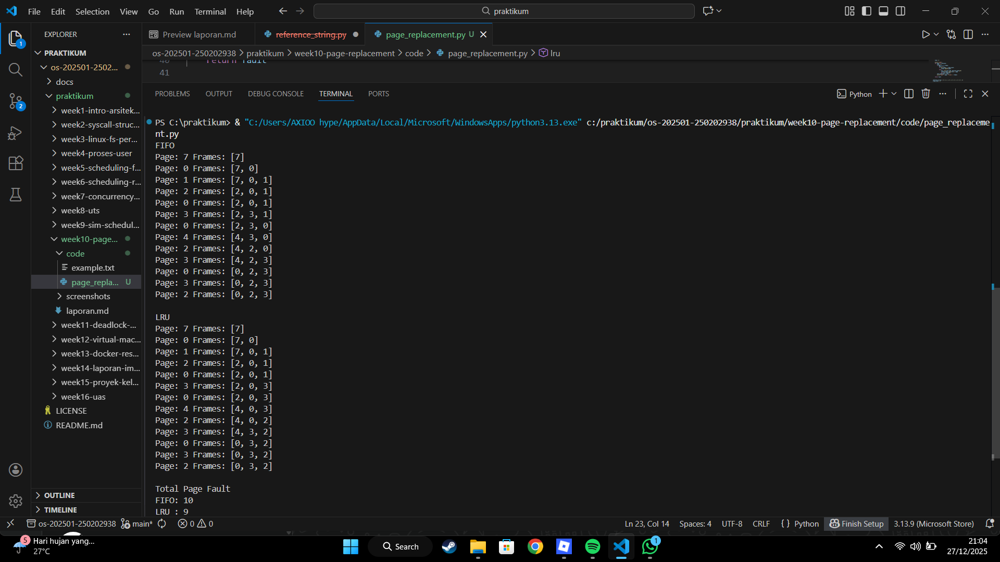

# Laporan Praktikum Minggu 10
Topik: [Tuliskan judul topik, misalnya "Arsitektur Sistem Operasi dan Kernel"]

---

## Identitas
- **Nama**  : Farhan Ramdhani  
- **NIM**   : 250202938  
- **Kelas** : 1IKRB

---

## Tujuan
Tuliskan tujuan praktikum minggu ini.  

1. Mengimplementasikan algoritma page replacement FIFO dalam program.
2. Mengimplementasikan algoritma page replacement LRU dalam program.
3. Menjalankan simulasi page replacement dengan dataset tertentu.
4. Membandingkan performa FIFO dan LRU berdasarkan jumlah *page fault*.
5. Menyajikan hasil simulasi dalam laporan yang sistematis.

---

## Dasar Teori
Tuliskan ringkasan teori (3–5 poin) yang mendasari percobaan.

1. Page replacement adalah mekanisme sistem operasi untuk mengganti halaman di memori ketika kapasitas frame sudah penuh.
2. FIFO (First In First Out) mengganti halaman yang pertama kali masuk ke memori tanpa mempertimbangkan frekuensi penggunaannya.
3. LRU (Least Recently Used) mengganti halaman yang paling lama tidak digunakan berdasarkan riwayat akses halaman.
4. Page fault terjadi ketika halaman yang dibutuhkan tidak berada di memori utama sehingga harus diambil dari penyimpanan sekunder.

---

## Ketentuan Teknis
- Bahasa pemrograman **bebas** (Python / C / Java / lainnya).
- Program berbasis **terminal** (tidak wajib GUI).
- Fokus penilaian pada **logika algoritma dan keakuratan hasil simulasi**.

Struktur folder (sesuaikan dengan template repo):
```
praktikum/week10-page-replacement/
├─ code/
│  ├─ page_replacement.*
│  └─ reference_string.txt
├─ screenshots/
│  └─ hasil_simulasi.png
└─ laporan.md
```

---

## D. Langkah Pengerjaan
1. **Menyiapkan Dataset**

   Gunakan *reference string* berikut sebagai contoh:
   ```
   7, 0, 1, 2, 0, 3, 0, 4, 2, 3, 0, 3, 2
   ```
   Jumlah frame memori: **3 frame**.

2. **Implementasi FIFO**

   - Simulasikan penggantian halaman menggunakan algoritma FIFO.
   - Catat setiap *page hit* dan *page fault*.
   - Hitung total *page fault*.

3. **Implementasi LRU**

   - Simulasikan penggantian halaman menggunakan algoritma LRU.
   - Catat setiap *page hit* dan *page fault*.
   - Hitung total *page fault*.

4. **Eksekusi & Validasi**

   - Jalankan program untuk FIFO dan LRU.
   - Pastikan hasil simulasi logis dan konsisten.
   - Simpan screenshot hasil eksekusi.

5. **Analisis Perbandingan**

   Buat tabel perbandingan seperti berikut:

   | Algoritma | Jumlah Page Fault | Keterangan |
   |:--|:--:|:--|
   | FIFO | ... | ... |
   | LRU | ... | ... |


   - Jelaskan mengapa jumlah *page fault* bisa berbeda.
   - Analisis algoritma mana yang lebih efisien dan alasannya.

6. **Commit & Push**

   ```bash
   git add .
   git commit -m "Minggu 10 - Page Replacement FIFO & LRU"
   git push origin main
   ```

---

## Hasil Eksekusi
Sertakan screenshot hasil percobaan atau diagram:



| Algoritma | Jumlah Page Fault | Keterangan |
|----------|-------------------|------------|
| FIFO     | 10                | Mengganti halaman yang pertama kali masuk ke memori tanpa memperhatikan apakah halaman tersebut masih sering digunakan. |
| LRU      | 9                 | Mengganti halaman yang paling lama tidak digunakan sehingga lebih sesuai dengan pola akses program. |

### Penjelasan Perbedaan Jumlah Page Fault

Perbedaan jumlah page fault terjadi karena strategi penggantian halaman yang digunakan oleh masing-masing algoritma berbeda. 
FIFO hanya mempertimbangkan urutan masuk halaman ke memori tanpa memperhatikan frekuensi atau waktu terakhir halaman digunakan. 
Akibatnya, FIFO dapat mengganti halaman yang sebenarnya masih dibutuhkan, sehingga meningkatkan jumlah page fault.  

Sebaliknya, LRU mempertimbangkan halaman yang paling lama tidak digunakan, sehingga halaman yang masih sering diakses cenderung tetap berada di memori. 
Hal ini membuat jumlah page fault pada LRU lebih sedikit dibandingkan FIFO.

### Analisis Algoritma yang Lebih Efisien

Berdasarkan hasil simulasi, algoritma LRU lebih efisien dibandingkan FIFO karena menghasilkan jumlah page fault yang lebih rendah. 
LRU lebih mampu menyesuaikan diri dengan pola akses program yang umumnya bersifat lokalitas (locality of reference). 
Meskipun implementasi LRU lebih kompleks dibandingkan FIFO, performa yang dihasilkan lebih baik dalam pengelolaan memori.

---

## Kesimpulan
Tuliskan 2–3 poin kesimpulan dari praktikum ini.

Algoritma LRU menghasilkan jumlah page fault lebih sedikit dibanding FIFO pada percobaan yang dilakukan.
FIFO lebih sederhana dalam implementasi, namun kurang optimal karena tidak mempertimbangkan pola penggunaan halaman.
Pemilihan algoritma page replacement berpengaruh terhadap kinerja sistem memori.

---

## Quiz
1. Apa perbedaan utama FIFO dan LRU?

   **Jawaban:**  FIFO (First In First Out) adalah algoritma penggantian halaman yang mengganti halaman yang pertama kali masuk ke memori tanpa memperhatikan seberapa sering halaman tersebut digunakan.
Sedangkan LRU (Least Recently Used) mengganti halaman yang paling lama tidak digunakan dengan mempertimbangkan riwayat akses halaman.
2. Mengapa FIFO dapat menghasilkan *Belady’s Anomaly*?  

   **Jawaban:**  FIFO dapat mengalami Belady’s Anomaly karena penambahan jumlah frame tidak selalu mengurangi jumlah page fault. Hal ini terjadi karena FIFO tidak mempertimbangkan pola penggunaan halaman dan hanya mengganti halaman berdasarkan urutan masuk.
3. Mengapa LRU umumnya menghasilkan performa lebih baik dibanding FIFO?  

   **Jawaban:**  LRU biasanya memiliki performa lebih baik karena mengikuti prinsip locality of reference, yaitu halaman yang baru digunakan cenderung akan digunakan kembali. Dengan demikian, LRU dapat mengurangi jumlah page fault dibanding FIFO.

---

## Refleksi Diri
Tuliskan secara singkat:
- Apa bagian yang paling menantang minggu ini?  
**Jawaban:**  Bagian yang paling menantang pada minggu ini adalah memahami alur kerja algoritma FIFO dan LRU serta proses penggantian halaman pada setiap langkah.

- Bagaimana cara Anda mengatasinya?  
**Jawaban:**  Tantangan tersebut diatasi dengan melakukan simulasi langkah demi langkah dan menjalankan program untuk melihat perubahan frame secara langsung.

---

**Credit:**  
_Template laporan praktikum Sistem Operasi (SO-202501) – Universitas Putra Bangsa_
