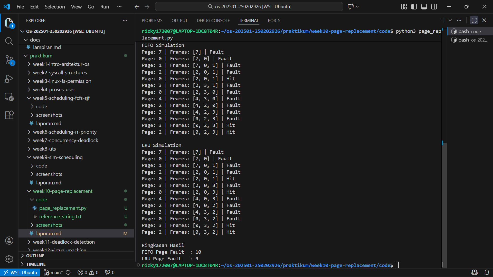

# Laporan Praktikum Minggu 10
Topik: Manajemen Memori – Page Replacement (FIFO & LRU)

---

## Identitas
- **Nama**  : Rizky Iqbal Hisyam
- **NIM**   : 250202926
- **Kelas** : 1IKRA

---

## Tujuan
Setelah menyelesaikan tugas ini, mahasiswa mampu:
1. Mengimplementasikan algoritma page replacement FIFO dalam program.
2. Mengimplementasikan algoritma page replacement LRU dalam program.
3. Menjalankan simulasi page replacement dengan dataset tertentu.
4. Membandingkan performa FIFO dan LRU berdasarkan jumlah *page fault*.
5. Menyajikan hasil simulasi dalam laporan yang sistematis.

---

## Dasar Teori
Page replacement merupakan teknik manajemen memori yang digunakan ketika terjadi **page fault** dan memori utama sudah penuh, sehingga sistem operasi harus mengganti salah satu halaman yang ada di memori. Algoritma **FIFO** mengganti halaman yang pertama kali masuk ke memori tanpa memperhatikan pola penggunaannya, sehingga mudah diimplementasikan tetapi kurang efisien. Sementara itu, algoritma **LRU** mengganti halaman yang paling lama tidak digunakan, sehingga lebih adaptif terhadap pola akses memori dan umumnya menghasilkan jumlah page fault yang lebih sedikit. Simulasi digunakan untuk melihat dan membandingkan kinerja kedua algoritma tersebut secara praktis.

---

## Langkah Praktikum
1. Sesuaikan struktur folder repo:
```
praktikum/week10-page-replacement/
├─ code/
│  ├─ page_replacement.py
│  └─ reference_string.txt
├─ screenshots/
│  └─ hasil_simulasi.png
└─ laporan.md
```
2. Siapkan dataset dalam reference_string.txt seperti berikut:
```
   7, 0, 1, 2, 0, 3, 0, 4, 2, 3, 0, 3, 2
   ```
   Jumlah frame memori: **3 frame**.

3. Implementasi FIFO
   - Simulasikan penggantian halaman menggunakan algoritma FIFO.
   - Catat setiap *page hit* dan *page fault*.
   - Hitung total *page fault*.
4. Implementasi LRU
   - Simulasikan penggantian halaman menggunakan algoritma LRU.
   - Catat setiap *page hit* dan *page fault*.
   - Hitung total *page fault*.
5. Eksekusi program, pastikan hasil simulasi logis dan konsisten, simpan screenshots hasil eksekusi.
6. Commit & Push

   ```bash
   git add .
   git commit -m "Minggu 10 - Page Replacement FIFO & LRU"
   git push origin main
   ```


---

## Kode / Perintah
Kode utama ada di folder praktikum/week10-page-replacement/code/page_replacement.py

---

## Hasil Eksekusi
Hasil simulasi FIFO & LRU:


---

## Analisis
- Mengapa jumlah *page fault* bisa berbeda?

   Jumlah page fault bisa berbeda karena setiap algoritma page replacement memiliki mekanisme pemilihan halaman yang berbeda. FIFO mengganti halaman berdasarkan urutan masuk tanpa mempertimbangkan frekuensi atau penggunaan halaman yang baru, sehingga halaman yang masih sering dibutuhkan bisa ikut terganti dan menyebabkan page fault tambahan. Sebaliknya, LRU mempertimbangkan riwayat akses halaman dengan mengganti halaman yang paling lama tidak digunakan, sehingga lebih sesuai dengan pola penggunaan memori.

- Jadi, algoritma mana yang lebih efisien dan alasannya?

| Algoritma | Jumlah Page Fault | Keterangan                                         |
| :---: | :---: | :---: |
| FIFO      | 10                | Mengganti halaman berdasarkan urutan masuk         |
| LRU       | 9                 | Mengganti halaman yang paling lama tidak digunakan |


   Berdasarkan hasil simulasi, algoritma LRU lebih efisien dibandingkan FIFO karena menghasilkan jumlah page fault yang lebih sedikit. Hal ini menunjukkan bahwa LRU lebih efektif dalam mempertahankan halaman yang sering digunakan di memori, meskipun implementasinya lebih kompleks dibandingkan FIFO.

---

## Kesimpulan
Praktikum ini menunjukkan bahwa algoritma page replacement memiliki pengaruh besar terhadap kinerja manajemen memori. FIFO mudah diimplementasikan namun kurang adaptif terhadap pola akses halaman, sedangkan LRU lebih kompleks tetapi mampu menghasilkan jumlah page fault yang lebih rendah. Melalui simulasi, mahasiswa dapat memahami cara kerja kedua algoritma secara praktis dan melihat langsung perbedaan efisiensinya.

---

## Quiz
1. Apa perbedaan utama FIFO dan LRU?
  
   **Jawaban:**  FIFO mengganti halaman yang paling awal masuk ke memori, sedangkan LRU mengganti halaman yang paling lama tidak digunakan.
2. Mengapa FIFO dapat menghasilkan *Belady’s Anomaly*? 
  
   **Jawaban:**  Karena FIFO tidak mempertimbangkan pola penggunaan halaman, sehingga penambahan jumlah frame justru bisa meningkatkan page fault.
3. Mengapa LRU umumnya menghasilkan performa lebih baik dibanding FIFO?
  
   **Jawaban:**  Karena LRU menyesuaikan dengan perilaku akses memori aktual, sehingga lebih efektif mengurangi page fault.

---

## Refleksi Diri
Tuliskan secara singkat:
- Apa bagian yang paling menantang minggu ini?  Memahami konsep dari *page replacement*.
- Bagaimana cara Anda mengatasinya?  Terus belajar dan mempraktikkannya.

---

**Credit:**  
_Template laporan praktikum Sistem Operasi (SO-202501) – Universitas Putra Bangsa_
