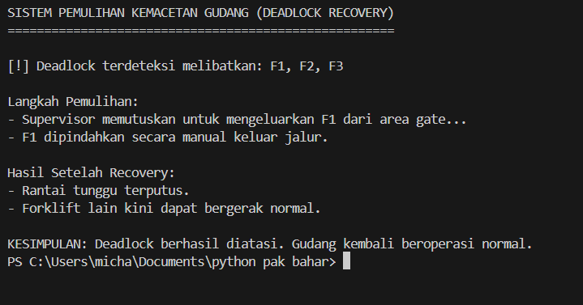

# Laporan Praktikum Minggu [X]
Topik:Simulasi dan Mekanisme Deadlock Detection

---

## Identitas
- **Nama**  : [Miftakhul Lisna Esa Baehaqi]  
- **NIM**   : [250202951]  
- **Kelas** : [1 IKRB]

---

## Tujuan
1. Membuat program sederhana untuk mendeteksi deadlock.
2. Menjalankan simulasi deteksi deadlock dengan dataset uji.
3. Menyajikan hasil analisis deadlock dalam bentuk tabel.
4. Memberikan interpretasi hasil uji secara logis dan sistematis.
5. Menyusun laporan praktikum sesuai format yang ditentukan.

---

## Dasar Teori
- Definisi Kebuntuan (Deadlock): Sebuah kondisi dalam sistem operasi ketika sekumpulan proses berhenti bekerja karena setiap proses menunggu sumber daya yang sedang dikuasai oleh proses lain dalam kelompok tersebut.

- Strategi Deteksi: Berbeda dengan metode pencegahan, strategi deteksi membiarkan sistem menjalankan proses secara bebas, kemudian secara berkala memeriksa keberadaan siklus yang menyebabkan kebuntuan melalui pendekatan algoritmik.

- Empat Syarat Utama: Suatu kebuntuan dapat terdeteksi apabila memenuhi kriteria Mutual Exclusion , Hold and Wait , No Preemption , dan Circular Wait.
---

## Langkah Praktikum
1. Menyiapkan Dataset

Membuat dataset sederhana yang berisi:

- Daftar proses
- Resource Allocation
- Resource Request / Need

Data tabel:

| Proses | Allocation | Request |
   |:--|:--|:--|
   | Mobil_A | Jalur_Utara | Jalur_Timur |
   | Mobil_B | Jalur_Timur | Jalur_Selatan |
   | Mobil_C | Jalur_Selatan | Jalur_Utara |

2. Implementasi Algoritma Deteksi Deadlock   

Program:

- Membaca data proses dan resource.
- Menentukan apakah sistem berada dalam kondisi deadlock.
- Menampilkan proses mana saja yang terlibat deadlock.

3. Eksekusi & Validasi

- Menjalankan program dengan dataset uji.
- Memvalidasi hasil deteksi dengan analisis manual/logis.
- Menyimpan hasil eksekusi dalam bentuk screenshot.

4. Analisis Hasil

- Menyajikan hasil deteksi dalam tabel (proses deadlock / tidak).
- Menjelaskan mengapa deadlock terjadi atau tidak terjadi.
- Mengaitkan hasil dengan teori deadlock (empat kondisi).
.

---

## Kode / Perintah

**1. Potongan Code  deadlock_detection.py**

```python
import csv
import time
from colorama import Fore, Style, init
init(autoreset=True)

# ===============================
# Membaca Dataset
# ===============================
def baca_data_gudang(nama_file):
    data = []
    with open(nama_file) as file:
        reader = csv.DictReader(file)
        for row in reader:
            data.append(row)
    return data


# ===============================
# Pengecekan Deadlock (Circular Wait)
# ===============================
def cek_deadlock(peta_tunggu):
    sudah_dicek = set()

    for f in peta_tunggu:
        jalur = f
        rantai = []

        while jalur not in sudah_dicek:
            sudah_dicek.add(jalur)
            rantai.append(jalur)

            if jalur not in peta_tunggu:
                break

            jalur = peta_tunggu[jalur]

            # Jika kembali ke awal → DEADLOCK
            if jalur == f:
                return True, rantai

    return False, []


# ===============================
# Simulasi Deteksi Deadlock
# ===============================
def simulasi_deteksi():
    catatan = baca_data_gudang("dataset_forklift.csv")

    print(Fore.CYAN + "\nSISTEM MONITORING GUDANG OTOMATIS\n")

    # Mapping Gate yang sedang ditempati siapa
    posisi_gate = {row['Gate_Current']: row['Forklift'] for row in catatan}

    peta_tunggu = {}
    print(Fore.YELLOW + "[!] Sistem memantau pergerakan Forklift:\n")

    for row in catatan:
        forklift = row['Forklift']
        gate_asal = row['Gate_Current']
        gate_tujuan = row['Gate_Target']

        print(f"{Fore.WHITE}{forklift} berada di {Fore.GREEN}{gate_asal} "
              f"{Fore.WHITE}ingin pindah ke {Fore.BLUE}{gate_tujuan}")

        if gate_tujuan in posisi_gate:
            penghalang = posisi_gate[gate_tujuan]
            peta_tunggu[forklift] = penghalang
            print(f"   {Fore.RED}>> Tertahan! {gate_tujuan} sedang dipakai {Fore.MAGENTA}{penghalang}")
        else:
            print(f"   {Fore.GREEN}>> Gate tujuan kosong, aman.")

        time.sleep(0.5)

    print(Fore.YELLOW + "\n[!] Sistem menganalisis potensi deadlock...")

    status, rantai = cek_deadlock(peta_tunggu)

    print("\nKESIMPULAN SISTEM:")
    if status:
        print(Fore.WHITE + "STATUS: " + Fore.RED + "TERDETEKSI DEADLOCK")
        print(Fore.WHITE + "Forklift yang saling mengunci: " + Fore.MAGENTA + ", ".join(rantai))
        print(Fore.YELLOW + "Tindakan: Supervisor perlu mengeluarkan salah satu forklift agar alur terbuka.")
    else:
        print(Fore.GREEN + "STATUS: TIDAK ADA DEADLOCK")
        print("Semua forklift dapat bergerak tanpa saling mengunci.")


# ===============================
# Main
# ===============================
if __name__ == "__main__":
    simulasi_deteksi()

```

 ## **2. Potongan Code deadlock_solution.py**

```python

import csv
import time

# ===============================
# Membaca Dataset Gudang
# ===============================
def baca_data_gudang(nama_file):
    data = []
    with open(nama_file) as file:
        reader = csv.DictReader(file)
        for row in reader:
            data.append(row)
    return data


# ===============================
# Cek Circular Deadlock
# ===============================
def cek_deadlock(peta_tunggu):
    sudah_dicek = set()

    for f in peta_tunggu:
        jalur = f
        rantai = []

        while jalur not in sudah_dicek:
            sudah_dicek.add(jalur)
            rantai.append(jalur)

            if jalur not in peta_tunggu:
                break

            jalur = peta_tunggu[jalur]

            if jalur == f:
                return True, rantai

    return False, []


# ===============================
# Proses Recovery Deadlock
# ===============================
def recovery_deadlock():
    data = baca_data_gudang("dataset_forklift.csv")

    print("\nSISTEM PEMULIHAN KEMACETAN GUDANG (DEADLOCK RECOVERY)")
    print("=====================================================\n")

    posisi_gate = {row['Gate_Current']: row['Forklift'] for row in data}
    peta_tunggu = {}

    for row in data:
        forklift = row["Forklift"]
        gate_tujuan = row["Gate_Target"]

        if gate_tujuan in posisi_gate:
            peta_tunggu[forklift] = posisi_gate[gate_tujuan]

    status, rantai = cek_deadlock(peta_tunggu)

    if not status:
        print("Status: Tidak ada deadlock. Semua forklift aman bergerak.")
        return

    print(f"[!] Deadlock terdeteksi melibatkan: {', '.join(rantai)}\n")

    # Pilih forklift pertama untuk dikeluarkan
    forklift_dikeluarkan = rantai[0]

    print(f"Langkah Pemulihan:")
    print(f"- Supervisor memutuskan untuk mengeluarkan {forklift_dikeluarkan} dari area gate...")
    time.sleep(1)
    print(f"- {forklift_dikeluarkan} dipindahkan secara manual keluar jalur.")
    time.sleep(1)

    print("\nHasil Setelah Recovery:")
    print("- Rantai tunggu terputus.")
    print("- Forklift lain kini dapat bergerak normal.")
    print("\nKESIMPULAN: Deadlock berhasil diatasi. Gudang kembali beroperasi normal.")


# ===============================
# Main Program
# ===============================
if __name__ == "__main__":
    recovery_deadlock()

```

---

## Hasil Eksekusi
:
- Hasil Mendeteksi Deadlock

.png)

- Hasil Solusi Dedlock



---

## Analisis
1. Berdasarkan simulasi deteksi dan pemulihan deadlock yang dilakukan menggunakan program Python, dapat dianalisis bahwa sistem mampu mengidentifikasi kondisi ketika proses berada pada keadaan aman (safe state) maupun tidak aman (unsafe state).
Pada saat seluruh permintaan sumber daya masih dapat dipenuhi secara berurutan, sistem berada pada kondisi tidak mengalami deadlock sehingga seluruh proses dapat diselesaikan tanpa intervensi.

2. Namun, ketika terdapat proses yang saling menunggu sumber daya dan tidak ada lagi alokasi yang memungkinkan untuk dilanjutkan, sistem akan mendeteksi kondisi deadlock. Proses deteksi ini dilakukan dengan memeriksa ketersediaan resource yang tersisa dan membandingkannya dengan kebutuhan tiap proses. Jika tidak ada proses yang dapat dilanjutkan, maka sistem menyimpulkan terjadi deadlock.

3. Untuk mencegah sistem berhenti total, mekanisme pemulihan (recovery) dijalankan. Pada simulasi, pemulihan dilakukan dengan memilih proses tertentu untuk dihentikan (terminate) atau dicabut alokasinya (resource preemption), sehingga resource dapat dikembalikan ke sistem dan proses lain dapat kembali berjalan. Setelah pemulihan dilakukan, sistem kembali berada pada kondisi aman dan eksekusi dapat dilanjutkan.

Kesimpulan Singkat

- Sistem dapat membedakan kondisi aman dan deadlock.

- Ketika deadlock terjadi, sistem mampu melakukan deteksi secara tepat melalui analisis kebutuhan dan ketersediaan sumber daya.

- Mekanisme pemulihan berhasil mengembalikan sistem ke kondisi normal dengan mengorbankan salah satu proses.

- Dengan adanya deteksi dan pemulihan, sistem tetap dapat beroperasi dan tidak berhenti total.
---

## Kesimpulan
1. Deadlock dapat terjadi ketika proses saling menunggu resource dan tidak ada resource yang tersedia untuk melanjutkan eksekusi.

2. Melalui algoritma deadlock detection, sistem mampu mengidentifikasi apakah kondisi sistem berada pada state aman (safe) atau mengalami deadlock.

3. Ketika deadlock terdeteksi, sistem membutuhkan mekanisme recovery, misalnya penghentian proses (termination) atau pengambilan kembali resource (preemption), untuk mengembalikan sistem ke kondisi aman.

4. Simulasi membuktikan bahwa tanpa mekanisme ini, sistem akan berhenti dan tidak dapat melanjutkan proses.

5. Praktik ini menunjukkan pentingnya manajemen resource dalam sistem operasi untuk menjaga keandalan, stabilitas, dan kontinuitas proses.

---

## Quiz
1. **Perbedaan Deadlock Prevention, Avoidance, Detection**  
   **Jawaban:**
   - Prevention: Mencegah deadlock dengan memblokir salah satu dari 4 kondisi deadlock.
   - Avoidance: Sistem menghindari keadaan berbahaya (unsafe state) menggunakan algoritma seperti Banker's Algorithm.
   - Detection: Deadlock dibiarkan terjadi, lalu sistem mendeteksi dan menangani.  

2. **Mengapa Deteksi Deadlock Diperlukan?**

**Jawaban:**

Karena dalam sistem nyata deadlock sulit dihindari sepenuhnya, terutama pada sistem multiuser & multiprogramming. Deteksi diperlukan agar sistem tetap bisa berjalan dan deadlock bisa ditangani.

3. **Kelebihan & Kekurangan Deteksi Deadlock**
Kelebihan:

**Jawaban:**
- Fleksibel, tidak membatasi alokasi resource
- Performa sistem bisa tetap tinggi

Kekurangan:
- Membutuhkan algoritma pendeteksi
- Perlu mekanisme recovery (kill / rollback process)
- Bisa terjadi penurunan performa saat deadlock


---

## Refleksi Diri
Tuliskan secara singkat:
- Apa bagian yang paling menantang minggu ini?  
- Bagaimana cara Anda mengatasinya?  

---

**Credit:**  
_Template laporan praktikum Sistem Operasi (SO-202501) – Universitas Putra Bangsa_
