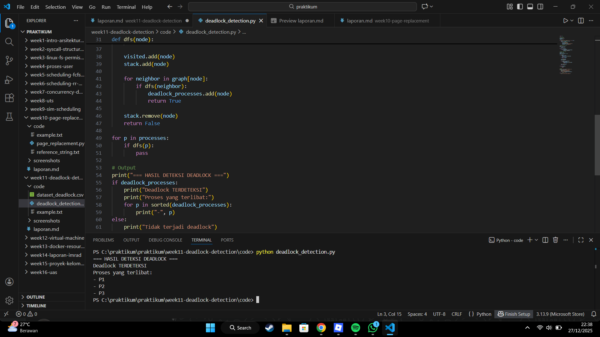

# Laporan Praktikum Minggu 11
Topik: Simulasi dan Deteksi Deadlock

---

## Identitas
- **Nama**  : Farhan Ramdhani  
- **NIM**   : 250202938  
- **Kelas** : 1IKRB

---

## Tujuan
Tuliskan tujuan praktikum minggu ini.  

1. Membuat program sederhana untuk mendeteksi deadlock.  
2. Menjalankan simulasi deteksi deadlock dengan dataset uji.  
3. Menyajikan hasil analisis deadlock dalam bentuk tabel.  
4. Memberikan interpretasi hasil uji secara logis dan sistematis.  
5. Menyusun laporan praktikum sesuai format yang ditentukan.

---

## Dasar Teori
Tuliskan ringkasan teori (3–5 poin) yang mendasari percobaan.

- Deadlock adalah kondisi di mana dua atau lebih proses saling menunggu resource sehingga tidak ada proses yang dapat melanjutkan eksekusi.
- Deadlock dapat terjadi apabila empat kondisi terpenuhi, yaitu mutual exclusion, hold and wait, no preemption, dan circular wait.
- Deadlock detection merupakan teknik untuk mengidentifikasi adanya deadlock dengan menganalisis hubungan permintaan dan alokasi resource antar proses.
- Salah satu cara mendeteksi deadlock adalah dengan membangun wait-for graph dan mencari adanya siklus (cycle).

---

## Ketentuan Teknis
- Bahasa pemrograman **bebas** (Python / C / Java / lainnya).  
- Program berbasis **terminal**, tidak memerlukan GUI.  
- Fokus penilaian pada **logika algoritma deteksi deadlock**, bukan kompleksitas bahasa.

Struktur folder (sesuaikan dengan template repo):
```
praktikum/week11-deadlock-detection/
├─ code/
│  ├─ deadlock_detection.*
│  └─ dataset_deadlock.csv
├─ screenshots/
│  └─ hasil_deteksi.png
└─ laporan.md
```

---

## Langkah Praktikum
1. **Menyiapkan Dataset**

   Gunakan dataset sederhana yang berisi:
   - Daftar proses  
   - Resource Allocation  
   - Resource Request / Need

   Contoh tabel:

   | Proses | Allocation | Request |
   |:--:|:--:|:--:|
   | P1 | R1 | R2 |
   | P2 | R2 | R3 |
   | P3 | R3 | R1 |

2. **Implementasi Algoritma Deteksi Deadlock**

   Program minimal harus:
   - Membaca data proses dan resource.  
   - Menentukan apakah sistem berada dalam kondisi deadlock.  
   - Menampilkan proses mana saja yang terlibat deadlock.

3. **Eksekusi & Validasi**

   - Jalankan program dengan dataset uji.  
   - Validasi hasil deteksi dengan analisis manual/logis.  
   - Simpan hasil eksekusi dalam bentuk screenshot.

4. **Analisis Hasil**

   - Sajikan hasil deteksi dalam tabel (proses deadlock / tidak).  
   - Jelaskan mengapa deadlock terjadi atau tidak terjadi.  
   - Kaitkan hasil dengan teori deadlock (empat kondisi).

5. **Commit & Push**

   ```bash
   git add .
   git commit -m "Minggu 11 - Deadlock Detection"
   git push origin main
   ```

---

## Hasil Eksekusi
Sertakan screenshot hasil percobaan atau diagram:



---

## Analisis
### A. Sajikan hasil deteksi dalam tabel (proses deadlock / tidak).  

| Proses | Resource Dialokasikan | Resource Diminta | Status |
|-------|-----------------------|------------------|--------|
| P1    | R1                    | R2               | Deadlock |
| P2    | R2                    | R3               | Deadlock |
| P3    | R3                    | R1               | Deadlock |

Berdasarkan tabel di atas, setiap proses memegang satu resource dan meminta resource lain yang sedang digunakan oleh proses berbeda.
Kondisi ini membentuk circular wait, yaitu P1 menunggu R2, P2 menunggu R3, dan P3 menunggu R1.

Karena seluruh proses saling menunggu resource yang tidak dapat dilepaskan secara paksa, sistem berada dalam kondisi deadlock.

### B. Jelaskan mengapa deadlock terjadi atau tidak terjadi.  

**Jawaban:**  
Deadlock terjadi karena adanya circular wait antar proses. 
Proses P1 memegang resource R1 dan menunggu R2, proses P2 memegang resource R2 dan menunggu R3, sedangkan proses P3 memegang resource R3 dan menunggu R1. 
Kondisi ini menyebabkan setiap proses saling menunggu resource yang sedang digunakan oleh proses lain sehingga tidak ada proses yang dapat melanjutkan eksekusi.

Selain itu, keempat syarat terjadinya deadlock terpenuhi, yaitu mutual exclusion, hold and wait, no preemption, dan circular wait. 
Oleh karena itu, sistem berada dalam kondisi deadlock.

### C. Kaitkan hasil dengan teori deadlock (empat kondisi).

**Jawaban:**  
Hasil percobaan menunjukkan bahwa keempat kondisi terjadinya deadlock terpenuhi. 
Kondisi mutual exclusion terpenuhi karena setiap resource hanya dapat digunakan oleh satu proses dalam satu waktu. 
Kondisi hold and wait terjadi karena setiap proses memegang satu resource sambil menunggu resource lain. 

Kondisi no preemption terpenuhi karena resource yang sedang digunakan tidak dapat diambil secara paksa oleh proses lain. 
Selain itu, kondisi circular wait terjadi karena adanya siklus permintaan resource, yaitu P1 menunggu R2, P2 menunggu R3, dan P3 menunggu R1. 
Dengan terpenuhinya keempat kondisi tersebut, sistem berada dalam keadaan deadlock.

---

## Kesimpulan
Tuliskan 2–3 poin kesimpulan dari praktikum ini.

- Berdasarkan hasil simulasi, sistem terdeteksi mengalami deadlock karena adanya circular wait antar proses.
- Algoritma deadlock detection mampu mengidentifikasi proses-proses yang terlibat dalam deadlock.
- Deteksi deadlock penting untuk membantu sistem operasi menentukan langkah penanganan agar eksekusi dapat dilanjutkan.

---

## Quiz
1. Apa perbedaan antara *deadlock prevention*, *avoidance*, dan *detection*?   
   **Jawaban:**  Deadlock prevention bertujuan mencegah deadlock dengan menghilangkan satu atau lebih kondisi deadlock sejak awal. 
Deadlock avoidance menghindari deadlock dengan memastikan sistem selalu berada pada keadaan aman sebelum mengalokasikan resource. 
Deadlock detection bertujuan mendeteksi deadlock setelah terjadi, kemudian sistem melakukan tindakan pemulihan.
2. Mengapa deteksi deadlock tetap diperlukan dalam sistem operasi?  
   **Jawaban:**  Deteksi deadlock diperlukan karena tidak semua sistem dapat menerapkan pencegahan atau penghindaran deadlock secara efisien. 
Dengan deteksi deadlock, sistem dapat mengidentifikasi kondisi deadlock yang terjadi dan mengambil langkah pemulihan yang sesuai.
3. Apa kelebihan dan kekurangan pendekatan deteksi deadlock?  
   **Jawaban:**  Kelebihan deteksi deadlock adalah penggunaan resource yang lebih fleksibel karena sistem tidak membatasi alokasi resource secara ketat. 
Namun, kekurangannya adalah deadlock dibiarkan terjadi terlebih dahulu sehingga diperlukan mekanisme tambahan untuk pemulihan.

---

## Refleksi Diri
Tuliskan secara singkat:
- Apa bagian yang paling menantang minggu ini?  
 **Jawaban:**  Bagian yang paling menantang pada praktikum ini adalah memahami hubungan antara alokasi dan permintaan resource dalam mendeteksi deadlock. 
- Bagaimana cara Anda mengatasinya?  
 **Jawaban:**  Kesulitan tersebut diatasi dengan mempelajari kembali teori deadlock dan mencoba menjalankan simulasi secara langsung hingga hasilnya dipahami.

---

**Credit:**  
_Template laporan praktikum Sistem Operasi (SO-202501) – Universitas Putra Bangsa_
