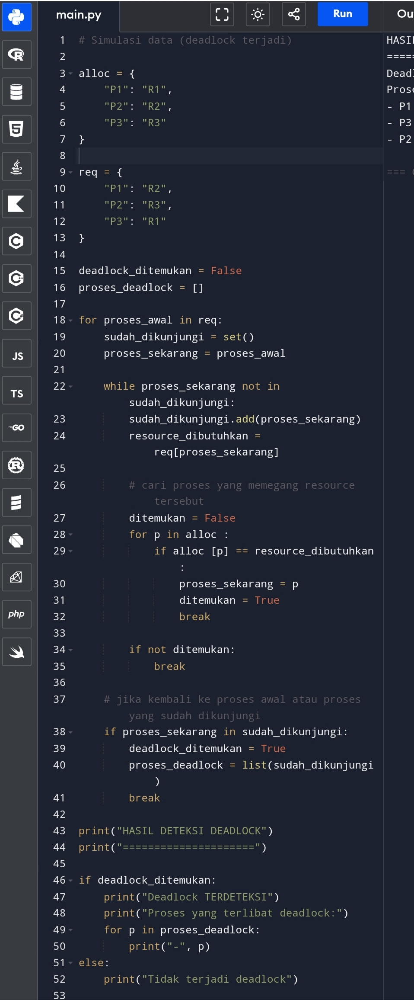
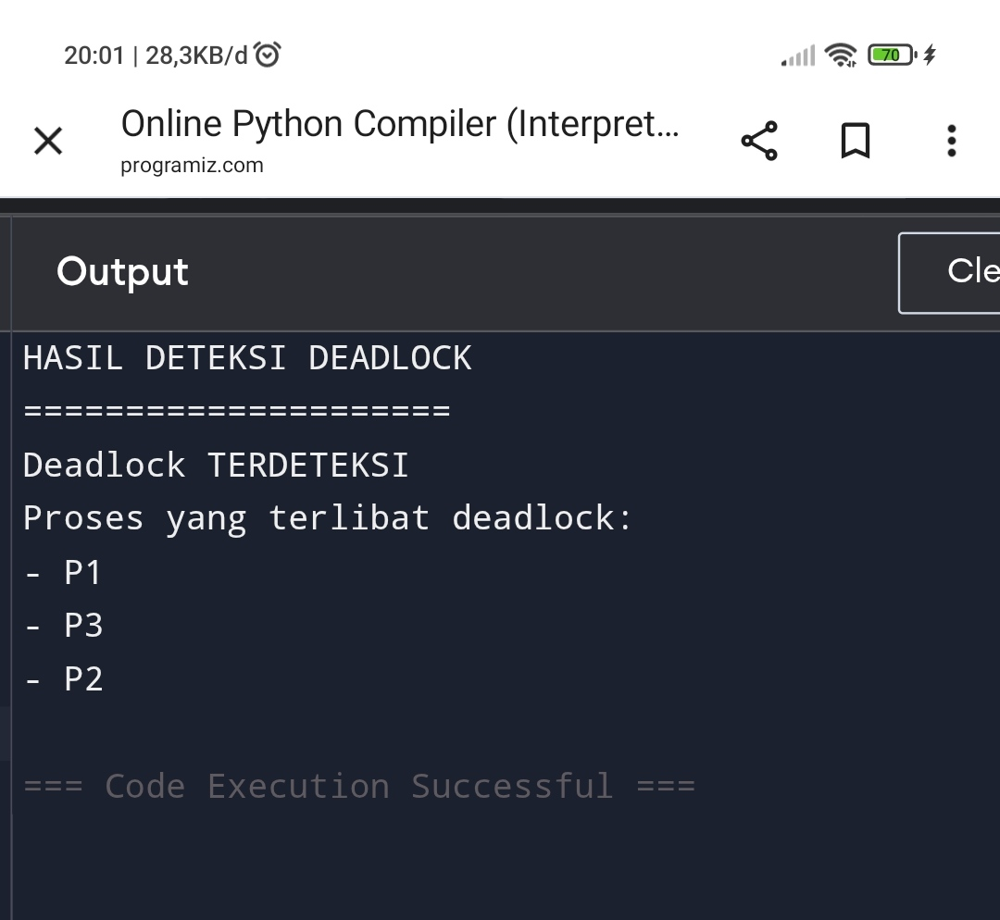

# Laporan Praktikum Minggu [11]
Topik: [: Simulasi dan Deteksi Deadlock]

---

## Identitas
- **Nama**  : [Mohammad Fatikh Mahsun]  
- **NIM**   : [250202952]  
- **Kelas** : [1IKRB]

---

## Tujuan
•Menjelaskan konsep dan mekanisme deteksi deadlock pada sistem operasi melalui kegiatan praktikum.

•Mengimplementasikan program sederhana untuk mendeteksi deadlock berdasarkan data alokasi dan permintaan resource.

•Menguji program deteksi deadlock menggunakan dataset uji yang telah disiapkan.

•Menyajikan hasil deteksi deadlock dalam bentuk tabel yang sistematis dan mudah dipahami.

•Menganalisis dan menginterpretasikan hasil simulasi deteksi deadlock secara logis berdasarkan teori deadlock.

---

## Dasar Teori
•Deadlock merupakan kondisi pada sistem operasi ketika dua atau lebih proses saling menunggu resource yang sedang digunakan oleh proses lain. Akibatnya, tidak ada satu pun proses yang dapat melanjutkan eksekusi dan sistem berada dalam keadaan macet. Kondisi ini biasanya terjadi pada sistem yang memiliki banyak proses dan resource yang terbatas.

•Deadlock dapat terjadi jika empat kondisi terpenuhi, yaitu resource hanya bisa digunakan satu proses dalam satu waktu, proses menahan resource sambil menunggu resource lain, resource tidak dapat diambil secara paksa, dan adanya siklus saling menunggu antar proses.

•Deteksi deadlock dilakukan dengan menganalisis hubungan antara alokasi resource dan permintaan resource dari setiap proses. Jika ditemukan pola siklus atau circular wait, maka sistem dapat dinyatakan mengalami deadlock. Pendekatan ini fokus pada identifikasi masalah setelah deadlock terjadi.

•Pendekatan deteksi deadlock berbeda dengan pencegahan dan penghindaran deadlock. Pada deteksi deadlock, sistem tetap mengizinkan proses berjalan secara normal dan baru melakukan pemeriksaan secara berkala untuk mengetahui apakah deadlock terjadi.

---

## Langkah Praktikum
1.Menyiapkan dataset sederhana yang berisi informasi proses, resource yang sedang dialokasikan, dan resource yang diminta oleh masing-masing proses. Dataset disusun sedemikian rupa sehingga membentuk kondisi circular wait.

2.Membuat program simulasi deteksi deadlock menggunakan bahasa pemrograman Python dengan pendekatan penelusuran siklus permintaan resource antar proses.

3.Memasukkan data proses dan resource ke dalam program, baik melalui file dataset maupun langsung di dalam kode (untuk pengujian menggunakan Programiz).

4.Menjalankan program pada lingkungan berbasis terminal atau compiler online untuk melakukan proses deteksi deadlock.

5.Melakukan analisis terhadap hasil deteksi deadlock dengan membandingkan hasil program dengan analisis logis berdasarkan teori deadlock.

6.Menyajikan hasil deteksi dan analisis dalam bentuk tabel serta narasi pada laporan praktikum.

---

## Kode / Perintah
Tuliskan potongan kode atau perintah utama:
```bash
Python deadlock_detection.py
```

---

## Hasil Eksekusi
Sertakan screenshot hasil percobaan atau diagram:




---

## Analisis

 | Proses | Allocation|   Request   |      Status |
| ------      | ----------------- | ---------------- | ------------- |
| P1       | R1                | R2               | Deadlock      |
| P2       | R2                | R3               | Deadlock      |
| P3       | R3                | R1               | Deadlock      |

•Berdasarkan hasil simulasi deteksi deadlock yang dilakukan, sistem menunjukkan kondisi deadlock. Hal ini dapat dilihat dari hasil eksekusi program yang menyatakan bahwa deadlock terdeteksi dan melibatkan proses P1, P2, dan P3. Dataset yang digunakan menggambarkan kondisi di mana setiap proses memegang satu resource dan secara bersamaan menunggu resource lain yang sedang digunakan oleh proses lain.

•Pada data uji tersebut, proses P1 memegang resource R1 dan menunggu resource R2, proses P2 memegang resource R2 dan menunggu resource R3, sedangkan proses P3 memegang resource R3 dan menunggu resource R1. Kondisi ini menyebabkan terbentuknya siklus saling menunggu atau circular wait, sehingga tidak ada satu pun proses yang dapat melanjutkan eksekusi.

•Hasil simulasi ini sesuai dengan teori deadlock dalam sistem operasi. Keempat kondisi terjadinya deadlock terpenuhi, yaitu resource hanya dapat digunakan oleh satu proses dalam satu waktu, setiap proses menahan resource sambil menunggu resource lain, resource tidak dapat diambil secara paksa, serta adanya siklus permintaan antar proses. Karena seluruh kondisi tersebut terpenuhi, maka sistem berada dalam keadaan deadlock.

•Melalui percobaan ini, dapat dipahami bahwa deadlock tidak selalu dapat dicegah, sehingga mekanisme deteksi deadlock sangat diperlukan. Dengan adanya deteksi deadlock, sistem operasi dapat mengetahui proses-proses yang terjebak dalam kondisi deadlock dan mengambil tindakan lanjutan untuk mengatasinya.

---

## Kesimpulan
Berdasarkan praktikum simulasi dan deteksi deadlock yang telah dilakukan, dapat disimpulkan bahwa sistem operasi dapat mengalami deadlock ketika beberapa proses saling menunggu resource yang sedang digunakan oleh proses lain. Melalui implementasi program deteksi deadlock dan pengujian menggunakan dataset uji, terbukti bahwa kondisi deadlock dapat diidentifikasi dengan mendeteksi adanya siklus permintaan resource atau circular wait antar proses.

Hasil praktikum menunjukkan bahwa pada data uji yang digunakan, seluruh proses terlibat dalam deadlock karena masing-masing proses memegang satu resource dan menunggu resource lain yang tidak dapat dilepaskan. Kondisi ini sesuai dengan teori deadlock, di mana keempat syarat terjadinya deadlock terpenuhi. Dengan demikian, algoritma deteksi deadlock yang digunakan dalam praktikum ini mampu bekerja sesuai dengan konsep dasar sistem operasi.

Melalui praktikum ini, saya menjadi lebih memahami pentingnya mekanisme deteksi deadlock dalam sistem operasi. Deteksi deadlock diperlukan agar sistem dapat mengenali kondisi macet yang terjadi dan melakukan penanganan lebih lanjut, sehingga kinerja dan kestabilan sistem tetap terjaga.

---

## Quiz
1. Apa perbedaan antara deadlock prevention, avoidance, dan detection?

Deadlock prevention merupakan metode yang bertujuan untuk mencegah terjadinya deadlock sejak awal dengan cara menghilangkan salah satu dari empat kondisi deadlock. Pendekatan ini cukup ketat karena membatasi cara proses menggunakan resource. Deadlock avoidance berbeda karena sistem tetap mengizinkan proses meminta resource, tetapi akan mengecek terlebih dahulu apakah permintaan tersebut aman dan tidak menyebabkan deadlock, contohnya dengan algoritma Banker. Sementara itu, deadlock detection membiarkan sistem berjalan secara normal tanpa pembatasan, kemudian melakukan pemeriksaan untuk mendeteksi apakah deadlock benar-benar terjadi, seperti yang dilakukan pada praktikum ini.

2. Mengapa deteksi deadlock tetap diperlukan dalam sistem operasi?

Deteksi deadlock tetap diperlukan karena tidak semua sistem dapat atau efisien jika menggunakan pencegahan atau penghindaran deadlock. Pada sistem dengan banyak proses dan resource, pembatasan yang terlalu ketat justru dapat menurunkan kinerja. Dengan adanya deteksi deadlock, sistem operasi dapat mengetahui kapan deadlock terjadi dan proses mana saja yang terlibat, sehingga dapat dilakukan penanganan lebih lanjut seperti menghentikan proses tertentu atau mengambil kembali resource.

3. Apa kelebihan dan kekurangan pendekatan deteksi deadlock?

Kelebihan pendekatan deteksi deadlock adalah sistem dapat berjalan dengan lebih fleksibel karena tidak membatasi permintaan resource dari proses. Pendekatan ini juga lebih sederhana untuk diterapkan pada sistem yang kompleks. Namun, kekurangannya adalah deadlock tetap dibiarkan terjadi terlebih dahulu, sehingga dapat menyebabkan sistem berhenti sementara sebelum dilakukan penanganan. Selain itu, proses deteksi juga memerlukan biaya komputasi tambahan untuk melakukan pemeriksaan secara berkala.

---

## Refleksi Diri

- Apa bagian yang paling menantang minggu ini?

memahami alur terjadinya deadlock dan menerjemahkannya ke dalam logika program agar dapat mendeteksi kondisi circular wait dengan benar.
 
- Bagaimana cara Anda mengatasinya?  
dengan mempelajari kembali teori deadlock, mencoba beberapa contoh kasus secara manual, serta melakukan percobaan dan perbaikan kode hingga hasil deteksi sesuai dengan teori.
---

**Credit:**  
_Template laporan praktikum Sistem Operasi (SO-202501) – Universitas Putra Bangsa_
