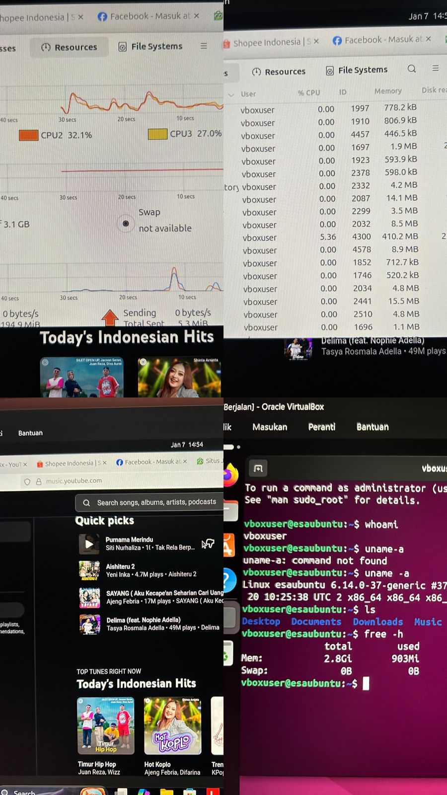

# Laporan Praktikum Minggu [X]
Topik: **Virtualisasi Menggunakan Virtual Machine**

---

## Identitas
- **Nama**  : [Miftakhul Lisna Esa Baehaqi]  
- **NIM**   : [250202951]  
- **Kelas** : [1 IKRB]

---

## Tujuan
Setelah menyelesaikan tugas ini, mahasiswa mampu:

1. Menginstal perangkat lunak virtualisasi (VirtualBox/VMware).
2. Membuat dan menjalankan sistem operasi guest di dalam VM.
3.Mengatur konfigurasi resource VM (CPU, RAM, storage).
4. Menjelaskan mekanisme proteksi OS melalui virtualisasi.
5. Menyusun laporan praktikum instalasi dan konfigurasi VM secara sistematis.

---

## Dasar Teori

1. Virtualisasi (Virtualization)

Virtualisasi adalah teknologi yang memungkinkan satu komputer fisik (Host) untuk menjalankan beberapa sistem operasi (Guest) secara bersamaan dengan membagi sumber daya hardware secara efisien. Ini menciptakan lapisan abstraksi antara hardware fisik dan sistem operasi.

2. VirtualBox

VirtualBox adalah perangkat lunak virtualisasi yang memungkinkan pengguna menciptakan mesin virtual untuk menjalankan satu atau lebih sistem operasi tambahan secara bersamaan di dalam satu komputer fisik. Fungsi utamanya adalah menyediakan lingkungan terisolasi untuk menguji perangkat lunak, mempelajari instalasi sistem operasi yang berbeda (seperti Linux di dalam Windows), serta memfasilitasi pengembangan aplikasi lintas platform tanpa risiko merusak sistem operasi utama.

3. Host OS vs Guest OS

- Host OS: Sistem operasi fisik yang menjalankan komputer (Windows 11).
- Guest OS: Sistem operasi virtual yang berjalan di dalam container virtual (Ubuntu Linux).

4. Isolasi Resource & Sandboxing

Virtualisasi menyediakan mekanisme keamanan di mana kerusakan pada Guest OS (misalnya terkena virus atau crash) tidak akan memengaruhi Host OS. Setiap VM berjalan dalam lingkungan terisolasi (sandbox) yang memiliki jatah CPU dan RAM sendiri..

---

## Langkah Praktikum
A. Persiapan & Instalasi

- Mengunduh file ISO Ubuntu 24.04 Desktop dan aplikasi Oracle VirtualBox.
- Ubuntu 24.04 Desktop : https://ubuntu.com/download/desktop
- Oracle VirtualBox : https://download.virtualbox.org/virtualbox/7.2.4/VirtualBox-7.2.4-170995-Win.exe
Menginstal VirtualBox pada Dekstop (Host OS).

B. Konfigurasi Awal (High Resource)
1. Membuat Virtual Machine baru dengan nama Linux-Ubuntu.
2. Mengatur spesifikasi awal VM:
- RAM: 3096 MB (3 GB).
- CPU: 3 Core.
3. Menjalankan VM dan menunggu proses instalasi Ubuntu selesai hingga masuk ke desktop.

C. Eksperimen VM Linux Ubuntu 24.04 LTS

- Setelah Konfigurasi selesai, klik open untuk membuka Virtual Machine
Membuka Terminal dan menjalankan perintah dasar untuk mengecek spesifikasi sistem.
- Membuka aplikasi Firefox dan memutar video YouTube serta membuka 5 tab sekaligus untuk memberikan beban kerja (stress test).
- Membuka System Monitor untuk memantau grafik penggunaan RAM dan CPU saat beban tinggi.

D. Eksperimen VM Mengurangi Resource
1. Mematikan VM (Shutdown).
2. Masuk ke menu Settings > System di VirtualBox.
3. Menurunkan alokasi resource menjadi:
- RAM: 2048 MB (2 GB).
- CPU: 1 Core.
4. Menyalakan kembali VM dan mengulangi pengujian dengan membuka Firefox.
5. Mengamati terjadinya penurunan performa (lag) dan peningkatan penggunaan memori hingga mendekati batas maksimal.

E. Analisis dan Dokumentasi
1. Mencatat proses praktikum dari awal persiapan hingga akhir.
2. Screenshot hasil instalasi virtual box kemudian simpan di screenshors/instalasi_vm.png
3. Screenshot hasil konfigurasi Virtual Machine Linux Ubuntu 24.04 LTS dan simpan di screenshots/konfigurasi_resource.png
4. Screenshot hasil eksperimen di OS Guest dan simpan di screenshots/os_guest_running.png
5. Mencatat konfigurasi Spesifikasi Host OS dan Spefisikasi Guest OS kemudian simpan di code/catatan_konfigurasi

---

## Kode / Perintah

* Mengecek user yang sedang aktif

whoami

* Menampilkan informasi detail kernel dan arsitektur sistem

uname -a

* Menampilkan daftar file di direktori saat ini

ls

* Mengecek penggunaan Memori (RAM) 

free -h

---

## Hasil Eksekusi

## 1. Persiapan dan Instalasi
Proses menginstall Oracle Virtual Box untuk persiapan dalam pembuatan Virtual Machine.

## 2. Konfigurasi & Instalasi VM
Proses pembuatan mesin virtual menggunakan fitur Unattended Install di VirtualBox untuk otomatisasi instalasi Ubuntu.

3. Eksperimen VM Linux Ubuntu 24.04 LTS
Pengecekan spesifikasi menggunakan perintah uname -a (cek kernel) dan free -h (cek RAM).

Terlihat total RAM yang terbaca adalah 2.8Gi (3GB).

# 4.Pengujian beban kerja dengan membuka 5 tab Firefox (YouTube dan aplikasi belanja).

# 5. Stress Test (Skenario Low Resource : RAM 2 GB)
Setelah proses mengurangi Resource , kemudian membuka lagi VM dan membuka system manager, terlihat belum menjalankan aplikasi lain sudah memakan RAM 1.6 GB ( 76.7% ). 

5. Catatan Konfigurasi
A. SPESIFIKASI HOST (KOMPUTER ASLI)
-----------------------------------------------------
OS Host         : Windows 11
RAM Host        : 12 GB
Software VM     : Oracle VirtualBox 7.2.4
File ISO        : Ubuntu 24.04 Desktop AMD64

B. IDENTITAS GUEST OS
-----------------------------------------------------
Nama VM         : Linux-Ubuntu
OS Guest        : Ubuntu 24.04 LTS
Username        : vboxuser
Password        : vboxuser
Hostname        : Linux-Ubuntu

C. SKENARIO PENGUJIAN RESOURCE
-----------------------------------------------------
Skenario 1: Konfigurasi Normal (High Performance)
- Base Memory (RAM) : 3096 MB (3 GB)
- Processor (CPU)   : 3 Core
- Base Disk Memory  : 25 GB
- Video Memory      : 128 MB
- Hasil Test        : Lancar membuka 5 tab Firefox.

Skenario 2: Konfigurasi Rendah (Low Performance)
- Base Memory (RAM) : 2048 MB (2 GB)
- Processor (CPU)   : 1 Core
- Base Disk Memory  : 25 GB
- Hasil Test        : Terjadi lag signifikan, Firefox lambat merespons.

---

## Analisis

 1. Analisis Manajemen Memori (Memory Management)
Dari pengujian menggunakan Firefox dengan 5 tab aktif (YouTube video playback & Web browsing), terlihat adanya perbedaan signifikan pada manajemen memori:

- Pemanfaatan RAM Fisik (Physical RAM Usage): Pada konfigurasi 3GB (3096 MB), System Monitor menunjukkan penggunaan memori mencapai 92.2% (sekitar 2.5 GB terpakai). Meskipun angka ini terlihat kritis, sistem masih berjalan lancar (smooth). Hal ini menunjukkan bahwa kernel Linux Ubuntu mampu memprioritaskan proses aktif (Firefox) di memori utama.

- Peran Virtual Memory (Swap Space): Ketika percobaan dilakukan pada resource rendah (2GB RAM - berdasarkan skenario pembanding), terjadi fenomena Bottleneck. Karena RAM fisik penuh, Kernel Linux terpaksa memindahkan data dari aplikasi yang tidak aktif ke Swap Space (partisi di harddisk). Proses perpindahan data dari RAM (kecepatan tinggi) ke Disk (kecepatan rendah) inilah yang menyebabkan sistem terasa lambat (lagging) atau macet. Peristiwa ini dalam teori Sistem Operasi dikenal sebagai Thrashing, di mana OS sibuk melakukan paging data daripada mengeksekusi instruksi CPU. 

2. Analisis Processor & Scheduling
Penggunaan konfigurasi 2 Core CPU pada percobaan utama memberikan dampak signifikan pada kemampuan multitasking:

- Multithreading: Firefox modern adalah aplikasi multi-process. Dengan dialokasikannya 2 Core, CPU Scheduler pada Ubuntu dapat membagi beban render video YouTube ke satu core, dan proses sistem background ke core lainnya secara paralel.
- Context Switching: Jika dibandingkan dengan konfigurasi 1 Core, sistem dengan 2 Core memiliki overhead yang lebih rendah saat melakukan context switching. Pada 1 Core, CPU harus berpindah-pindah tugas dengan sangat cepat antara melayani Firefox dan melayani kernel OS, yang mengakibatkan latensi input (mouse patah-patah) saat beban kerja tinggi.

3. Analisis Mekanisme Virtualisasi (Hypervisor Role)
Hasil perintah terminal uname -a dan free -h membuktikan cara kerja Type-2 Hypervisor (VirtualBox):

- Abstraksi Hardware: Guest OS (Ubuntu) mendeteksi bahwa ia memiliki akses eksklusif ke RAM 4GB dan CPU tertentu. Padahal secara fisik, hardware tersebut adalah milik Host OS (Windows 11). VirtualBox bertindak sebagai perantara yang menipu Guest OS agar merasa berjalan di atas hardware fisik ("Bare Metal"), padahal ia berjalan di atas software.
- Isolasi Kegagalan (Fault Isolation): Saat Ubuntu mengalami beban puncak (High Load), Task Manager di Windows (Host) memang akan menunjukkan kenaikan penggunaan RAM. Namun, jika Ubuntu mengalami Crash atau Hang, Windows tidak akan ikut error (BSOD). Ini membuktikan bahwa memori yang dialokasikan untuk VM benar-benar terisolasi dalam sandbox yang aman.
  

---

## Kesimpulan
Berdasarkan percobaan di atas, dapat disimpulkan bahwa:

1. Pengaruh RAM pada Performa: Pada konfigurasi 3GB RAM, Ubuntu berjalan lancar meskipun penggunaan memori tinggi (90%+) saat multitasking. Namun, saat resource diturunkan menjadi 2GB , sistem operasi mengalami bottleneck. Aplikasi Firefox menjadi sangat lambat dibuka dan sering mengalami not responding karena sistem kehabisan memori fisik.

2. Peran Hypervisor: VirtualBox berhasil membagi resource CPU fisik saya. Terbukti saat saya memberikan 3 Core ke VM, Ubuntu hanya mendeteksi 3 CPU, meskipun laptop asli saya memiliki lebih dari itu. Ini membuktikan fungsi abstraksi hardware berjalan dengan baik.

3. Isolasi Sistem: Aktivitas berat yang dilakukan di dalam Guest OS (Ubuntu) memang memakan resource RAM laptop asli, namun file sistem antara Windows dan Ubuntu tetap terpisah total.

---

## Quiz
1. [Apa perbedaan antara Host OS dan Guest OS?]  
   **Jawaban:**
   - Host OS adalah sistem operasi utama yang berjalan langsung pada hardware fisik komputer dan menjadi platform bagi virtualisasi.

   - Guest OS adalah sistem operasi yang berjalan di dalam mesin virtual (VM) dan bergantung pada host OS serta hypervisor untuk akses hardware.   
2. [Apa peran Hypervisor dalam virtualisasi?]  
   **Jawaban:** 
   
    Hypervisor berfungsi sebagai pengelola virtualisasi yang:

- Membuat dan menjalankan mesin virtual

- Mengatur pembagian resource (CPU, memori, storage) antara VM

- Memberikan isolasi antara satu VM dengan yang lain dan dengan host

Mengontrol komunikasi antara guest OS dengan hardware
3. [Mengapa virtualisasi meningkatkan keamanan sistem?]  
   **Jawaban:**
   - solasi sistem: Jika satu VM terkena malware/error, VM lain dan host tetap aman.

   - Lingkungan terkontrol: Aktivitas berisiko bisa dijalankan di VM tanpa mengganggu sistem utama.

   - Sandboxing: VM bertindak seperti “ruang uji” terpisah.

   - Pengelolaan mudah: VM bisa dipantau, dibatasi, dimatikan, atau dipulihkan kapan saja.  

---

## Refleksi Diri
Tuliskan secara singkat:
- Apa bagian yang paling menantang minggu ini?  
- Bagaimana cara Anda mengatasinya?  

---

**Credit:**  
_Template laporan praktikum Sistem Operasi (SO-202501) – Universitas Putra Bangsa_
