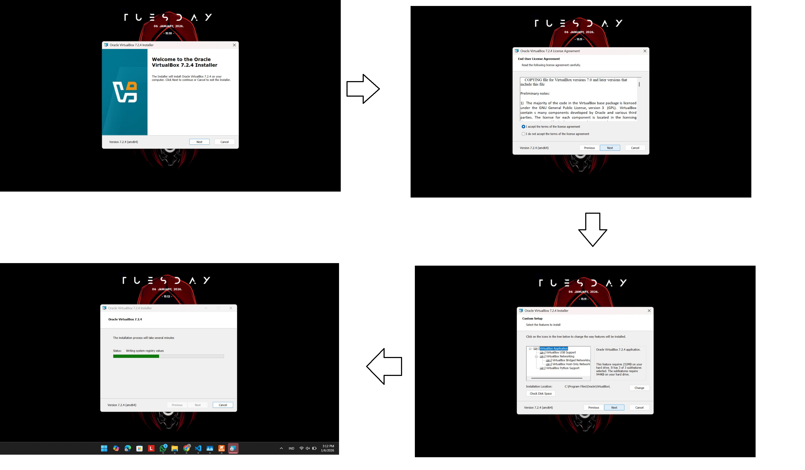
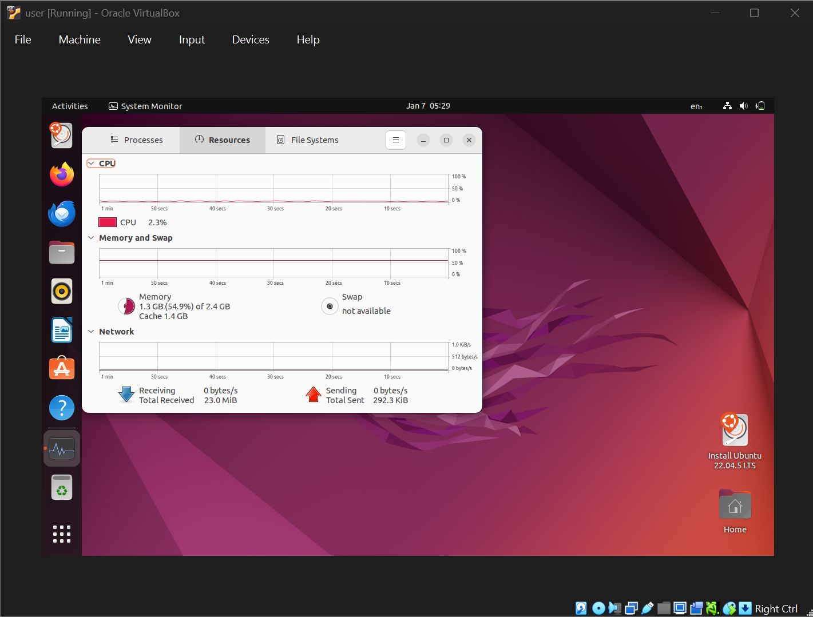

# Laporan Praktikum Minggu 12
Topik: Virtualisasi Menggunakan Virtual Machine  

---

## Identitas
- **Nama**  : 
1. Lintang Galih P./250202946 (Instalasi dan dokumentasi)
              
2. Nanang Apriyanto/250202957 (Quiz dan analisis)
              
3. Rizky Iqbal H./250202926 (Penyusun laporan)

- **Kelas** : 1IKRA

---

## Tujuan
Setelah menyelesaikan tugas ini, mahasiswa mampu:
1. Menginstal perangkat lunak virtualisasi (VirtualBox/VMware).  
2. Membuat dan menjalankan sistem operasi guest di dalam VM.  
3. Mengatur konfigurasi resource VM (CPU, RAM, storage).  
4. Menjelaskan mekanisme proteksi OS melalui virtualisasi.  
5. Menyusun laporan praktikum instalasi dan konfigurasi VM secara sistematis.

---

## Dasar Teori
- Virtualisasi adalah metode untuk menyediakan sebuah guest (sistem tamu) dengan salinan dari perangkat keras dasar suatu sistem. 
- Beberapa guest dapat berjalan pada satu sistem yang sama, dan masing-masing menganggap bahwa dirinya adalah sistem operasi asli serta memiliki kendali penuh atas sistem tersebut.
- Virtualisasi awalnya dikembangkan sebagai metode bagi IBM untuk memisahkan pengguna dan menyediakan lingkungan eksekusi masing-masing pada komputer mainframe IBM. Sejak saat itu, berkat peningkatan kinerja sistem dan CPU serta teknik perangkat lunak yang inovatif, virtualisasi menjadi fitur umum di pusat data dan bahkan pada komputer pribadi. Karena popularitasnya, para perancang CPU menambahkan fitur khusus untuk mendukung virtualisASI
---

## Langkah Praktikum
1. **Sesuaikan struktur folder repo:**
```
praktikum/week12-virtual-machine/
├─ code/
│  └─ catatan_konfigurasi.txt (opsional)
├─ screenshots/
│  ├─ instalasi_vm.png
│  ├─ konfigurasi_resource.png
│  └─ os_guest_running.png
└─ laporan.md
```
2. **Instalasi Virtual Machine**
   - Instal VirtualBox atau VMware pada komputer host.  
   - Pastikan fitur virtualisasi (VT-x / AMD-V) aktif di BIOS.

3. **Pembuatan OS Guest**
   - Buat VM baru dan pilih OS guest (misal: Ubuntu Linux).  
   - Atur resource awal:
     - CPU: 1–2 core  
     - RAM: 2–4 GB  
     - Storage: ≥ 20 GB

4. **Instalasi Sistem Operasi**
   - Jalankan proses instalasi OS guest sampai selesai.  
   - Pastikan OS guest dapat login dan berjalan normal.

5. **Konfigurasi Resource**
   - Ubah konfigurasi CPU dan RAM.  
   - Amati perbedaan performa sebelum dan sesudah perubahan resource.

6. **Analisis Proteksi OS**
   - Jelaskan bagaimana VM menyediakan isolasi antara host dan guest.  
   - Kaitkan dengan konsep *sandboxing* dan *hardening* OS.

7. **Dokumentasi**
   - Ambil screenshot setiap tahap penting.  
   - Simpan di folder `screenshots/`.

8. **Commit & Push**
   ```bash
   git add .
   git commit -m "Minggu 12 - Virtual Machine"
   git push origin main
   ```


---

## Hasil Eksekusi
Screenshot hasil percobaan atau diagram:

1. Proses instalasi:


2. Proses konfigurasi virtual machine:


3. OS Guest running dengan konfigurasi cpu 1 core, RAM 2 GB, penyimpanan 20 GB:



---

## Analisis
- Bagaimana VM menyediakan isolasi antara host dan guest?
   
   VM menyediakan isolasi melalui Hypervisor yang bertindak sebagai perantara untuk memisahkan sumber daya antara guest dan host. Isolasi ini dilakukan dengan membatasi hak akses, memisahkan ruang alamat memori agar guest tidak bisa mengakses memori host sehingga seluruh aktivitas guest terpisah dalam lingkungan virtual yang terisolasi sepenuhnya dari sistem utama.  
- Kaitannya dengan konsep *sandboxing* dan *hardening* OS?

   VM adalah bentuk sandboxing tingkat tinggi yang mereplikasi seluruh perangkat keras. Hal ini membuat wadah isolasi total, segala aktivitas berbahaya atau malware di dalam guest akan terkurung dan tidak bisa melakukan perubahan ke sistem host.
   *Hardening OS* Virtual Machine (VM) berfungsi sebagai lapisan keamanan tambahan (additional security layer) yang berkontribusi dalam pengurangan area serangan (attack surface), pembatasan penyebaran ancaman (threat containment), serta mendukung penerapan prinsip-prinsip keamanan, seperti segmentasi sistem dan prinsip least privilege. Melalui mekanisme isolasi yang disediakan oleh teknologi virtualisasi, setiap sistem operasi guest dapat dikonfigurasi dan diamankan secara independen tanpa memengaruhi sistem lain.


---

## Kesimpulan

Dari praktikum ini dapat disimpulkan bahwa:

- Mahasiswa memahami proses instalasi dan konfigurasi mesin virtual serta pengelolaan resource (CPU, RAM, penyimpanan).
- Pengaturan resource VM berdampak langsung pada kinerja guest; pengujian dan penyesuaian diperlukan untuk optimasi.
- Virtualisasi menyediakan isolasi efektif antara host dan guest, sehingga berguna untuk keamanan, pengujian, dan pengembangan.


---

## Quiz
1. Apa perbedaan antara host OS dan guest OS?  
   **Jawaban:** Perbedaan Host OS dan Guest OS terletak pada peran dan tingkat akses terhadap perangkat keras. Host OS merupakan sistem operasi utama yang berjalan langsung di atas perangkat keras fisik dan bertugas mengelola sumber daya serta menjalankan perangkat lunak virtualisasi. Sementara itu, Guest OS adalah sistem operasi yang berjalan di dalam Virtual Machine dan mengakses sumber daya perangkat keras secara tidak langsung melalui hypervisor, sehingga tetap bersifat mandiri dan terisolasi dari sistem lain. Dengan demikian, Host OS dapat dipahami sebagai komputer fisik, sedangkan Guest OS berperan sebagai komputer virtual yang berjalan di dalam komputer tersebut / konsep komputer di dalam komputer.
2. Apa peran hypervisor dalam virtualisasi?  
   **Jawaban:** Hypervisor berperan sebagai pengelola utama dalam virtualisasi yang mengatur, membagi, dan mengawasi penggunaan sumber daya perangkat keras sehingga beberapa sistem operasi dapat berjalan secara bersamaan pada satu komputer fisik. Selain itu, hypervisor menjaga isolasi antar sistem operasi agar masing-masing sistem operasi tetap berjalan secara mandiri dan aman.
3. Mengapa virtualisasi meningkatkan keamanan sistem?  
   **Jawaban:** Virtualisasi meningkatkan keamanan sistem karena menyediakan mekanisme isolasi ntara sistem operasi satu sama lain. Setiap sistem operasi berjalan dalam lingkungan virtual yang terpisah, sehingga gangguan, kesalahan, atau serangan pada satu Virtual Machine tidak secara langsung memengaruhi sistem lain maupun sistem host.
   
---

## Refleksi Diri
Tuliskan secara singkat:
- Apa bagian yang paling menantang minggu ini?  
- Bagaimana cara Anda mengatasinya?  

---

**Credit:**  
_Template laporan praktikum Sistem Operasi (SO-202501) – Universitas Putra Bangsa_
