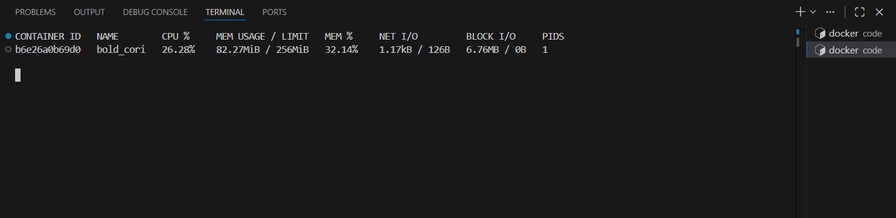

# Laporan Praktikum Minggu 13
Topik: Docker – Resource Limit (CPU & Memori)

---

## Identitas
- **Nama**  : Rizky Iqbal Hisyam 
- **NIM**   : 250202926  
- **Kelas** : 1IKRA

---

## Tujuan
Setelah menyelesaikan tugas ini, mahasiswa mampu:
1. Menulis Dockerfile sederhana untuk sebuah aplikasi/skrip.
2. Membangun image dan menjalankan container.
3. Menjalankan container dengan pembatasan **CPU** dan **memori**.
4. Mengamati dan menjelaskan perbedaan eksekusi container dengan dan tanpa limit resource.
5. Menyusun laporan praktikum secara runtut dan sistematis.

---

## Dasar Teori
Docker merupakan teknologi containerization yang memungkinkan aplikasi dijalankan dalam lingkungan terisolasi dengan memanfaatkan kernel sistem operasi host. Docker menyediakan fitur pembatasan resource seperti CPU dan memori untuk mencegah satu container menghabiskan seluruh sumber daya sistem (Docker Documentation). Pembatasan ini diimplementasikan menggunakan mekanisme kernel Linux, yaitu control groups (cgroups) yang berfungsi membatasi dan memantau penggunaan resource, serta namespaces yang menyediakan isolasi lingkungan proses antar container (Linux Kernel Documentation). Dalam konteks manajemen resource sistem operasi, container termasuk bentuk virtualisasi tingkat sistem operasi yang lebih ringan dibandingkan virtual machine karena tidak memerlukan sistem operasi terpisah, sehingga lebih efisien namun tetap membutuhkan pembatasan resource untuk menjaga stabilitas dan keadilan penggunaan sistem (OSTEP).

---

## Langkah Praktikum
1. Sesuaikan struktur folder seperti berikut:
   ```
   praktikum/week13-docker-resource-limit/
   ├─ code/
   │  ├─ Dockerfile
   │  └─ app.*
   ├─ screenshots/
   │  └─ hasil_limit.png
   └─ laporan.md
   ```
2. Siapkan Docker dan pastikan sudah berjalan:
   Verifikasi:
     ```bash
     docker version
     docker ps
     ```
3. Buat program sederhana di folder `code/` (bahasa bebas) yang:
   - Melakukan komputasi berulang (untuk mengamati limit CPU), dan/atau
   - Mengalokasikan memori bertahap (untuk mengamati limit memori).
4. Buat Dockerfile
   - Tulis `Dockerfile` untuk menjalankan program uji.
   - Build image:
     ```bash
     docker build -t week13-resource-limit .
     ```
5. Jalankan container normal:
     ```bash
     docker run --rm week13-resource-limit
     ```
   Catat output/hasil pengamatan.
6. Jalankan container dengan batasan resource (contoh):
   ```bash
   docker run --rm --cpus="0.5" --memory="256m" week13-resource-limit
   ```
   Catat perubahan perilaku program (mis. lebih lambat, error saat memori tidak cukup, dll.).
7. Commit & Push

   ```bash
   git add .
   git commit -m "Minggu 13 - Docker Resource Limit"
   git push origin main
   ```


---

## Kode / Perintah
Kode program:
```
   import time

   data = []
   i = 0

   print("Program berjalan...")
   while True:
      for _ in range(10_000_000):
         pass

      data.append("X" * 10_000_000)
      i += 1
      print(f"Iterasi {i}, alokasi memori ~ {i * 10} MB")
      time.sleep(1)
```

---

## Hasil Eksekusi
Berikut hasil running container dengan limit **CPU** dan **memori**:


---

## Analisis
- Hasil pengamatan:   
   | Kondisi | CPU | Memori | Hasil |
   |:---:|:---:|:---:|:---:|
   | Tanpa limit | Tidak dibatasi | Tidak dibatasi | Program berjalan normal, memori terus bertambah |
   | Dengan limit | 0.5 core | 256 MB | Program lebih lambat, container berhenti saat memori habis |

- Pembatasan CPU menyebabkan aplikasi berjalan lebih lambat karena waktu eksekusi dibagi dengan proses lain. Pada saat perintah docker stats dijalankan, tidak terdapat container yang aktif karena container sebelumnya telah berhenti akibat pembatasan memori (OOM Kill). Hal ini menunjukkan bahwa container dengan resource limit memiliki waktu hidup yang singkat.


---

## Kesimpulan
Docker menyediakan mekanisme pembatasan resource yang efektif melalui CPU dan memori limit. Dengan pembatasan ini, penggunaan resource dapat dikontrol sehingga sistem menjadi lebih stabil dan efisien.

---

## Quiz
1. Mengapa container perlu dibatasi CPU dan memori?  
   **Jawaban:**  Agar satu container tidak menghabiskan seluruh resource host dan mengganggu container atau aplikasi lain.
2. Apa perbedaan VM dan container dalam konteks isolasi resource?  
   **Jawaban:**  VM menggunakan virtualisasi hardware dan memiliki OS sendiri, sedangkan container berbagi kernel host dan lebih ringan dalam penggunaan resource.
3. Apa dampak limit memori terhadap aplikasi yang boros memori?  
   **Jawaban:**  Aplikasi dapat melambat, gagal berjalan, atau container dihentikan secara paksa ketika melebihi batas memori.


---

## Refleksi Diri
Tuliskan secara singkat:
- Apa bagian yang paling menantang minggu ini?  Yang paling menantang menurut saya adalah penggunaan docker container untuk pertama kalinya.
- Bagaimana cara Anda mengatasinya?  mempelajari dan mempraktikkan penggunaan docker ini.

---

**Credit:**  
_Template laporan praktikum Sistem Operasi (SO-202501) – Universitas Putra Bangsa_
