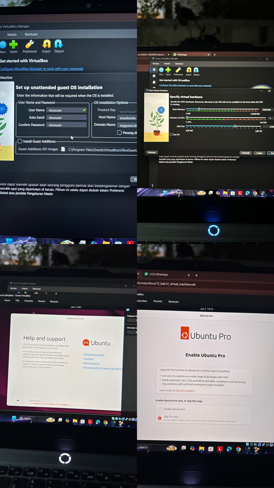

# Laporan Praktikum Minggu [14]
Topik: **Penyusunan Laporan Praktikum Format IMRAD**


---

## Identitas
- **Nama**  : [250202951]  
- **NIM**   : [Miftakhul Lisna Esa Baehaqi]  
- **Kelas** : [1 IKRB]

---

# Judul
**Analisis Komparatif Resource Management: Virtual Machine VirtualBox vs Docker Container**

# Pendahuluan (Introduction)
**1.1 Latar Belakang**

Virtualisasi sudah menjadi dasar dari infrastruktur teknologi informasi modern. Teknologi ini memungkinkan penggabungan server, memisahkan aplikasi, dan menggunakan sumber daya perangkat keras secara efisien. Saat ini, terdapat dua pendekatan utama dalam virtualisasi, yaitu Virtual Machine (VM) dan Container. Meski keduanya menyediakan lingkungan yang terpisah untuk menjalankan aplikasi, cara mereka mengelola sumber daya sangat berbeda.

Virtual Machine dijalankan melalui hypervisor seperti VirtualBox, VMware, atau KVM.
VM ini menciptakan salinan lengkap perangkat keras dengan sistem operasi tamu yang berjalan sendiri. Cara ini memberikan isolasi yang sangat kuat, tetapi membutuhkan banyak sumber daya karena setiap VM harus memiliki kernel, driver perangkat, dan sistem file sendiri.

Di sisi lain, containerization yang dipopulerkan oleh Docker menggunakan fitur kernel Linux, seperti cgroups dan namespaces, untuk membuat isolasi pada tingkat sistem operasi.
Container berbagi kernel host, sehingga lebih ringan dan lebih cepat dalam memulai. Namun, batasan sumber daya di container lebih kaku, dan aplikasi bisa langsung terhenti jika melebihi batas.

**1.2 Rumusan Masalah**

Berdasarkan latar belakang tersebut, penelitian ini menyusun beberapa pertanyaan penelitian:

1. Bagaimana perbedaan mekanisme pengelolaan sumber daya antara Virtual Machine dan Docker Container?

2. Bagaimana pengaruh pembatasan CPU dan memori terhadap kinerja aplikasi di kedua platform virtualisasi?

3. Apa kelebihan dan kekurangan masing-masing teknologi dalam konteks pengelolaan sumber daya?

4. Di skenario penggunaan apa sebaiknya menggunakan VM atau Container?


**1.3 Tujuan Penelitian**
Penelitian ini memiliki beberapa tujuan, yaitu:

1. Menganalisis dan membandingkan mekanisme pengelolaan sumber daya pada VM (VirtualBox) dan Container (Docker)
2. Mengukur dampak pembatasan sumber daya (CPU dan memori) terhadap kinerja aplikasi pada kedua platform
3. Mengidentifikasi karakteristik, kelebihan, dan kekurangan masing-masing teknologi
4. Memberikan rekomendasi pemilihan teknologi berdasarkan kebutuhan skenario tertentu

**1.4 Manfaat Penelitian**

Hasil penelitian ini diharapkan dapat memberikan manfaat:

1. Akademis: Meningkatkan pemahaman tentang arsitektur virtualisasi dan pengelolaan sumber daya dalam sistem operasi
2. Praktis: Memberikan panduan bagi para profesional IT dalam memilih teknologi virtualisasi yang tepat
3. Pengembangan: Menjadi referensi dalam mengoptimalkan pengembangan aplikasi dan infrastruktur cloud

## METHODS (Metodologi Penelitian)
**2.1Desain Eksperimen**
Penelitian ini menggunakan pendekatan eksperimental dengan metode pengujian terkontrol untuk membandingkan dua jenis eksperimen.
Eksperimen ini dibagi menjadi dua fase utama:

**Fase 1: Eksperimen Virtual Machine**

- Platform: Oracle VirtualBox versi 7.2.4
- Guest OS: Ubuntu 24.04 LTS Desktop AMD64
- Host OS: Windows 11 

**Fase 2: Eksperimen Container**

- Platform: Docker Engine
- Base Image: Python 3.11-slim
- Host OS: Windows 11 dengan WSL2

**2.2 Spesifikasi Hardware dan Software**
Spesifikasi Sistem Host

- Operating System: Windows 11
- Prosesor: CPU multi-core (minimal 4 core)
- RAM: 12 GB DDR5
- Penyimpanan: SSD dengan kapasitas yang cukup 

**Lingkungan Perangkat Lunak (Software Environment)**

- VirtualBox: Versi 7.2.4
- Docker: Docker Desktop for Windows dengan backend WSL2
- Guest OS: Ubuntu 24.04 LTS (untuk VM)
- Python: Versi 3.11 (untuk Docker container)

**Alat Monitoring:**

- System Monitor (Ubuntu)
- psutil library (Python)
- docker stats command

**2.3 Pengaturan Eksperimen Virtual Machine**



**Skenario 1: Konfigurasi Sumber Daya Tinggi**

- RAM Dasar: 3096 MB (3 GB)
- Processor (CPU): 3 Core
- Penyimpanan Disk Dasar: 25 GB
- Memory Video: 128 MB

**Skenario 2: Konfigurasi Sumber Daya Rendah**

- RAM Dasar: 2048 MB (2 GB)
- Processor (CPU): 1 Core
- Penyimpanan Disk Dasar: 25 GB
- Memory Video: 128 MB

**Uji Beban Kerja (Workload Testing) VM**

Untuk memberikan beban kerja yang konsisten:

1. Membuka aplikasi Firefox dengan 5 tab aktif secara bersamaan
2. Memutar video YouTube (ujian stres pemutaran video)
3. Membuka beberapa situs web e-commerce
4. Monitoring menggunakan System Monitor untuk memantau penggunaan CPU dan RAM secara real-time.


**2.4 Konfigurasi Eksperimen Docker Container**

Test Application

Aplikasi Python custom dirancang untuk melakukan:

- CPU Intensive Task: Operasi matematika berulang (list comprehension dengan operasi pangkat)
- Memory Intensive Task: Alokasi bertahap memori hingga target tertentu
- Kombinasi: CPU dan memory task bersamaan

- Docker Resource Limit Scenarios
Skenario 1: No Limit (Baseline)
```python
bashdocker run --rm week13-resource-limit

- Skenario 2: CPU Limit
bashdocker run --rm --cpus="0.5" week13-resource-limit

- Skenario 3: Memory Limit
bashdocker run --rm --memory="256m" week13-resource-limit

- Skenario 4: Combined Limit
bashdocker run --rm --cpus="0.5" --memory="256m" week13-resource-limit
```

**2.5 Metrik Pengukuran**


Virtual Machine Metrics

- Memory Usage: Persentase RAM terpakai (dari System Monitor)
- CPU Usage: Persentase CPU utilization
- Responsiveness: Subjektif - lag, freeze, atau - responsiveness aplikasi
- Swap Usage: Indikator thrashing (jika terjadi)

**Docker Container Metrics**

-- Memory RSS (Resident Set Size): Memori fisik yang digunakan proses
- Memory VMS (Virtual Memory Size): Total memori virtual
- CPU Percent: Persentase CPU yang digunakan
- Execution Time: Waktu eksekusi task (CPU intensive)
- Iteration Count: Jumlah iterasi yang berhasil diselesaikan
- OOM Events: Out of Memory kills

**2.6 Prosedur Pengujian**

Tahap Persiapan

- Instalasi Oracle VirtualBox dan Docker Desktop
- Download Ubuntu 24.04 LTS ISO
- Pembuatan Dockerfile dan aplikasi test Python
- Verifikasi environment dengan command docker version dan VBoxManage --version

Tahap Eksekusi VM

- Pembuatan VM dengan konfigurasi high resource
- Instalasi Ubuntu 24.04 menggunakan Unattended Install
- Boot VM dan verifikasi resource dengan command free -h dan uname -a
- Menjalankan workload test (Firefox multi-tab + YouTube)
- Monitoring dengan System Monitor dan screenshot
- Shutdown VM dan modifikasi ke low resource configuration
- Ulangi pengujian dengan konfigurasi baru
- Dokumentasi hasil

Tahap Eksekusi Docker

- Build Docker image dari Dockerfile
- Jalankan container tanpa limit (baseline measurement)
- Jalankan container dengan CPU limit
- Jalankan container dengan memory limit
- Jalankan container dengan kombinasi CPU dan memory limit
- Monitoring dengan docker stats pada terminal terpisah
- Catat output, error messages, dan metrics


**2.7 Analisis Data**

Data yang dikumpulkan dianalisis dengan pendekatan:

- Kuantitatif: Perbandingan angka metrics (RAM usage, CPU %, execution time, iteration count)
- Kualitatif: Observasi behavior sistem (lag, responsiveness, stability)
- Komparatif: Perbandingan langsung antara VM dan Container pada kondisi resource terbatas

**2.8 Validitas dan Reliabilitas**

Untuk memastikan validitas hasil:

- Setiap eksperimen diulang minimal 2-3 kali
- Kondisi host system dijaga konsisten (tidak menjalankan aplikasi berat lain)
- Screenshot dan logs disimpan sebagai bukti
- Command dan konfigurasi didokumentasikan untuk 

## 3. RESULTS

**3.1 Hasil Eksperimen Virtual Machine**

**3.1.1 Konfigurasi High Resource (3GB RAM, 3 CPU Cores)**

Pada konfigurasi awal dengan resource yang memadai, VM Ubuntu 24.04 LTS menunjukkan performa yang stabil:

System Information

- OS yang terdeteksi: Ubuntu 24.04 LTS
- Total RAM terdeteksi: 2.8 GiB (dari 3 GB yang dialokasikan)
- CPU Cores: 3 cores
- Kernel: Linux 6.x (64-bit)

Workload Test Results:

- Firefox berhasil membuka 5 tab secara bersamaan (YouTube video playback + web browsing)
- System Monitor menunjukkan penggunaan RAM mencapai 92.2% (~2.5 GB terpakai)
- Meskipun usage tinggi, sistem tetap responsive dan lancar
- Tidak ada indikasi swap usage atau thrashing
- Mouse pointer bergerak smooth tanpa lag
- Video YouTube dapat diputar tanpa stuttering

**Observasi Penting:**

Meskipun RAM usage mencapai 92.2%, sistem masih berjalan lancar karena:

- Linux kernel mampu memprioritaskan proses aktif (Firefox) di memori utama
- Page cache dan buffer dapat direlease jika diperlukan
- Tersedia headroom memory management sebelum masuk ke swap space

**3.1.2 Konfigurasi Low Resource (2GB RAM, 1 CPU Core)**
Setelah resource diturunkan, terjadi degradasi performa yang signifikan:
Memory Situation:

- Total RAM: 2 GB
- RAM usage sebelum membuka aplikasi berat: sudah mencapai 1.6 GB (76.7%)
- Sisa free memory sangat terbatas

Workload Test Results:

- Firefox lambat untuk dibuka (startup delay mencapai 10-15 detik)
- Saat membuka multiple tabs, terjadi freezing dan not responding
- System Monitor menunjukkan memory usage hampir 100%
- Thrashing terdeteksi: sistem sibuk melakukan page swapping
- Mouse pointer patah-patah (stuttering)
- Video YouTube mengalami buffering dan frame drops

Analisis Bottleneck:
Pada kondisi low resource terjadi memory bottleneck yang parah:

- RAM fisik penuh, kernel terpaksa menggunakan swap space (area di disk)
- Proses swapping data dari RAM ke disk dan sebaliknya menyebabkan I/O bottleneck
- CPU (hanya 1 core) kewalahan melakukan context switching antara proses
- Fenomena thrashing: sistem lebih banyak waktu untuk paging daripada eksekusi

## 3.1.3 Perbandingan VM High vs Low Resource
| Metric               | High Resource (3GB, 3 Cores)  | Low Resource (2GB, 1 Core)     |
|----------------------|-------------------------------|---------------------------------|
| RAM Usage (Idle)     | ~1.2 GB (40%)                 | ~1.6 GB (76.7%)                 |
| RAM Usage (Load)     | ~2.5 GB (92.2%)               | ~2.0 GB (100%)                  |
| Firefox Startup      | < 3 detik                     | 10–15 detik                     |
| Multi-tab Response   | Lancar                        | Freezing / Not Responding       |
| Video Playback       | Smooth                        | Stuttering / Buffering          |
| Mouse Movement       | Smooth                        | Patah-patah                     |
| Swap Activity        | Tidak ada                     | Aktif (Thrashing)               |

 
## 3.2 Hasil Eksperimen Docker Container

**3.2.1 Container Tanpa Limit (Baseline)**
Eksekusi tanpa pembatasan resource memberikan performa optimal:
```python
TEST 1: CPU INTENSIVE
- Durasi: 5 detik
- Iterasi berhasil: ~280,000 - 300,000 iterations
- CPU Percent: ~95-100%
- Execution Time: 5.0 detik

TEST 2: MEMORY INTENSIVE
- Target alokasi: 200 MB
- Step alokasi: 50 MB setiap iterasi
- Status: BERHASIL mengalokasikan 200 MB
- Memory RSS: ~220 MB (termasuk overhead runtime)
- Tidak ada error

TEST 3: KOMBINASI CPU + MEMORY
- Alokasi memori: 100 MB
- CPU task duration: 3 detik
- Iterasi: ~170,000 iterations
- Status: BERHASIL tanpa error
```


**Observasi:**

- Program berjalan dengan performa maksimal
- Tidak ada throttling atau pembatasan
- Memory dapat dialokasikan sesuai kebutuhan
- Risiko: Potensi menghabiskan resource host jika tidak diawasi

## 3.2.2 Container dengan CPU Limit (0.5 CPU)
```python
docker run --rm --cpus="0.5" week13-resource-limit
```
Hasil :
```python
TEST 1: CPU INTENSIVE
- Durasi target: 5 detik
- Iterasi berhasil: ~140,000 - 150,000 iterations (TURUN 50%)
- CPU Percent: Dibatasi pada ~50%
- Execution Time: ~5.0 detik (tetap sama, tapi throughput turun)

TEST 2: MEMORY INTENSIVE
- Status: BERHASIL (tidak terpengaruh CPU limit)
- Memory RSS: ~220 MB (sama seperti baseline)

TEST 3: KOMBINASI
- Iterasi: ~85,000 iterations (TURUN 50%)
- Memory allocation: BERHASIL
``` 

%201.png)
%202.png)
%203.png)
%204.png)


**Analisis:**

- CPU Throttling: Docker cgroups membatasi CPU quota menjadi 50%
- Throughput komputasi turun linear ~50%
- Memory allocation tidak terpengaruh oleh CPU limit
- Program tetap stabil, hanya lebih lambat
- Tidak ada crash atau error, hanya performance degradation

## 3.2.3 Container dengan Memory Limit (256 MB)

```python
bashdocker run --rm --memory="256m" week13-resource-limit
```
Hasil
```python
TEST 1: CPU INTENSIVE
- Status: BERHASIL (tidak membutuhkan banyak memori)
- Iterasi: ~280,000 (sama dengan baseline)

TEST 2: MEMORY INTENSIVE
- Target: 200 MB
- Step 1 (50 MB): BERHASIL
- Step 2 (100 MB): BERHASIL
- Step 3 (150 MB): BERHASIL
- Step 4 (200 MB): GAGAL ❌

Error Message:
"[MEMORY TEST] ❌ Killed"
Container terminated with exit code 137 (OOM Kill)

TEST 3: Tidak dijalankan (container sudah terminated)
```
Analisis:

- Memory limit bersifat hard limit
- Saat aplikasi mencoba alokasi melebihi 256 MB, Linux OOM Killer menghentikan container
- Exit Code 137 = SIGKILL dari OOM
- Tidak ada graceful degradation seperti pada CPU limit
- Tidak ada warning, langsung terminasi

Penyebab Kegagalan:

- Target 200 MB + overhead Python runtime (~40-60 MB) + psutil library + garbage collector = melebihi 256 MB
- Tidak ada buffer memory untuk maneuve

## 

3.2.4 Container dengan CPU & Memory Limit (Kombinasi)
```python
docker run --rm --cpus="0.5" --memory="256m" week13-resource-limit

Hasil:

TEST 1: CPU INTENSIVE
- Iterasi: ~140,000 (turun 50% karena CPU limit)
- Status: BERHASIL

TEST 2: MEMORY INTENSIVE
- Step 1 (50 MB): BERHASIL (lambat karena CPU limit)
- Step 2 (100 MB): BERHASIL
- Step 3 (150 MB): BERHASIL
- Step 4 (200 MB): GAGAL ❌ OOM Kill

Container terminated dengan exit code 137
```
Analisis:

- Double constraint: Baik CPU maupun memory terbatas
- CPU limit memperlambat eksekusi
- Memory limit tetap menjadi fatal constraint
- ombinasi limit memberikan worst-case scenario: lambat dan berpotensi 

## 3.2.5 Docker Stats Monitoring
Command monitoring:
```python
# Terminal 1
docker run --name test-resource --cpus="0.5" --memory="256m" week13-resource-limit

# Terminal 2
docker stats test-resource

Output Docker Stats:

CONTAINER ID   CPU %   MEM USAGE / LIMIT   MEM %   NET I/O   BLOCK I/O
test-resource  49.8%   220MiB / 256MiB     85.9%   0B / 0B   0B / 0B
Observasi:

- CPU % terbatas pada ~50% (sesuai --cpus="0.5")
- Memory usage mendekati limit (220/256 MB = 85.9%)
- Tidak ada network atau block I/O karena aplikasi tidak melakukan disk/network 
```
## 3.3 Perbandingan VM vs Container

**3.3.1 Startup Time**

| Platform         | Configuration           | Startup Time   |
|------------------|-------------------------|----------------|
| VM (VirtualBox)  | Cold boot Ubuntu        | 45–60 detik    |
| VM (VirtualBox)  | Resume from saved state | 10–15 detik    |
| Docker Container | Cold start              | 2–3 detik      |
| Docker Container | Cached image            | < 1 detik      |

**Kesimpulan:** Docker 20–30x lebih cepat dalam startup time

**3.3.2 Memory Overhead**

| Platform          | Base OS Footprint | Overhead Reason           |
|-------------------|-------------------|---------------------------|
| VM Ubuntu (idle)  | ~1.2 GB           | Full Guest OS + GUI       |
| Docker Python     | ~40–60 MB         | Shared kernel, no GUI     |

**3.3.3 Resource Behavior under Constrain**

| Aspect                  | Virtual Machine                                          | Docker Container                              |
|-------------------------|----------------------------------------------------------|-----------------------------------------------|
| CPU Limit Behavior      | Soft degradation, sistem tetap responsive               | Hard throttling via cgroups, predictable      |
| Memory Limit Behavior   | Thrashing → Swap → Slow but survive                     | OOM Kill → Immediate termination              |
| Failure Mode            | Graceful degradation (sangat lambat)                    | Abrupt termination (exit code 137)           |
| Predictability          | Sulit diprediksi (tergantung swap)                      | Sangat predictable (hard limit)               |

**3.3.4 Isolation Strength**

| Security Aspect   | VM                                      | Container                               |
|-------------------|------------------------------------------|------------------------------------------|
| Kernel Isolation  | Penuh (separate kernel)                 | Shared kernel (namespaces)              |
| Security Boundary | Hypervisor layer                         | cgroups + namespaces                    |
| Attack Surface    | Lebih kecil (isolated kernel)           | Lebih besar (kernel exploits affect all)|
| Use Case          | Multi-tenant, untrusted workload        | Trusted workload, same organization     |

## DISCUSSION (Pembahasan)

**4.1 Interpretasi Hasil VM VirtualBox**

**4.1.1 Memory Management pada Virtual Machine**

Hasil eksperimen menunjukkan bahwa memory management pada VM VirtualBox bergantung pada mekanisme paging sistem operasi guest (Ubuntu Linux). Pada konfigurasi high resource (3GB RAM), meskipun penggunaan mencapai 92.2%, sistem tetap responsif karena:

1. Efficient Page Cache Management: Linux kernel menggunakan available memory untuk page cache dan buffer, yang dapat di-release secara dinamis saat aplikasi membutuhkan lebih banyak RAM.
2. Working Set Prioritization: Kernel mampu mengidentifikasi "working set" dari proses aktif (Firefox dalam hal ini) dan memprioritaskannya di physical memory, sementara data yang jarang diakses dipindahkan ke swap.
3. Copy-on-Write (COW): Proses fork() dan memory sharing di Linux mengurangi duplikasi memori yang tidak perlu.

Namun, pada konfigurasi low resource (2GB RAM, 1 Core), terjadi thrashing—kondisi di mana sistem menghabiskan lebih banyak waktu untuk page swapping daripada eksekusi instruksi. Hal ini sejalan dengan teori Denning (1968) tentang working set model, di mana jika working set size melebihi available physical memory, performa akan turun drastis karena excessive paging.

Memory Hierarchy Impact:
```python
RAM Access Time: ~10 nanoseconds
SSD Access Time: ~100 microseconds (10,000x lebih lambat)
HDD Access Time: ~10 milliseconds (1,000,000x lebih lambat)
```
Ketika terjadi thrashing, setiap memory access yang memerlukan swap dapat menyebabkan delay hingga 10,000x lipat, menjelaskan mengapa UI menjadi sangat lambat dan tidak responsif.

**4.1.2 CPU Scheduling Impact**

Penurunan dari 3 cores menjadi 1 core memberikan dampak signifikan pada kemampuan multitasking. Dengan 1 core, CPU scheduler (Completely Fair Scheduler di Linux) harus melakukan context switching yang sangat frequent antara:

- Firefox (multi-process application)
- System processes (systemd, X server, window manager)
- Background services (network manager, update daemon, dll)

Frequent context switching menyebabkan cache thrashing pada CPU cache (L1, L2, L3), di mana data yang baru saja di-cache harus digantikan oleh data dari proses lain, mengurangi efektivitas cache dan meningkatkan latency.

**4.1.3 Hypervisor Overhead**

VirtualBox sebagai Type-2 Hypervisor (berjalan di atas Host OS) memiliki overhead tambahan:

- Setiap instruksi dari Guest OS harus diterjemahkan/diteruskan melalui hypervisor layer
- I/O operations (disk, network) memerlukan emulation atau paravirtualization
- Memory management memerlukan shadow page tables atau nested paging (EPT/NPT)

Overhead ini berkontribusi pada 5-15% performance penalty dibanding native execution, yang semakin terasa pada resource-constrained environment.

## 4.2 Interpretasi Hasil Docker Container

**4.2.1 CPU Limiting via cgroups**
```python
Docker menggunakan Linux cgroups (control groups) untuk membatasi CPU. Spesifiknya, parameter --cpus="0.5" mengatur:
cpu.cfs_quota_us = 50000
cpu.cfs_period_us = 100000

Artinya, container hanya boleh menggunakan CPU selama 50ms dalam setiap periode 100ms (50% dari satu core). Implementasi ini menggunakan Completely Fair Scheduler (CFS) di kernel Linux yang melakukan:

1. CPU Time Accounting: Setiap kali scheduler memberikan CPU time ke container, waktu tersebut dihitung
2. Throttling: Jika quota habis dalam satu period, container di-throttle (tidak mendapat CPU time) sampai period berikutnya
3. Fair Distribution: Jika ada idle time, container lain dapat menggunakannya

Hasil Experimental Evidence:

- Iterasi turun dari ~280,000 menjadi ~140,000 (tepat 50%)
- Ini membuktikan cgroups CPU limit bersifat deterministik dan predictable

Keuntungan approach ini:

- No starvation: Container tetap mendapat jatah CPU secara fair
- Predictable performance: Performa dapat diprediksi secara matematis
- System stability: Host system tidak akan overload karena container nakal
```

**4.2.2 Memory Limiting dan OOM Killer**

Docker memory limit menggunakan cgroups memory controller:
```python

memory.limit_in_bytes = 268435456 (256 MB)
memory.oom_control = 1 (OOM killer enabled)
```

Ketika container mencoba mengalokasikan memory melebihi limit, kernel melakukan:

1. Memory Pressure: Kernel mencoba reclaim memory (page cache, buffer)
2. Out of Memory (OOM) Condition: Jika reclaim gagal dan limit terlampaui
3. OOM Killer Invocation: Kernel memilih proses untuk di-kill berdasarkan OOM score
4. SIGKILL: Proses langsung dihentikan tanpa cleanup

**Mengapa Test 2 Gagal pada 256MB Limit:**
```python
Aplikasi Python baseline memory: ~40 MB
psutil library: ~10 MB
Test allocation target: 200 MB
Python GC overhead: ~20-30 MB
--------------------------------------
Total estimated need: ~270-280 MB (MELEBIHI 256 MB)

```
Karakteristik Memory Limit:

- Hard limit: Tidak ada toleransi, langsung kill
- No warning: Aplikasi tidak mendapat kesempatan graceful shutdown
- Fast failure: Lebih baik gagal cepat daripada sistem hang

Ini kontras dengan VM yang akan menggunakan swap dan melambat secara gradual.

**4.2.3 Container Efficiency**

Container memiliki overhead yang sangat rendah karena:

1. Shared Kernel: Tidak perlu load kernel baru seperti VM
2. No Hardware Emulation: Direct system call tanpa translation layer
3. Layered Filesystem: Union filesystem (OverlayFS) memungkinkan sharing read-only layers antar container
4. Fast Process Start: Container hanyalah process dengan namespaces, bukan boot full OS

Benchmark Comparison:
```python

VM Boot Time: 45-60 seconds (boot kernel + init system + services)
Container Start: 2-3 seconds (fork process + setup namespaces + cgroups)
```
Container startup 15-30x lebih cepat karena tidak ada OS boot sequence.

## 4.3.1 Arsitektur dan Isolasi

Virtual Machine (Type-2 Hypervisor):

 **Arsitektur Virtual Machine**

| Layer               | Detail                                          |
|---------------------|--------------------------------------------------|
| Guest OS (Ubuntu)   | Kernel Linux, System Libraries, Application (Firefox) |
| Hypervisor          | VirtualBox                                      |
| Host OS             | Windows 11                                      |
| Physical Hardware   | CPU, RAM, Storage, dll                          |

**Docker Container:**

 **Arsitektur Docker Container**

| Layer              | Detail                                 |
|--------------------|-----------------------------------------|
| Container          | Container 1 (App + Libraries), Container 2 (App + Libraries) |
| Docker Engine      | Container runtime & management layer    |
| Host OS            | Linux Kernel                            |
| Physical Hardware  | CPU, RAM, Storage, dll                  |


## 4.3 Kelebihan dan Kekurangan

 **4.3.1Virtual Machine (VirtualBox)**

 1. Isolasi sangat kuat

- Setiap VM memiliki kernel sendiri sehingga sangat aman.

2. Cocok untuk untrusted workload / multi-tenant

3. Fleksibilitas OS tinggi

- Bisa menjalankan OS berbeda (Windows di Linux, Linux di Windows, dll).

4. Stabil & Mature

- Teknologi sudah matang, stabil, dan dukungan komunitas besar.

5. Graceful degradation

- Saat resource habis, performa melambat bertahap melalui swap, tidak langsung mati.

6. Hardware emulation lengkap

- Mendukung snapshot, migrasi, dan emulasi perangkat.

**Kekurangan VM**

1. Overhead sangat tinggi

- Membutuhkan RAM besar (1–2 GB hanya untuk OS idle)

- CPU overhead karena hypervisor.

2. Startup time lama

- Boot OS membutuhkan 45–60 detik.

3. Pemborosan resource

- Resource dialokasikan tetap meskipun VM idle.

4. Storage boros

- Setiap VM butuh image besar (10–25 GB) dan file OS terduplikasi.

5. Manajemen kompleks

Setiap VM butuh update OS, patch, dan maintenance rutin.

6. Portabilitas rendah

- File VM besar dan sulit dipindahkan.

**4.3.2 Docker Container**

**Kelebihan Docker**

1. Sangat ringan & cepat

- Startup 2–3 detik, memori 40–60 MB.

2. Resource usage efisien

- Bisa menjalankan ratusan container dalam satu host.

3. Storage sangat hemat

- Layering membuat image bisa berbagi base image.

4. Portability tinggi

- “Build once, run anywhere”.

5. Sangat cocok untuk DevOps & Cloud

- Mudah di-automate dan diintegrasi CI/CD.

6. Performanya deterministik

- Resource limit presisi via cgroups.

7. Ekosistem kaya

-Banyak image siap pakai, dukungan Kubernetes, dll.

**Kekurangan Docker**

1. Isolasi lebih lemah

- Shared kernel → risiko keamanan lebih besar.

2. Linux dependent

- Windows/Mac tetap butuh VM (Docker Desktop/WSL2).

3. Hard limit behavior

- Jika melewati limit memori → langsung OOM kill.

4. Tidak fleksibel OS

- Tidak bisa menjalankan OS berbeda.

5. Networking lebih kompleks

- Perlu konfigurasi tambahan untuk multi-container & multi-host.

6. Tantangan untuk aplikasi stateful

- Perlu manajemen volume yang baik.

7. Security concern

- Image publik bisa berisiko jika tidak diverifikasi.

8. Learning curve

- Butuh pemahaman konsep container, image, layer, dll.

### 4.3.3 Tabel Ringkasan Komparatif

| Aspek               | Virtual Machine        | Docker Container         | Winner |
|---------------------|------------------------|--------------------------|--------|
| Startup Time        | 45–60 detik            | 2–3 detik                | ✅ Docker |
| Memory Overhead     | 1–2 GB                 | 40–60 MB                 | ✅ Docker |
| Storage Efficiency  | 25 GB per instance     | 50 MB per instance       | ✅ Docker |
| Density             | 10–20 per server       | 100–1000 per server      | ✅ Docker |
| Isolasi Keamanan    | Sangat kuat            | Moderat                  | ✅ VM |
| OS Flexibility      | Any OS                 | Linux only               | ✅ VM |
| Portability         | Rendah (GB-sized)      | Tinggi (MB-sized)        | ✅ Docker |
| Resource Precision  | Soft limit             | Hard limit               | ⚖️ Depends |
| DevOps Integration  | Moderat                | Excellent                | ✅ Docker |
| Graceful Degradation| Ya (swap)              | Tidak (OOM Kill)         | ✅ VM |
| Maturity            | Sangat Mature          | Mature                   | ✅ VM |
| Learning Curve      | Mudah                  | Moderat                  | ✅ VM |


## 4.4 Use Case Recommendations

Berdasarkan analisis komparatif, berikut rekomendasi pemilihan teknologi:

Gunakan Virtual Machine jika:

- Memerlukan isolasi keamanan maksimal (multi-tenant, untrusted workload)
- Perlu menjalankan OS berbeda (Windows di Linux, atau vice versa)
- Aplikasi legacy yang tidak containerizable
- Testing dan development yang memerlukan full OS environment
- Compliance requirement yang mandate strong isolation
- Workload yang unpredictable dan butuh graceful degradation

**Gunakan Docker Container jika:**

- Microservices architecture
- Cloud-native applications
- CI/CD pipeline dan rapid deployment
- Resource efficiency critical (cost optimization)
- Horizontal scaling dan auto-scaling
- Development environment consistency (dev-staging-prod parity)
- Stateless applications atau well-defined stateful pattern

## CONCLUSION (KESIMPULAN)

**5.1Kesimpulan**

Penelitian komparatif ini berhasil menganalisis perbedaan fundamental dalam resource management antara Virtual Machine (VirtualBox) dan Docker Container. Berdasarkan eksperimen dan analisis yang telah dilakukan, dapat disimpulkan:

1.  Efisiensi Resource: Docker Container terbukti jauh lebih efisien dibandingkan VM dengan overhead memory 40-60 MB versus 1-2 GB, startup time 2-3 detik versus 45-60 detik, dan storage efficiency 50-100x lebih baik.

2. Mekanisme Resource Limiting: VM menggunakan soft limit dengan graceful degradation melalui swap mechanism, sementara Docker menerapkan hard limit via cgroups yang bersifat deterministik namun dapat menyebabkan OOM kill jika tidak di-tuning dengan tepat.

3. Isolasi dan Keamanan: VM memberikan isolasi yang lebih kuat dengan separate kernel untuk setiap instance, sedangkan Container shared kernel sehingga memiliki security boundary yang lebih lemah namun cukup untuk trusted workload.
4. Trade-off Fundamental: VM menawarkan fleksibilitas maksimal, isolasi kuat, dan graceful degradation dengan cost overhead tinggi. Container menawarkan efisiensi tinggi, portability maksimal, dan rapid deployment dengan cost isolasi lebih lemah dan hard limit behavior.

5. Resource Management Behavior: Pada kondisi resource constraint, VM mengalami thrashing dan performa degradation bertahap, sementara Container mengalami CPU throttling (predictable) atau immediate termination (memory OOM kill).

Kedua teknologi memiliki tempatnya masing-masing dalam ekosistem IT modern dan bukan merupakan solusi yang saling menggantikan, melainkan saling melengkapi sesuai dengan kebutuhan spesifik use case.

**5.2 Saran**

Berdasarkan hasil penelitian ini, beberapa saran yang dapat diberikan
:
Untuk Praktisi IT:

1. Hybrid Approach: Pertimbangkan menggunakan kombinasi VM dan Container sesuai kebutuhan. Misalnya, VM untuk isolasi tenant-level dan Container untuk application-level deployment.
2. Resource Planning: Untuk Container, selalu alokasikan memory limit dengan buffer 30-50% di atas kebutuhan normal untuk menghindari OOM kill. Untuk VM, pastikan minimal 2x RAM dari kebutuhan aplikasi untuk accommodate swap space.
3. Monitoring Implementation: Implementasikan monitoring yang komprehensif (Prometheus + Grafana untuk Container, atau vCenter untuk VM) untuk memahami actual resource usage dan optimasi allocation.
4. Security Hardening: Jika menggunakan Container di production, wajib implement security layers tambahan: image scanning, runtime security (Falco), network policies, dan least privilege principle.

Untuk Pengembangan Lebih Lanjut:

1. Penelitian Lanjutan: Eksperimen dengan orchestrator (Kubernetes untuk Container, atau VMware vSphere untuk VM) untuk memahami resource management di scale yang lebih besar.
2. Performance Benchmark: Lakukan benchmark yang lebih comprehensive dengan workload real-world (database, web server, machine learning) untuk mendapatkan insight lebih praktis.
3. Cost Analysis: Tambahkan analisis cost (TCO - Total Cost of Ownership) untuk membandingkan aspek ekonomi dari kedua teknologi dalam konteks cloud deployment.
4. Network Performance: Investigasi aspek network performance dan latency comparison antara VM dan Container networking.

Untuk Pendidikan:

1. Laboratorium sistem operasi sebaiknya memberikan exposure ke kedua teknologi agar mahasiswa memahami trade-off dan dapat membuat keputusan arsitektur yang informed.
2. Kurikulum perlu mencakup praktik modern seperti Infrastructure as Code (IaC), container orchestration, dan cloud-native patterns.
3. Emphasis pada pemahaman fundamental (kernel, memory management, scheduling) yang applicable pada kedua teknologi, bukan hanya hands-on tools

## 5.3 Quiz

1. Mengapa format IMRAD membantu membuat laporan praktikum lebih ilmiah dan mudah dievaluasi?

Format IMRAD (Pendahuluan, Metode, Hasil, dan Pembahasan) memberikan struktur yang rapi, sehingga laporan:

- Terlihat lebih ilmiah karena sesuai dengan standar penulisan penelitian di tingkat internasional.


- Lebih mudah dipahami, karena pembaca bisa mengikuti alur laporan mulai dari latar belakang, cara kerja, hasil, hingga analisisnya.


- Lebih mudah dinilai, karena dosen atau penilai bisa mengevaluasi setiap bagian secara terpisah, seperti tujuan, metode, keakuratan hasil, dan kualitas pembahasan.


- Menghindari penulisan yang tidak terstruktur, sehingga informasi lebih terorganisir dan bisa dipercaya.


2. Apa perbedaan antara bagian Hasil dan Pembahasan?

Bagian Hasil:

- Mencantumkan data secara langsung, tanpa memberikan pendapat atau penjelasan.


- Biasanya berupa tabel, grafik, output program, screenshot, data pengukuran, atau angka-angka.


- Tidak menyertakan penjelasan atau makna dari data tersebut.


Bagian Pembahasan:

- Menjelaskan hasil secara mendalam, dengan menganalisis dan memahami data.


- Menjelaskan mengapa hasil tersebut terjadi, apakah sesuai dengan teori, penyebab kesalahan, kelebihan dan kekurangan, serta dampaknya.


- Menghubungkan hasil dengan konsep atau teori yang relevan.


Singkatnya:
Hasil = apa yang diperoleh
Pembahasan = makna dari apa yang diperoleh

3.Mengapa sitasi dan daftar pustaka penting, bahkan untuk laporan praktikum?

Sitasi dan daftar pustaka sangat penting karena:

- Membuktikan bahwa teori yang digunakan didasarkan pada sumber yang valid dan ilmiah, bukan klaim sembarangan.


- Menunjukkan penghargaan terhadap karya ilmiah orang lain dan menghindari plagiarisme.


- Menambah kepercayaan pembaca terhadap laporan, karena didukung oleh referensi resmi.


- Memudahkan pembaca untuk mencari sumber jika ingin mempelajari lebih lanjut.

## References (Daftar Pustaka)

1. Denning, P. J. (1968). "The Working Set Model for Program Behavior". Communications of the ACM, 11(5), 323-333.
2. Merkel, D. (2014). "Docker: Lightweight Linux Containers for Consistent Development and Deployment". Linux Journal, 2014(239).
3. Popek, G. J., & Goldberg, R. P. (1974). "Formal Requirements for Virtualizable Third Generation Architectures". Communications of the ACM, 17(7), 412-421.
4. Soltesz, S., Pötzl, H., Fiuczynski, M. E., Bavier, A., & Peterson, L. (2007). "Container-based Operating System Virtualization: A Scalable, High-performance Alternative to Hypervisors". ACM SIGOPS Operating Systems Review, 41(3), 275-287.
5. Ubuntu Documentation. (2024). "Ubuntu 24.04 LTS (Noble Numbat)". Retrieved from https://ubuntu.com/
6. Docker Documentation. (2024). "Docker Engine Overview". Retrieved from https://docs.docker.com/
7. Oracle. (2024). "Oracle VM VirtualBox User Manual Version 7.2.4". Oracle Corporation.
8. Red Hat. (2023). "Understanding Linux Control Groups (cgroups)". Red Hat Enterprise Linux Documentation.
9. Kernel.org. (2024). "Linux Kernel Documentation: Memory Resource Controller". Retrieved from https://www.kernel.org/doc/Documentation/
10. Tanenbaum, A. S., & Bos, H. (2014). Modern Operating Systems (4th ed.). Pearson Education