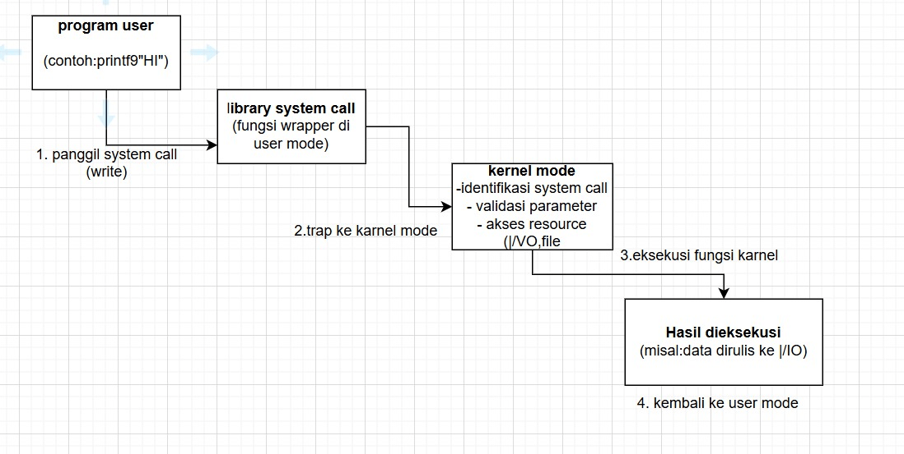
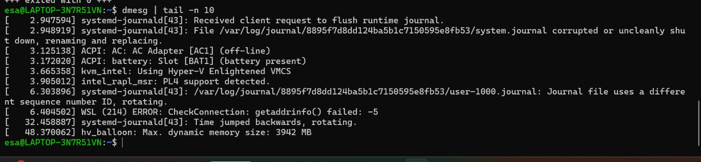

# Laporan Praktikum Minggu [X]
mekanisme system call dan struktur sistem operasi.

---

## Identitas
- **Nama**  : [Miftakhul Lisna Esa Baehaqi]  
- **NIM**   : [250202951]  
- **Kelas** : [1IKRB]

---

## Tujuan
-Menjelaskan konsep dan fungsi system call dalam sistem operasi.

-Mengidentifikasi jenis-jenis system call dan fungsinya.

-Mengamati alur perpindahan mode user ke kernel saat system call terjadi.

-Menggunakan perintah Linux untuk menampilkan dan menganalisis system call.


---

## Dasar Teori
System Call (Panggilan Sistem) adalah antarmuka yang disediakan oleh SO agar program aplikasi di User Mode dapat meminta layanan dari Kernel (inti SO) yang berjalan di Kernel Mode (mode terproteksi). Ini adalah satu-satunya cara bagi program untuk mengakses sumber daya istimewa (I/O, manajemen memori, dll.)

-Percobaan strace ls secara langsung mendemonstrasikan mekanisme ini, mencatat setiap kali program ls melakukan transisi dari User Mode ke Kernel Mode untuk meminta layanan (misalnya, execve untuk memulai program, openat untuk membuka library, atau getdents untuk membaca isi direktori).

---

## Langkah Praktikum
1. Langkah-langkah yang dilakukan.  
2. Perintah yang dijalankan.  
3. File dan kode yang dibuat.  
4. Commit message yang digunakan.

---

## Kode / Perintah
Tuliskan potongan kode atau perintah utama:
```bash
uname -a
lsmod | head
dmesg | head
```

---

## Hasil Eksekusi
Sertakan screenshot hasil percobaan atau diagram:






---
## Eksperimen 1 – Analisis System Call
| No  | Perintah/System Call | Fungsi                           | Output Contoh                         | Tujuan                                                                                      |
|------|---------------------|---------------------------------|-------------------------------------|----------------------------------------------------------------------------------------------|
| 1    | execve         | Menjalankan Program Baru        | execve	"/bin/ls", ["ls"], | Mengganti proses saat ini dengan program baru.                                                          |
| 2    | brk              | Mengubah Ukuran Data Segment         | brk	NULL, kemudian 0x7d827feaa000 | Digunakan untuk mengubah ukuran data segment program.                              |
| 3    | access          | Memeriksa Izin Akses | access	"/etc/ld.so.preload", R_OK | Memeriksa apakah process memiliki izin untuk mengakses file atau direktori tertentu.                                         |
| 4    | openat               | Membuka File atau Direktori       | openat	`AT_FDCWD, "/etc/ld.so.cache", O_RDONLY | Membuat file descriptor baru yang merujuk ke file atau direktori yang ditentukan oleh jalur (pathname).                                                     |
| 5    | mmap          | Memetakan File ke Memori                | mmap	NULL, 35463, PROT_READ, MAP_PRIVATE, 3, 0)                     | Memetakan file atau perangkat ke ruang alamat memori proses.                                        |
| 6    | fstat         | Mendapatkan Status File  | fstat	`3, {st_mode=S_IFREG | Mendapatkan informasi status untuk file yang baru dibuka (pustaka liblinux-so.1).  |
| 7    | read         | Membaca Data dari File | read	3, "\177ELF\2\1\1\0\0\0\0\0\0\0\0\0\3\0>\0\1\0\0\0\220\0\4\0\0\0\0\0"..., 832 | Membaca data sejumlah byte tertentu dari file yang terkait dengan file descriptor yang diberikan (3) ke dalam buffer.         |

## Eksperimen 2 – Menelusuri System Call File I/O

   * Proses dimulai saat program cat meminta kernel untuk membuka file /etc/passwd. Kernel merespons dengan mengalokasikan dan mengembalikan file descriptor (FD) 3. FD ini adalah kunci unik yang akan digunakan cat untuk merujuk pada file tersebut selama operasi I/O. Tahap ini krusial karena menyiapkan jalur komunikasi antara aplikasi dan sumber daya file di sistem operasi.

   * Selanjutnya, program menggunakan system call read untuk memindahkan data. Awalnya, read mungkin memuat pustaka yang dibutuhkan, tetapi panggilan utama (read(3, ..., 1443)) meminta kernel untuk menyalin seluruh konten file (1443 bytes) dari disk ke dalam buffer di memori proses cat. Kernel bertindak sebagai driver yang mengelola transfer data yang efisien dan aman.

   * Setelah data berada di memori, cat memanggil system call write untuk menampilkan konten tersebut. Perintah write(1, ..., 1443) menginstruksikan kernel untuk mengambil data 1443 bytes dari buffer program dan menuliskannya ke File Descriptor 1 (Standard Output), yaitu terminal. Kernel bertugas mengirimkan data ini ke perangkat output yang sesuai, sehingga pengguna dapat melihat isi dari /etc/passwd.

   * Terakhir, setelah semua I/O selesai, program memanggil system call close(3). Perintah ini memerintahkan kernel untuk menutup koneksi dan melepaskan file descriptor 3. Kernel membebaskan nomor FD tersebut dari alokasi, memastikan bahwa tidak ada sumber daya yang terbuang dan nomor tersebut siap digunakan kembali oleh proses atau file lain.

## Eksperimen 3 – Mode User vs Kernel
   * Perbedaan mendasar antara log kernel (strace) dan output program biasa adalah pada fokus dan tujuannya. Log kernel adalah catatan teknis tingkat rendah mengenai proses internal, yaitu perintah (read, write) yang dikeluarkan program ke kernel untuk meminta layanan. Sebaliknya, output program biasa adalah hasil akhir tingkat tinggi yang disajikan kepada pengguna, yaitu data mentah dari file tersebut. Singkatnya, strace menampilkan bagaimana program bekerja, sedangkan output biasa menampilkan apa yang berhasil dilakukan program.

---

.## Analisis
- Jelaskan makna hasil percobaan. 
Dalam percobaan ini Mengetahui bagaimana program ls (list directory) berinteraksi dengan sistem operasi melalui system call — yaitu layanan yang disediakan kernel untuk program user.
-Berdasarkan hasil percobaan strace cat /etc/passwd, dapat disimpulkan bahwa kernel berfungsi sebagai pengendali utama dalam eksekusi operasi file melalui system call. Proses perpindahan antara user mode dan kernel mode membuktikan konsep arsitektur berlapis pada sistem operasi, di mana setiap akses ke sumber daya harus melalui kernel untuk menjamin keamanan dan stabilitas sistem.

- Hubungkan hasil dengan teori (fungsi kernel, system call, arsitektur OS). 
- Kernel menangani semua operasi I/O (membuka, membaca, menulis, menutup file) atas perintah dari program user. Tanpa kernel, program tidak bisa mengakses perangkat keras secara aman.
- strace memperlihatkan bagaimana system call menjadi jembatan komunikasi antara program cat (di user mode) dan kernel (di kernel mode).
- Percobaan strace membuktikan konsep transisi mode (user ↔ kernel) yang merupakan ciri khas arsitektur sistem operasi berlapis (layered architecture), di mana lapisan aplikasi tidak dapat langsung mengakses hardware, tetapi harus melalui lapisan kernel. 
- Apa perbedaan hasil di lingkungan OS berbeda (Linux vs Windows)?  
- Walaupun kedua OS memiliki tujuan yang sama (menghubungkan program dengan hardware melalui kernel), implementasi dan nama system call berbeda.
Linux mengikuti standar POSIX dengan system call terbuka dan dapat dilacak melalui strace, sedangkan Windows menggunakan API tertutup yang berlapis (Win32 → NTDLL → Kernel), sehingga lebih sulit dilihat langsung oleh pengguna.

---

## Kesimpulan
System call merupakan mekanisme utama komunikasi antara program user dan kernel.
Program di user mode tidak bisa langsung mengakses perangkat keras atau memori sistem, sehingga membutuhkan system call untuk meminta layanan kernel.

Mekanisme system call menunjukkan bahwa sistem operasi memiliki struktur berlapis yang memisahkan program user dari kernel. Kernel bertindak sebagai penghubung utama antara aplikasi dan perangkat keras, menjamin keamanan, stabilitas, serta efisiensi dalam pengelolaan sumber daya komputer.

---

## Quiz
1. [Apa fungsi utama system call dalam sistem operasi]  
   Fungsi utama system call adalah memberikan antarmuka yang aman dan terstandar agar program di user mode dapat menggunakan layanan kernel tanpa harus berinteraksi langsung dengan perangkat keras.
Dengan system call, sistem operasi dapat mengontrol akses, menjaga keamanan  
2. [Sebutkan 4 kategori system call yang umum digunakan]  
1. Process Control, 2. File Management, 3. Device Management, dan 4. Information Maintenance.
3. [Mengapa system call tidak bisa dipanggil langsung oleh user program]  
System call tidak dapat dipanggil langsung oleh program user karena alasan keamanan, stabilitas, dan pemisahan mode eksekusi.
Semua akses ke sumber daya perangkat keras harus melalui kernel, yang bertugas mengatur, memvalidasi, dan mengeksekusi permintaan tersebut secara aman.  

---

## Refleksi Diri
Tuliskan secara singkat:
- Apa bagian yang paling menantang minggu ini?  semuanya menantang pak karena baru dua kali pertemuan
- Bagaimana cara Anda mengatasinya?  
  bertanya ke teman yang sudah lulus dan belajar otodidak

---

**Credit:**  
_Template laporan praktikum Sistem Operasi (SO-202501) – Universitas Putra Bangsa_
