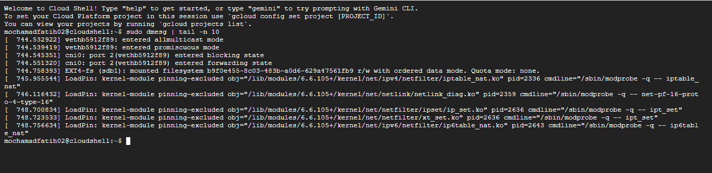
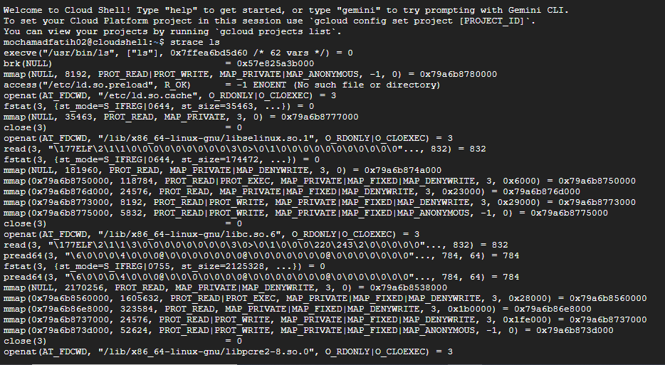

# Laporan Praktikum Minggu [2]
Topik: ["Struktur System Call dan Fungsi Kernel"]

---

## Identitas
- **Nama**  : [MOHAMMAD FATIKH MAHSUN ]  
- **NIM**   : [250202952]  
- **Kelas** : [1IKRB]

---

## Tujuan
Tuliskan tujuan praktikum minggu ini.  
•Menjelaskan konsep dan fungsi system call dalam sistem operasi. 
•Mengidentifikasi jenis - jenis system call dan fungsinya. 
•Mengamati alur perpindahan mode user ke kernel saat system call terjadi. 
•Menggunakan perintah Linux untuk menampilkan dan menganalisis system call. 

---

## Dasar Teori
Tuliskan ringkasan teori (3–5 poin) yang mendasari percobaan.
1.System call adalah cara bagi program aplikasi untuk berbicara dengan kernel OS dan meminta bantuan/layanan tertentu dari sistem operasi.
2.menentukan jenis jenis system call seperti:
 (proses control), (File Manipulation), (Device Manipulation), (information maintenance), dan (communication). 
3.Alur Perpindahan Mode dari User ke Kernel saat System Call
Proses pelaksanaan system call melibatkan serangkaian tahapan: program yang berjalan di mode pengguna melakukan pemanggilan system call; kemudian terjadi interupsi atau trap yang mengalihkan CPU ke mode kernel melalui instruksi khusus seperti syscall atau int 0x80. Kernel kemudian mengelola dan menyelesaikan permintaan tersebut dengan menggunakan hak istimewa kernel. Setelah proses selesai, kontrol dikembalikan ke mode pengguna beserta hasil eksekusi system call.
4.Cara Menampilkan dan Menganalisis System Call di Linux
Untuk mengamati system call yang tersedia atau aktif pada sistem operasi Linux, dapat dilakukan dengan beberapa cara, yaitu:
•Menggunakan perintah strace untuk memantau system call yang dieksekusi oleh suatu proses tertentu.
•Melalui perintah ausyscall --dump (dengan auditd terpasang) untuk menampilkan daftar nomor dan nama system call.
•Mengeksplorasi kode sumber kernel pada file syscall_table.S yang memetakan nomor system call ke fungsi kernel terkait.


---

## Langkah Praktikum
1.Buka terminal pada sistem operasi yang di gunakan, contohnya Linux.
2.Buat sebuah file program baru menggunakan editor teks yang tersedia.
3.Tulis kode program sederhana yang memanfaatkan system call, misalnya untuk menampilkan teks ke layar atau membaca file.
4.Simpan file tersebut, lalu kompilasi program menggunakan perintah gcc atau perintah lain yang cocok.
5.Jalankan hasil kompilasi untuk melihat bagaimana program berkomunikasi dengan sistem operasi lewat system call.
6.Uji program beberapa kali guna memastikan output yang dihasilkan benar sesuai yang diharapkan.
7.Simpan perubahan dengan meng-commit ke repositori Git, tuliskan pesan commit yang menjelaskan aktivitas yang telah dilakukan.

---

## Kode / Perintah
Tuliskan potongan kode atau perintah utama:
```bash
uname -a
lsmod | head
dmesg | head
```

---

## Hasil Eksekusi
Sertakan screenshot hasil percobaan atau diagram:







---

## Analisis
- Jelaskan makna hasil percobaan.  
- Hubungkan hasil dengan teori (fungsi kernel, system call, arsitektur OS).  
- Apa perbedaan hasil di lingkungan OS berbeda (Linux vs Windows)?  
  *Analisis 400/500 kata
System call merupakan elemen fundamental dalam arsitektur sistem operasi (OS), berperan sebagai penghubung antara aplikasi di ruang pengguna (user space) dan kernel OS. Analisis ini akan mengkaji alasan pentingnya system call bagi keamanan OS, mekanisme transisi yang aman antara mode pengguna dan kernel, serta contoh system call yang lazim digunakan di Linux.
1.Mengapa System Call penting untuk keamanan OS?                                           karena mereka menyediakan lapisan isolasi antara aplikasi dan sumber daya sistem yang kritis. Tanpa adanya system call, aplikasi dapat mengakses hardware atau memori kernel secara langsung, yang berpotensi mengakibatkan kerusakan atau eksploitasi keamanan. Sebagai ilustrasi, jika aplikasi mampu memodifikasi tabel halaman memori tanpa batasan, hal tersebut dapat memfasilitasi serangan seperti buffer overflow atau privilege escalation, di mana proses memperoleh akses yang tidak sah.Dalam perspektif keamanan, system call memungkinkan OS untuk menerapkan kontrol akses berdasarkan izin. Kernel dapat memvalidasi identitas proses (melalui UID/GID pada sistem Unix-like) sebelum menjalankan operasi seperti membaca file atau mengalokasikan memori. Hal ini menghalangi aplikasi berbahaya dari mengganggu proses lain atau mengakses data sensitif. Lebih lanjut, system call mendukung mekanisme seperti sandboxing, di mana aplikasi dioperasikan dalam lingkungan yang terbatas, sehingga mengurangi risiko penyebaran malware. Pada era ancaman siber seperti ransomware, system call juga memfasilitasi pencatatan dan audit aktivitas, memungkinkan OS mendeteksi anomali. Tanpa system call, OS akan rentan terhadap serangan yang memanfaatkan akses langsung, sebagaimana dalam model lama tanpa proteksi ring (seperti di DOS), yang mudah disusupi.
2.Bagaimana OS Menjamin Transisi User-Kernel Terlaksana dengan Aman?   Transisi dari mode pengguna ke mode kernel (dan sebaliknya) harus dilaksanakan secara aman untuk mencegah eksploitasi. OS memanfaatkan mekanisme hardware dan software untuk tujuan ini. Pada tingkat hardware, prosesor modern (seperti x86 atau ARM) mendukung mode ring: ring 0 untuk kernel (dengan akses penuh) dan ring 3 untuk pengguna (dengan akses terbatas). Transisi dimulai melalui instruksi spesifik seperti syscall (di x86-64) atau int 0x80 (di x86 lama), yang memicu trap atau interrupt.OS menjamin keamanan dengan memverifikasi parameter system call sebelum eksekusi. Misalnya, kernel memeriksa apakah alamat memori yang disediakan valid dan merupakan milik proses tersebut, sehingga mencegah serangan seperti null pointer dereference atau buffer overflow. Selama eksekusi, kernel menjalankan kode dalam mode privileged, namun hanya untuk operasi yang diizinkan. Setelah selesai, OS menggunakan instruksi seperti iret (interrupt return) untuk kembali ke mode pengguna, memulihkan konteks proses tanpa meninggalkan residu akses.Di Linux, mekanisme ini diperkuat dengan syscall table yang terdefinisi, di mana setiap call memiliki nomor unik dan handler yang diverifikasi. Jika parameter tidak valid, kernel mengembalikan error (seperti EINVAL) tanpa menjalankan operasi berbahaya. Hal ini mencegah race conditions atau privilege escalation, seperti dalam serangan Meltdown/Spectre, di mana transisi yang tidak aman dapat membocorkan data kernel.
3.Contoh System Call yang Umum Digunakan di Linux Linux, sebagai OS berbasis Unix, memiliki ratusan system call, namun beberapa yang paling sering digunakan meliputi:                                                                          fork: Membuat proses anak dari proses induk, krusial untuk multitasking dan keamanan karena memisahkan ruang alamat.                                                         exec(seperti execve()): Mengganti image proses dengan program baru, digunakan untuk menjalankan aplikasi sambil mempertahankan kontrol kernel.                  
open(): Membuka file dengan izin tertentu, memungkinkan kontrol akses berdasarkanizinfile.                                                                                                                        read() dan write(): Membaca/menulis data dari/ke file atau socket, dengan verifikasi kernel untuk mencegah akses ilegal.   close(): Menutup file descriptor, membebaskan sumber daya dan menghindari kebocoran.                                                              wait(): Menunggu proses anak selesai, mendukung sinkronisasi dan pencegahan zombieprocesses.                                                                                                        exit(): Mengakhiri proses, memungkinkan pembersihan sumber daya secara aman.


---

## Kesimpulan
Tuliskan 2–3 poin kesimpulan dari praktikum ini.
system call adalah sebagai mekanisme penghubung antara program aplikasi dan kernel sistem operasi untuk meminta layanan tertentu seperti manajemen proses, manipulasi file, kontrol perangkat, komunikasi antarproses, dan pemeliharaan informasi. System call juga memungkinkan akses yang aman dan terkendali ke sumber daya sistem operasi melalui interface yang disediakan, sehingga menjaga kestabilan dan keamanan sistem.


---

## Quiz
1.Apa fungsi utama system call dalam sistem operasi? 
  Fungsi utama system call dalam sistem operasi adalah menyediakan antarmuka yang memungkinkan program pengguna untuk berkomunikasi dan meminta layanan dari kernel sistem operasi, seperti manajemen proses, operasi file, manipulasi perangkat keras, dan komunikasi antar proses. System call bertindak sebagai jembatan antara ruang pengguna dan ruang kernel yang memiliki hak akses lebih tinggi, sehingga program aplikasi dapat menggunakan layanan sistem tanpa langsung mengakses kernel.
2.Sebutkan 4 kategori system call yang umum digunakan.
 Empat kategori system call yang umum digunakan adalah:
•Process Control (kontrol proses) 
 mengatur pembuatan, penghentian, dan sinkronisasi proses.
•File Manipulation (manipulasi berkas)
operasi pembacaan, penulisan, pembuatan, dan penghapusan file.
•Device Manipulation (manipulasi perangkat)
mengontrol perangkat keras yang terhubung.
•Information Maintenance (pemeliharaan informasi)
mengelola dan berbagi informasi sistem.
3.Mengapa system call tidak bisa dipanggil langsung oleh user program?
System call tidak bisa langsung dipanggil oleh program pengguna karena berada dalam ruang kernel dengan akses privilese yang lebih tinggi demi menjamin keamanan dan stabilitas sistem operasi. Jika program pengguna dapat langsung memanggil system call, maka potensi terjadi kerusakan sistem atau akses ilegal terhadap hardware dan data sistem menjadi besar. Oleh karena itu, system call dipanggil melalui mekanisme khusus seperti trap dan interrupt yang mengalihkan eksekusi dari mode pengguna ke mode kernel, sehingga akses ke sumber daya sistem dikontrol secara ketat oleh kernel

---

## Refleksi Diri
Tuliskan secara singkat:
- Apa bagian yang paling menantang minggu ini?  
- Bagaimana cara Anda mengatasinya?  

---

**Credit:**  
_Template laporan praktikum Sistem Operasi (SO-202501) – Universitas Putra Bangsa_
