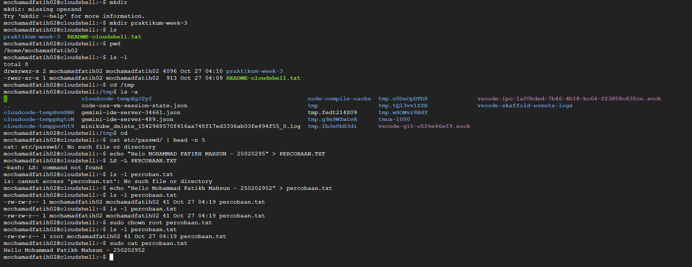

# Laporan Praktikum Minggu [3]
Topik: ["Manajemen File dan Permission di Linux"]

---

## Identitas
- **Nama**  : [MOHAMMAD FATIKH MAHSUN]  
- **NIM**   : [250202952]  
- **Kelas** : [1IKRB]

---

## Tujuan
Tuliskan tujuan praktikum minggu ini.  

1.Menggunakan perintah ls, pwd, cd, cat untuk navigasi file dan direktori.

2.Menggunakan chmod dan chown untuk manajemen hak akses file.

3.Menjelaskan hasil output dari perintah Linux dasar.

4.Menyusun laporan praktikum dengan struktur yang benar.

5.Mengunggah dokumentasi hasil ke Git Repository tepat waktu.

---

## Dasar Teori
Tuliskan ringkasan teori (3–5 poin) yang mendasari percobaan.
 •Manajemen file dan permission di Linux berfungsi untuk mengatur penyimpanan data, Memudahkan akses , menjaga keamanan dan kontrol akses terhadap file serta direktori.
 •Pengelolaan file dilakukan menggunakan perintah dasar seperti ls, cp, mv, rm, mkdir, dan cat untuk menampilkan, menyalin, memindahkan, menghapus, serta membuat file atau direktori.
 •Setiap file memiliki tiga jenis izin — read (r), write (w), dan execute (x) — yang berlaku bagi tiga kategori pengguna: owner (user), group, dan others.
 •Hak akses dapat diubah dengan chmod (mengatur izin), sedangkan kepemilikan file dapat diubah dengan chown (pemilik) dan chgrp (grup).

---

## Langkah Praktikum
1. Langkah-langkah yang dilakukan.  
2. Perintah yang dijalankan.  
3. File dan kode yang dibuat.  
4. Commit message yang digunakan.

1.langkah-langkah yang digunakan
  -menggunakan Linux
2.perintah yang dijalankan 
pwd
ls -l
cd /tmp
ls -a
cat /etc/passwd | head -n 5
Jelaskan isi file dan struktur barisnya (user, UID, GID, home, shell).
3.File dan kode yang dibuat 
echo "Hello <NAME><NIM>" > percobaan.txt
ls -l percobaan.txt
chmod 600 percobaan.txt
ls -l percobaan.txt
4.Commit message yang digunakan
git add .
git commit -m "Minggu 3 - Linux File System & Permission"
git push origin main

---

## Kode / Perintah
Tuliskan potongan kode atau perintah utama:
```bash
uname -a
lsmod | head
dmesg | head
```

---

## Hasil Eksekusi
Sertakan screenshot hasil percobaan atau diagram:


---

## Analisis
- Jelaskan makna hasil percobaan.  
- Hubungkan hasil dengan teori (fungsi kernel, system call, arsitektur OS).  
- Apa perbedaan hasil di lingkungan OS berbeda (Linux vs Windows)?  

---

## Kesimpulan
Tuliskan 2–3 poin kesimpulan dari praktikum ini.
manajemen berkas di Linux adalah cara mengatur file dan folder supaya mudah digunakan, aman, dan sesuai kebutuhan pengguna dengan mengatur siapa yang boleh melihat, mengubah, dan menjalankan file tersebut menggunakan perintah-perintah yang tersedia di sistem Linux.
Fungsi dari perintah chmod adalah untuk mengubah hak akses (permission) pada file atau direktori, 
sedangkan chown digunakan untuk mengubah kepemilikan file atau direktori. 

---

## Quiz
1.Apa fungsi dari perintah chmod? 
2.Apa arti dari kode permission rwxr-xr--?
3.Jelaskan perbedaan antara chown dan chmod.
   **Jawaban:**  

1.Fungsi dari perintah chmod adalah untuk mengubah atau mengatur izin akses (permission) suatu file atau direktori dalam sistem operasi Linux atau Unix. Izin akses ini menentukan siapa saja yang dapat membaca (read), menulis (write), atau mengeksekusi (execute) file atau direktori tersebut. Melalui chmod, pengguna dapat menetapkan hak akses berbeda untuk pemilik file (owner), grup pengguna (group), dan pengguna lain (others) agar file atau direktori dapat diatur keamanannya secara tepat.

2.Kode permission rwxr-xr-- menggambarkan hak akses atas sebuah file atau direktori dengan rincian sebagai berikut:
rwx: pemilik (owner) memiliki hak baca (read), tulis (write), dan eksekusi (execute)
r-x: grup pengguna (group) memiliki hak baca (read) dan eksekusi (execute), tetapi tidak memiliki hak tulis
r--: pengguna lain (others) hanya memiliki hak baca (read) tanpa hak tulis dan eksekusi. 

3.Perbedaan antara perintah chown dan chmod adalah sebagai berikut:
chmod digunakan untuk mengubah hak akses (permission) pada file atau direktori, yaitu menentukan apa yang dapat dilakukan pengguna terhadap file tersebut, seperti membaca, menulis, atau mengeksekusi. 
Sedangkan chown digunakan untuk mengubah kepemilikan file atau direktori, yaitu menentukan siapa pemilik file tersebut dan grup yang memiliki file tersebut. Dengan chown, dapat diubah pengguna atau grup yang memiliki file.


---

## Refleksi Diri
Tuliskan secara singkat:
- Apa bagian yang paling menantang minggu ini?  
- Bagaimana cara Anda mengatasinya?  


---

**Credit:**  
_Template laporan praktikum Sistem Operasi (SO-202501) – Universitas Putra Bangsa_
