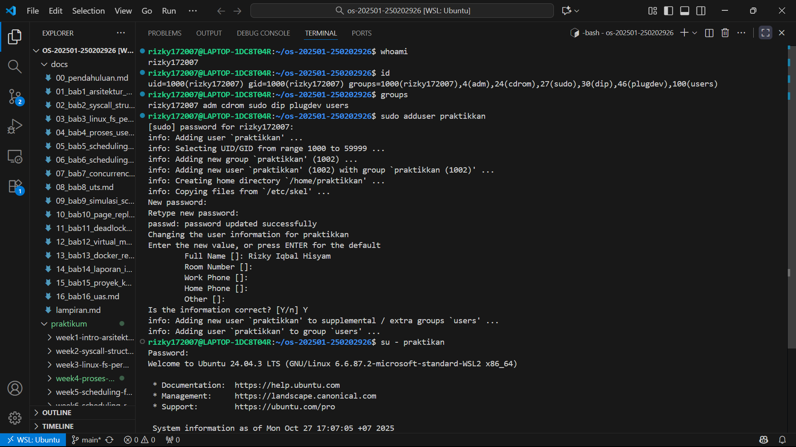
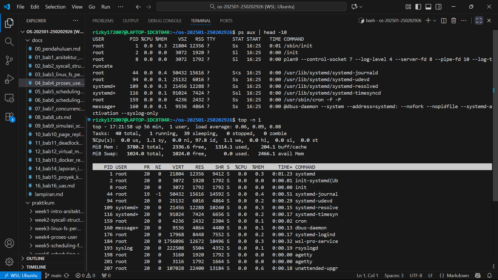
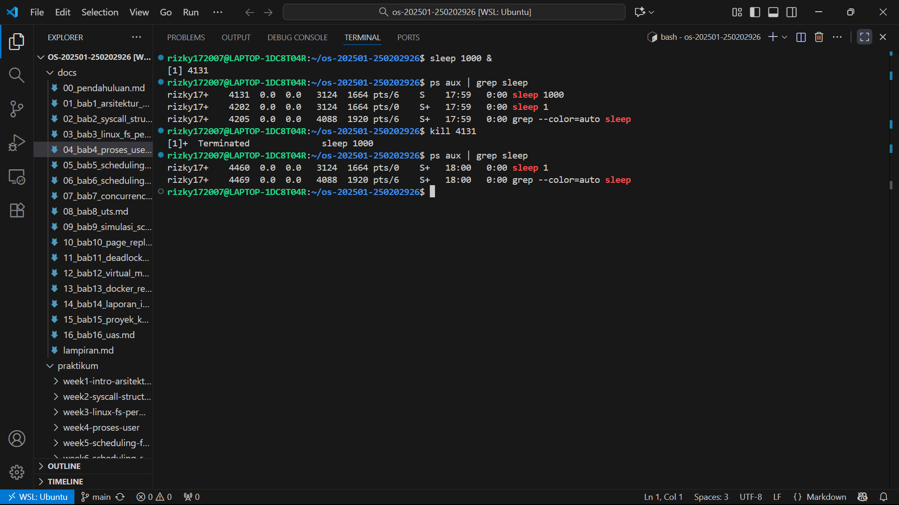
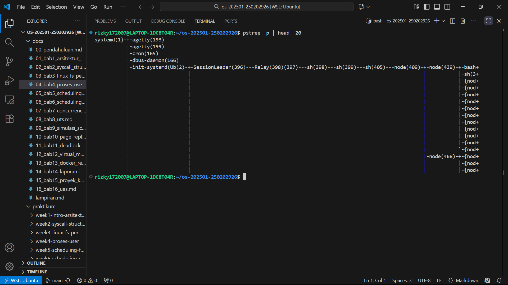

# Laporan Praktikum Minggu 4
Topik: Manajemen Proses dan User di Linux

---

## Identitas
- **Nama**  : Rizky Iqbal Hisyam
- **NIM**   : 250202926  
- **Kelas** : 1IKRA

---

## Tujuan
Setelah menyelesaikan tugas ini, mahasiswa mampu:
1. Menjelaskan konsep proses dan user dalam sistem operasi Linux.  
2. Menampilkan daftar proses yang sedang berjalan dan statusnya.  
3. Menggunakan perintah untuk membuat dan mengelola user.  
4. Menghentikan atau mengontrol proses tertentu menggunakan PID.  
5. Menjelaskan kaitan antara manajemen user dan keamanan sistem.  

---

## Dasar Teori
Dalam sistem operasi Linux, setiap pengguna memiliki identitas unik seperti UID, GID, dan username. Perintah seperti `whoami`, `id`, dan `groups` digunakan untuk melihat identitas dan hak akses user. Linux juga menyediakan berbagai utilitas untuk memantau aktivitas proses, seperti `ps` dan `top`. Selain itu, Linux memungkinkan pengguna untuk mengontrol proses dengan mengatur status atau sinyalnya, seperti `kill`. Konsep kontrol proses berkaitan dengan manajemen sumber daya sistem, agar proses penting mendapatkan prioritas dan proses bermasalah dapat dihentikan. Proses di Linux memiliki struktur hierarkis (parent–child), perintah seperti `pstree` menampilkan hubungan antarproses secara visual. Analisis hierarki ini penting untuk memahami mekanisme multitasking, serta bagaimana sistem mengelola proses secara terstruktur.

---

## Langkah Praktikum
1. **Setup Environment**
   - Gunakan Linux (Ubuntu/WSL).  
   - Pastikan Anda sudah login sebagai user non-root.  
   - Siapkan folder kerja:
     ```
     praktikum/week4-proses-user/
     ```

2. **Eksperimen 1 – Identitas User**
   Jalankan perintah berikut:
   ```bash
   whoami
   id
   groups
   ```
   - Jelaskan setiap output dan fungsinya.  
   - Buat user baru (jika memiliki izin sudo):
     ```bash
     sudo adduser praktikan
     sudo passwd praktikan
     ```
   - Uji login ke user baru.

3. **Eksperimen 2 – Monitoring Proses**
   Jalankan:
   ```bash
   ps aux | head -10
   top -n 1
   ```
   - Jelaskan kolom penting seperti PID, USER, %CPU, %MEM, COMMAND.  
   - Simpan tangkapan layar `top` ke:
     ```
     praktikum/week4-proses-user/screenshots/top.png
     ```

4. **Eksperimen 3 – Kontrol Proses**
   - Jalankan program latar belakang:
     ```bash
     sleep 1000 &
     ps aux | grep sleep
     ```
   - Catat PID proses `sleep`.  
   - Hentikan proses:
     ```bash
     kill <PID>
     ```
   - Pastikan proses telah berhenti dengan `ps aux | grep sleep`.

5. **Eksperimen 4 – Analisis Hierarki Proses**
   Jalankan:
   ```bash
   pstree -p | head -20
   ```
   - Amati hierarki proses dan identifikasi proses induk (`init`/`systemd`).  
   - Catat hasilnya dalam laporan.

6. **Commit & Push**

---

## Kode / Perintah
Tuliskan potongan kode atau perintah utama:

Eksperimen 1
```bash
whoami
id
groups
     
sudo adduser praktikkan
sudo passwd praktikkan
```
Eksperimen 2
```bash
ps aux | head -10
top -n 1
```
Eksperimen 3
```bash
sleep 1000 &
ps aux | grep sleep

kill <PID>
```
Eksperimen 4
```bash
pstree -p | head -20
```

---

## Hasil Eksekusi
Screenshot hasil percobaan:

Eksperimen 1

.png)

Eksperimen 2


Eksperimen 3


Eksperimen 4



---

## Tugas Analisis
**1. Analisis perintah eksperimen 1**

| **No.** | **Perintah** | **Output / Aktivitas di Terminal** | **Keterangan / Analisis** | **Sumber Referensi** |
|----------|---------------|------------------------------------|----------------------------|----------------------|
| 1 | `whoami` | `rizky172007` | Menampilkan **nama user yang sedang login** di terminal saat ini. User aktif adalah `rizky172007`. | Linux Manual Page: [`whoami(1)`](https://man7.org/linux/man-pages/man1/whoami.1.html) |
| 2 | `id` | `uid=1000(rizky172007)` | **User ID (UID)** pengguna aktif adalah `1000` dengan nama `rizky172007`. Setiap user memiliki UID unik untuk identifikasi. | Linux Manual Page: [`id(1)`](https://man7.org/linux/man-pages/man1/id.1.html) |
|   |  | `gid=1000(rizky172007)` | **Group ID (GID)** utama user `rizky172007` adalah `1000`. Grup ini menjadi pemilik default file yang dibuat user tersebut. | |
|   |  | `groups=1000(rizky172007),4(adm),24(cdrom),27(sudo),30(dip),46(plugdev),100(users)` | Menampilkan **daftar grup** tempat user tergabung. Masing-masing grup memberikan hak akses tambahan terhadap sistem. | |
| 3 | `groups` | `rizky172007 adm cdrom sudo dip plugdev users` | Menunjukkan semua **grup keanggotaan** user aktif. Mirip dengan hasil bagian “groups=” dari perintah `id`. Menandakan user `rizky172007` memiliki hak istimewa karena tergabung di grup `sudo`. | Linux Manual Page: [`groups(1)`](https://man7.org/linux/man-pages/man1/groups.1.html) |
| 4 | `sudo adduser praktikan` | Menampilkan proses penambahan user baru: <br>• `Adding user 'praktikan'` <br>• `Creating home directory '/home/praktikan'` <br>• Meminta pembuatan password baru <br>• Menambahkan ke grup `users` | Perintah `adduser` digunakan untuk **membuat akun user baru** di sistem. <br>Secara otomatis membuat **home directory**, menetapkan **UID dan GID**, serta dapat menambahkan user ke grup tertentu. | Linux Manual Page: [`adduser(8)`](https://man7.org/linux/man-pages/man8/adduser.8.html) |
| 5 | (input password baru) | Pengguna diminta mengetik dan mengonfirmasi password untuk user baru. | Tahap ini penting untuk mengamankan akun user baru. Password tidak ditampilkan saat diketik untuk menjaga kerahasiaan. | |
| 6 | (input informasi tambahan) | Diminta mengisi informasi seperti nama lengkap, room number, work phone, dsb. | Informasi ini bersifat opsional dan digunakan untuk dokumentasi identitas user dalam sistem. | |
| 7 | `su - praktikan` | Setelah berhasil, muncul prompt baru: <br>`Welcome to Ubuntu 24.04.3 LTS ...` <br>menandakan user telah berganti menjadi `praktikan`. | Perintah `su` (**substitute user**) digunakan untuk **berpindah ke user lain**. <br>Tambahan tanda minus (`-`) membuat sesi login baru dengan **environment user tujuan**. | Linux Manual Page: [`su(1)`](https://man7.org/linux/man-pages/man1/su.1.html) |
| 8 | `exit` atau `logout` | Kembali ke user sebelumnya (`rizky172007`). | Mengakhiri sesi `su` dan kembali ke shell user awal. | |

**Analisis perintah eksperimen 2**


| No | Perintah / Bagian | Fungsi | Keterangan | Sumber Referensi |
|----|--------------------|---------|-------------|------------------|
| 1 | `ps` | *Process Status* | Menampilkan daftar proses yang sedang berjalan di sistem. | GNU Linux Manual Page: `man ps`; Silberschatz, Galvin, & Gagne. *Operating System Concepts*, 10th Ed., Wiley, 2018 |
| 2 | `a` | *All users* | Menampilkan proses dari semua user, bukan hanya milik user saat ini. | Sama seperti di atas |
| 3 | `u` | *User format* | Menampilkan proses dengan format user, CPU, dan memori. | Sama seperti di atas |
| 4 | `x` | *Without terminal* | Menampilkan proses yang tidak terikat dengan terminal tertentu. | Sama seperti di atas |
| 5 | `\| head -10` | Filter tampilan | Menampilkan hanya 10 baris pertama dari hasil `ps aux`. | Sama seperti di atas |
| 6 | `top` | *Task Manager Linux* | Menampilkan proses yang sedang berjalan secara real-time, mirip Task Manager di Windows. | Linux Manual Page: `man top`; Tanenbaum & Bos. *Modern Operating Systems*, 4th Ed., Pearson, 2015 |
| 7 | `-n 1` | *Iteration count* | Menentukan jumlah pembaruan tampilan; `-n 1` artinya hanya satu kali snapshot tanpa pembaruan berkelanjutan. | Sama seperti di atas |


| Kolom | Arti | Sumber Referensi |
|--------|------|------------------|
| **USER** | Pemilik proses yang sedang berjalan. | GNU Linux Manual Page: `man ps`; *Operating System Concepts*, 10th Ed. |
| **PID** | Process ID, identitas unik untuk tiap proses. | Sama seperti di atas |
| **%CPU** | Persentase penggunaan CPU oleh proses. | Sama seperti di atas |
| **%MEM** | Persentase penggunaan memori oleh proses. | Sama seperti di atas |
| **COMMAND** | Perintah atau program yang dijalankan oleh proses. | Sama seperti di atas |
| **TIME+** | Total waktu CPU yang digunakan oleh proses (khusus pada `top`). | Linux Manual Page: `man top`; *Modern Operating Systems*, 4th Ed. |
| **PR / NI** | Prioritas dan nilai *nice* proses (khusus `top`). | Sama seperti di atas |
| **VIRT / RES / SHR** | Penggunaan memori virtual, fisik, dan berbagi. | Sama seperti di atas |

**Analisis perintah eksperimen 3**
| Urutan | Perintah              | Fungsi Utama                               | Hasil                                | Referensi |
|:-------|:----------------------|:-------------------------------------------|:-------------------------------------|:-----------|
| 1      | sleep 1000 &        | Menjalankan proses sleep di background   | Muncul job dan PID                   | Linux Manual Pages (man sleep) |
| 2      | ps aux \| grep sleep| Mengecek proses sleep                    | Terlihat proses sleep 1000         | Abraham Silberschatz, Operating System Concepts |
| 3      | kill 4131           | Menghentikan proses sleep dengan PID 4131| Proses terminated                    | Andrew S. Tanenbaum, Modern Operating Systems |
| 4      | ps aux \| grep sleep| Verifikasi proses sudah mati               | Tidak ada lagi proses sleep aktif  | Linux Manual Pages (man ps, man grep) |

**Analisis perintah eksperimen 4**
| Urutan | Perintah                   | Fungsi Utama                                                                 | Hasil / Output                                                                                                    | Referensi |
|:-------|:---------------------------|:------------------------------------------------------------------------------|:------------------------------------------------------------------------------------------------------------------|:-----------|
| 1      | pstree -p                | Menampilkan struktur *hierarki proses* dalam bentuk pohon (tree) lengkap dengan *PID* tiap proses. | Menunjukkan hubungan antar proses (parent–child) seperti systemd(1) → bash → node, beserta PID di dalam tanda kurung. | Linux Manual Pages (man pstree), Abraham Silberschatz, Operating System Concepts |
| 2      | `\|` (pipe)                 | Mengalirkan output dari perintah pstree -p ke perintah berikutnya (head -20). | Tidak menghasilkan output sendiri, hanya meneruskan data. | Linux Shell Command Reference |
| 3      | head -20                 | Menampilkan *20 baris pertama* dari output pstree -p agar hasil tidak terlalu panjang di terminal. | Menampilkan sebagian hierarki proses (20 baris pertama) dari struktur pohon proses yang ada. | Linux Manual Pages (man head), Andrew S. Tanenbaum, Modern Operating Systems |

**2. Diagram hierarki proses:**
```bash
systemd(1)
├─agetty(193)
├─agetty(199)
├─cron(165)
├─dbus-daemon(166)
└─init-systemd(Ub(2))
    └─SessionLeader(396)
        └─Relay(398)
            └─sh(398)
                └─sh(399)
                    └─sh(405)
                        └─node(409)
                            └─node(439)
                                ├─bash
                                │   ├─sh(43x)
                                │   ├─node(44x)
                                │   └─{node}
                                └─node(468)
                                    ├─{node}
                                    └─{node}

```
Hasil identifikasi proses induk (`init`/`systemd`)
| No | Nama Proses              | PID | Keterangan                                                                 |
|:------|:--------------------------|:-------------|:----------------------------------------------------------------------------|
| 1     | systemd                | (1)          | Proses induk utama (init process) yang dijalankan pertama kali oleh kernel. |
| 2     | agetty, cron, dbus-daemon, init-systemd(Ub) | (193, 199, 165, 2) | Proses turunan langsung dari systemd; menangani login, jadwal, dan layanan sistem. |
| 3     | SessionLeader, Relay | (396, 398)   | Anak dari init-systemd(Ub); mengelola sesi dan komunikasi pengguna.       |
| 4     | sh (shell)             | (397, 398, 405) | Proses shell turunan dari Relay.                                          |
| 5     | node                   | (409, 439, 468) | Menunjukkan program Node.js yang berjalan di bawah shell.                   |
| 6     | bash                   | —             | Shell interaktif yang digunakan oleh pengguna untuk menjalankan perintah.   |

**3. Hubungan Antara User Management dan Keamanan Sistem Linux**

Dalam sistem operasi Linux, user management (manajemen pengguna) memiliki peran yang sangat penting dalam menjaga keamanan sistem. Dengan pengelolaan yang tepat, sistem bisa membatasi apa yang boleh dan tidak boleh dilakukan oleh setiap user. Linux secara default adalah sistem multi-user, artinya banyak pengguna bisa mengakses sistem secara bersamaan tanpa saling mengganggu. Di sinilah peran user management. Melalui sistem akun, izin file (permission), dan grup, administrator dapat mengatur siapa yang berhak membaca, mengubah, atau menjalankan suatu file atau program. Contohnya, user biasa tidak bisa sembarangan menghapus file sistem, karena itu bisa menyebabkan kerusakan. Hanya root user yang punya hak penuh terhadap seluruh sistem. Dengan demikian, pembagian hak akses ini membantu mencegah kesalahan atau tindakan berbahaya baik yang disengaja maupun tidak. Secara keseluruhan, manajemen user adalah pondasi keamanan di Linux. Dengan membatasi akses sesuai peran pengguna, sistem menjadi lebih terlindungi dari kesalahan manusia, eksploitasi, maupun serangan dari pihak luar.

---

## Kesimpulan
Dari praktikum kali ini, dapat disimpulkan bahwa Linux mengelola identitas pengguna dan proses secara terstruktur dan aman. Setiap user memiliki identitas unik yang menentukan hak akses, sementara sistem menyediakan berbagai alat untuk memantau dan mengontrol proses agar berjalan efisien. Struktur hierarki proses memudahkan pemahaman multitasking dan hubungan antarproses. Secara keseluruhan, eksperimen ini menekankan pentingnya pengelolaan user dan proses dalam menjaga stabilitas, keamanan, dan performa sistem.

---

## Quiz
1. Apa fungsi dari proses `init` atau `systemd` dalam sistem Linux?  
   **Jawaban:**  Proses `init` atau `systemd` memiliki peran penting dalam menginisialisasi seluruh sistem setelah boot, mengatur semua layanan dan proses, dan bertanggung jawab penuh terhadap stabilitas sistem. Tanpa proses `init` atau `systemd`, sistem Linux tidak akan dapat menjalankan proses apapun bahkan shell `bash` atau terminal pun tidak akan muncul.
2. Apa perbedaan antara `kill` dan `killall`?    
   **Jawaban:**  Perintah `kill` dan `killall` di Linux sama-sama digunakan untuk menghentikan proses, tapi cara penggunaannya berbeda. `kill` mengirim sinyal ke proses tertentu berdasarkan PID (Process ID), sedangkan `killall` berdasarkan nama prosesnya. Umumnya `kill` hanya bisa menghentikan 1 proses, sedangkan `killall` bisa banyak proses sekaligus.  
3. Mengapa user `root` memiliki hak istimewa di sistem Linux? 
   **Jawaban:**  User `root` memiliki hak istimewa karena dalam sistem Linux User `root` didesain sebagai superuser untuk mengelola, mengatur, dan mengamankan seluruh sistem, sementara user biasa dibatasi untuk melindungi sistem dari kesalahan atau penyalahgunaan.

---

## Refleksi Diri
Tuliskan secara singkat:
- Apa bagian yang paling menantang minggu ini?  
Untuk minggu ini yang cukup sulit adalah membuat/mencantumkan diagram pohon (`pstree`) ke dalam laporan.
- Bagaimana cara Anda mengatasinya?  
Mencoba berbagai cara dan mencari di beberapa sumber terkait.

---

**Credit:**  
_Template laporan praktikum Sistem Operasi (SO-202501) – Universitas Putra Bangsa_
