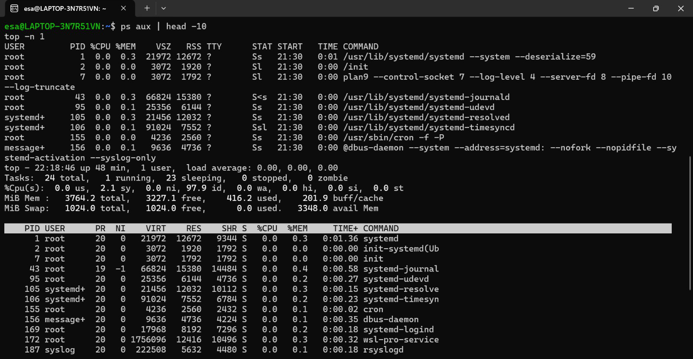

# Laporan Praktikum Minggu [X]
### konsep proses dan manajemen user dalam sistem operasi Linux.


---

## Identitas
- **Nama**  : [Miftakhul Lisna Esa Baehaqi]  
- **NIM**   : [250202951] 
- **Kelas** : [1IKRB]

---

## Tujuan
Setelah menyelesaikan tugas ini, mahasiswa mampu:

- Menjelaskan konsep proses dan user dalam sistem operasi Linux. 

- Menampilkan daftar proses yang sedang berjalan dan statusnya.

- Menggunakan perintah untuk membuat dan mengelola user.

- Menghentikan atau mengontrol proses tertentu menggunakan PID.

- Menjelaskan kaitan antara manajemen user dan keamanan sistem.


---

## Dasar Teori
- Proses merupakan program yang sedang dieksekusi oleh CPU, di mana setiap proses memiliki identitas unik (PID), status, dan sumber daya yang dikelola oleh kernel.

- Manajemen proses dilakukan oleh sistem operasi melalui scheduler, yang bertugas mengatur urutan eksekusi proses agar penggunaan CPU dan memori berjalan efisien.

- User (pengguna) adalah entitas yang memiliki hak akses terhadap sistem, dengan identitas berupa username, UID, GID, dan hak akses tertentu untuk menjaga keamanan sistem.

-Manajemen user mencakup pembuatan, penghapusan, serta pengaturan hak akses dan grup pengguna, yang dapat dilakukan dengan perintah seperti useradd, passwd, usermod, dan sudo.

- Hubungan antara proses dan user bersifat langsung, karena setiap proses dijalankan oleh user tertentu dan hak akses terhadap proses maupun file ditentukan oleh identitas user tersebut.
---

## Langkah Praktikum
1. Langkah-langkah yang dilakukan.  
2. Perintah yang dijalankan.  
3. File dan kode yang dibuat.  
4. Commit message yang digunakan.

---

## Kode / Perintah
Tuliskan potongan kode atau perintah utama:
```bash
uname -a
lsmod | head
dmesg | head
```

---

## Hasil Eksekusi
Sertakan screenshot hasil percobaan atau diagram:



---
## Hasiil Eksperimen
Eksperimen 1
perintah
## whoami
Output
## esa
Menampilkan nama user yang sedang login di terminal.
= Artinya user aktif saat ini bernama esa.
Perintah:
## id


Output:

## uid=1000(esa) gid=1000(esa) groups=1000(esa),4(adm),24(cdrom),27(sudo),30(dip),46(plugdev),100(users)

Penjelasan:

## uid=1000(esa) → User ID milik user esa.

## gid=1000(esa) → Group ID utama user esa.

## groups=... → Daftar grup yang diikuti user esa, termasuk sudo, yang berarti user ini memiliki hak administrator

Perintah:
## groups


Output:

## esa adm cdrom sudo dip plugdev users


Penjelasan:

Menampilkan semua grup tempat user esa terdaftar.
Artinya user esa tergabung dalam beberapa grup, seperti sudo (hak admin), users, dan lainnya.

Perintah:
## sudo adduser praktikan


Output (ringkas):

## Adding user `praktikan' ...
## Creating home directory `/home/praktikan' ...
## Copying files from `/etc/skel' ...
## New password:
## Retype new password:
## passwd: password updated successfully


Penjelasan:

- Membuat akun baru bernama praktikan.

- Sistem otomatis membuat home directory (/home/praktikan) dan grup baru (praktikan).

- Kamu mengisi Full Name: esa baehaqi saat diminta.

- Password berhasil disimpan untuk user baru.
  
Perintah:
## sudo passwd praktikan


Output:

## passwd: password updated successfully


Penjelasan:
Digunakan untuk mengatur atau mengganti password bagi user praktikan.
Password berhasil diperbarui.

Uji Login ke User Baru:

## su praktikan
whoami


Output:

## praktikan


Penjelasan:
Menunjukkan bahwa user praktikan berhasil login dan sekarang menjadi user aktif di terminal.

## Eksperimen 2 - Monitoring Proses
| Kolom       | Keterangan                                         |
| ----------- | -------------------------------------------------- |
| **PID**     | Nomor identifikasi proses.                         |
| **USER**    | Nama pengguna yang menjalankan proses.             |
| **%CPU**    | Persentase penggunaan CPU oleh proses.             |
| **%MEM**    | Persentase penggunaan memori oleh proses.          |
| **COMMAND** | Nama program atau perintah yang sedang dijalankan. |

## Eksperimen 3 – Kontrol Proses
## ps aux | grep sleep
menampilkan output seperti berikut
## esa     2369  0.0  0.0  3124  1664 pts/0  S  22:28  0:00 sleep 1000
## esa     2371 100  0.0  4088  2048 pts/0  S+ 22:28  0:00 grep --color=auto sleep
PID = 2369
## Eksperimen 4 – Analisis Hierarki Proses
Perintah yang Digunakan
## pstree -p | head -20

🔹 Tujuan

Mengamati hubungan antara proses induk dan anak (parent–child relationship) dalam sistem operasi Linux, serta mengidentifikasi proses utama seperti systemd atau init


1. Proses utama (root process):

## systemd(1)


- PID = 1

- Ini adalah proses induk tertinggi di sistem Linux (pengganti init di distro modern).

- Tugasnya: menginisialisasi sistem, memulai layanan (service), dan mengelola semua proses lain.

2. Contoh proses anak (child process):

- agetty(192) dan agetty(195) → menangani login di terminal (tty).

- cron(155) → menjalankan tugas terjadwal (scheduler).

- dbus-daemon(156) → layanan komunikasi antar-proses.

- systemd-logind(169) → mengelola sesi pengguna (login/logout).

- rsyslogd(187) → menangani pencatatan log sistem.

- bash(297) → shell aktif yang digunakan oleh user (dalam hal ini user esa).

3. Proses user kamu (bash) berada di dalam rantai
   
   systemd(1)
  └── init-systemd(Ub(2))
      └── bash(297)
          ├── head(2392)
          └── pstree(2391)
         
## Kesimpulan
| Aspek                          | Penjelasan                                                                                    |
| ------------------------------ | --------------------------------------------------------------------------------------------- |
| **Proses induk utama**         | `systemd` dengan PID **1**                                                                    |
| **Tugas utama systemd/init**   | Menginisialisasi sistem dan menjadi induk dari semua proses                                   |
| **Contoh proses anak**         | `agetty`, `cron`, `dbus-daemon`, `bash`, `rsyslogd`                                           |
| **Hubungan parent–child user** | `systemd → init-systemd(Ub) → bash → pstree/head`                                             |
| **Bentuk hierarki proses**     | Pohon (*process tree*) di mana setiap proses memiliki satu induk dan bisa punya beberapa anak |


## Analisis
## Jelaskan makna hasil percobaan. 
  Dari semua percobaan di atas, dapat disimpulkan bahwa:

- User management mengatur identitas dan hak akses pengguna.

- Process management mengontrol aktivitas program yang berjalan dalam sistem.

- Linux memberikan kemampuan kepada administrator untuk melihat, memantau, dan mengendalikan seluruh proses dan user.

  Semua aktivitas sistem berjalan di bawah proses induk (systemd/init) yang menjadi pusat kontrol sistem operasi. 
## Hubungkan hasil dengan teori (fungsi kernel, system call, arsitektur OS).  
  - Kernel bertugas mengatur seluruh aktivitas proses dan user di Linux.

- System call menjadi perantara antara perintah yang dijalankan pengguna dan eksekusi di level kernel.

- Arsitektur Linux (monolithic kernel) memungkinkan koordinasi yang cepat dan terintegrasi antara komponen sistem operasi
  
## Apa perbedaan hasil di lingkungan OS berbeda (Linux vs Windows)?  
- Linux memberikan kontrol lebih terbuka dan transparan terhadap proses dan user, cocok untuk sistem server dan pengembangan.

- Windows menekankan kemudahan penggunaan dan keamanan GUI, cocok untuk desktop dan pengguna umum.

- Walau konsepnya sama (setiap OS punya kernel, proses, dan user management), implementasinya berbeda karena desain arsitektur kernel dan sistem manajemennya.


---

## Kesimpulan
## Eksekusi 1 – Identitas User

- Perintah whoami, id, dan groups menunjukkan identitas user yang sedang aktif, beserta UID, GID, dan kelompoknya.

- Menunjukkan bahwa Linux adalah sistem multi-user, di mana setiap pengguna memiliki hak akses dan peran yang diatur oleh sistem.

## Eksekusi 2 – Monitoring Proses

- Perintah ps aux dan top digunakan untuk melihat proses yang sedang berjalan, termasuk pengguna, PID, penggunaan CPU dan memori, serta nama program (COMMAND).

- Ini membuktikan bahwa Linux melakukan manajemen proses secara real-time, sehingga pengguna dan administrator dapat memantau performa sistem.

## Eksekusi 3 – Kontrol Proses

- Perintah sleep 1000 & menunjukkan bahwa proses dapat dijalankan di background tanpa mengganggu aktivitas terminal.

- Dengan ps aux | grep sleep, pengguna dapat menemukan PID proses yang sedang berjalan, dan kill [PID] digunakan untuk menghentikannya.

- Ini membuktikan bahwa Linux memiliki mekanisme kontrol proses yang fleksibel dan efisien.

## Eksekusi 4 – Hierarki Proses

- Perintah pstree -p menampilkan struktur hierarki proses, di mana semua proses berawal dari systemd (PID 1) sebagai induk utama.

- Hal ini menunjukkan bahwa Linux menggunakan arsitektur hierarkis, di mana setiap proses memiliki induk (parent) dan anak (child).

---

## Quiz
1. [Apa fungsi dari proses init atau systemd dalam sistem Linux] 
. **Jawaban:** 
   Fungsi utama init atau systemd dalam sistem Linux adalah sebagai proses pertama (PID 1) yang dijalankan setelah kernel, berperan untuk menginisialisasi sistem, mengelola layanan dan proses, serta menjaga stabilitas operasi sistem.
Tanpa systemd atau init, sistem Linux tidak dapat menjalankan proses lain maupun mencapai keadaan siap digunakan.
2. [Apa perbedaan antara kill dan killall]  
   **Jawaban:**
- kill digunakan untuk menghentikan proses berdasarkan PID.
- killall digunakan untuk menghentikan semua proses dengan nama program tertentu.
- Keduanya mengirim sinyal ke proses, tetapi killall lebih luas cakupannya.  
3. [Mengapa user root memiliki hak istimewa di sistem Linux]  
   **Jawaban:**  User root memiliki hak istimewa karena berperan sebagai administrator utama sistem Linux yang bertanggung jawab penuh atas pengelolaan, konfigurasi, dan perbaikan sistem.
Hak istimewa ini diperlukan untuk pengendalian total, tetapi dibatasi penggunaannya demi menjaga keamanan sistem dari kesalahan atau ancaman.

---

## Refleksi Diri
Tuliskan secara singkat:
- Apa bagian yang paling menantang minggu ini? banyak halangan yang menghang minggu inii
- Bagaimana cara Anda mengatasinya? 
melihat madrid menang 

---

**Credit:**  
_Template laporan praktikum Sistem Operasi (SO-202501) – Universitas Putra Bangsa_
