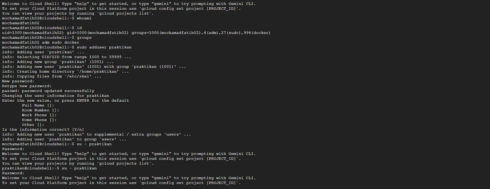

# Laporan Praktikum Minggu [4]
Topik: ["Manajemen Proses dan User di Linux"]

---

## Identitas
- **Nama**  : [Mohammad Fatikh Mahsun]  
- **NIM**   : [250202952]  
- **Kelas** : [1IKRB]

---

## Tujuan
Tuliskan tujuan praktikum minggu ini.  
> Mahasiswa mampu untuk :

-Menjelaskan konsep proses dan user dalam sistem operasi Linux.

-Menampilkan daftar proses yang sedang berjalan dan statusnya.

-Menggunakan perintah untuk membuat dan mengelola user.

-Menghentikan atau mengontrol proses tertentu menggunakan PID.

-Menjelaskan kaitan antara manajemen user dan keamanan sistem.

---

## Dasar Teori
Tuliskan ringkasan teori (3–5 poin) yang mendasari percobaan.

•Manajemen proses adalah inti dari sistem operasi Linux, di mana kernel bertanggung jawab atas pembuatan, eksekusi, dan penghentian proses.

•Proses didefinisikan sebagai instance dari program yang sedang berjalan, dengan atribut utama seperti PID (Process ID) unik, PPID (Parent Process ID), status, dan alokasi sumber daya (CPU, memori, I/O).

•Sedangkan Manajemen user melibatkan pengaturan akun untuk mengontrol akses ke sistem. Setiap user direpresentasikan oleh UID (User ID) dan GID (Group ID), dengan file konfigurasi utama 

---

## Langkah Praktikum
1. Langkah-langkah yang dilakukan.  
2. Perintah yang dijalankan.  
3. File dan kode yang dibuat.  
4. Commit message yang digunakan.

1.Setup Environment

Gunakan Linux (Ubuntu/WSL).
Pastikan Anda sudah login sebagai user non-root.
Siapkan folder kerja:
praktikum/week4-proses-user/

2.Eksperimen 1 – Identitas User Jalankan perintah berikut:

whoami
id
groups

Jelaskan setiap output dan fungsinya.
Buat user baru (jika memiliki izin sudo):
sudo adduser praktikan
sudo passwd praktikan
Uji login ke user baru.

3.Eksperimen 2 – Monitoring Proses Jalankan:

ps aux | head -10
top -n 1
Jelaskan kolom penting seperti PID, USER, %CPU, %MEM, COMMAND.
Simpan tangkapan layar top ke:
praktikum/week4-proses-user/screenshots/top.png

4.Eksperimen 3 – Kontrol Proses

Jalankan program latar belakang:
sleep 1000 &
ps aux | grep sleep
Catat PID proses sleep.
Hentikan proses:
kill <PID>
Pastikan proses telah berhenti dengan ps aux | grep sleep.

5.Eksperimen 4 – Analisis Hierarki Proses Jalankan:

pstree -p | head -20
Amati hierarki proses dan identifikasi proses induk (init/systemd).
Catat hasilnya dalam laporan.
Commit & Push

6.git add .
git commit -m "Minggu 4 - Manajemen Proses & User"
git push origin main

---

## Kode / Perintah
Tuliskan potongan kode atau perintah utama:
```bash
uname -a
lsmod | head
dmesg | head
```

---

## Hasil Eksekusi
Sertakan screenshot hasil percobaan atau diagram:


[Screenshot hasil](screenshots/week-4[1].png)

[Screenshot hasil](screenshots/week-4.png)

[Screenshot hasil](screenshots/weeek-4_fatihh[1].png)

---

## Analisis
- Jelaskan makna hasil percobaan.  
- Hubungkan hasil dengan teori (fungsi kernel, system call, arsitektur OS).  
- Apa perbedaan hasil di lingkungan OS berbeda (Linux vs Windows)?

Manajemen proses dan user adalah fondasi sistem operasi Linux, yang memungkinkan operasi multi-user dan multitasking yang efisien.
Proses: Linux menggunakan model proses berbasis Unix, di mana setiap proses memiliki PID unik dan hierarki parent-child melalui sistem call seperti fork dan exec,Kernel mengelola scheduling dengan CFS (Completely Fair Scheduler), yang mengalokasikan CPU secara adil berdasarkan prioritas. Proses dapat berjalan sebagai  background atau interaktif, dengan dukungan IPC (Inter-Process Communication) seperti pipes dan shared memory.
User: Sistem multi-user dengan UID/GID, diatur dalam file /etc/passwd dan /etc/shadow. Mekanisme sudo dan PAM memungkinkan autentikasi fleksibel, sementara grup memfasilitasi kontrol akses bersama.
Dalam segi keamanan dan resiko:
Linux unggul dalam keamanan open-source (patch cepat via komunitas), tetapi rendah dibandingkan macOS. Dibandingkan BSD, Linux lebih inovatif tapi kurang konsisten untuk embedded systems.


---

## Kesimpulan
Tuliskan 2–3 poin kesimpulan dari praktikum ini.
Manajemen proses dan user di Linux kuat untuk skalabilitas dan keamanan, namun rentan terhadap kesalahan manusia. Ini cocok untuk lingkungan yang membutuhkan kontrol granular, seperti server enterprise atau cloud, tapi memerlukan administrasi ahli untuk menghindari risiko. Jika dibandingkan secara keseluruhan, Linux menawarkan keseimbangan terbaik antara efisiensi dan fleksibilitas di antara sistem Unix-like.

---

## Quiz
1. Apa fungsi dari proses init atau systemd dalam sistem Linux?
   
2. Apa perbedaan antara kill dan killall?

3. Mengapa user root memiliki hak istimewa di sistem Linux?

   **Jawaban:**
   
1. Proses init adalah proses pertama yang dijalankan oleh kernel Linux setelah boot, bertugas sebagai "parent" dari semua proses lain. Ia mengelola startup sistem, menginisialisasi layanan dasar (seperti mounting filesystem dan mengaktifkan jaringan), dan menjaga sistem berjalan stabil. Pada distribusi lama seperti Ubuntu 14.04 atau CentOS 6, init menggunakan skrip SysV (berbasis shell script di /etc/init.d).

2. •Kill: Perintah untuk menghentikan proses spesifik berdasarkan Process ID (PID). Contoh: kill 1234 mengirim sinyal (default SIGTERM) ke proses dengan PID 1234. Jika proses tidak responsif, gunakan kill -9 1234 (SIGKILL paksa). Kill tepat untuk kontrol granular, tapi memerlukan PID yang diketahui (dapatkan via ps atau pgrep).
   •Killall: Menghentikan semua proses dengan nama tertentu, tanpa perlu PID. Contoh: killall firefox menghentikan semua instance Firefox. Lebih mudah untuk batch, tapi berbahaya jika nama proses umum (misalnya, killall bash bisa matikan shell aktif). Mengirim sinyal sama seperti kill, dan mendukung opsi seperti -9 untuk paksa.

3. Karena Dalam model multi-user Unix (dari 1970-an), root mencegah konflik—user biasa terisolasi untuk keamanan, sementara root diperlukan untuk tugas kritis seperti boot atau patching. Tanpa root, sistem rentan deadlock (misalnya, tidak bisa mount disk jika permission salah). Namun, ini berisiko: root bisa hapus sistem secara tidak sengaja. Mekanisme seperti sudo membatasi eskalasi, tapi root tetap "superuser" untuk kompatibilitas legacy.

---

## Refleksi Diri
Tuliskan secara singkat:
- Apa bagian yang paling menantang minggu ini?  
- Bagaimana cara Anda mengatasinya?

-keterbatasan laptop 

-berusaha dengan mengerjakanya di ruang lab


---

**Credit:**  
_Template laporan praktikum Sistem Operasi (SO-202501) – Universitas Putra Bangsa_
