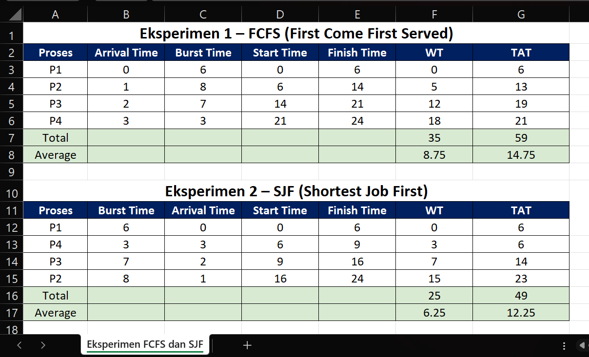

# Laporan Praktikum Minggu 5
Topik: Penjadwalan CPU – FCFS dan SJF

---

## Identitas
- **Nama**  : Rizky Iqbal Hisyam  
- **NIM**   : 250202926  
- **Kelas** : 1IKRA

---

## Tujuan
Setelah menyelesaikan tugas ini, mahasiswa mampu:
1. Menghitung *waiting time* dan *turnaround time* untuk algoritma FCFS dan SJF.  
2. Menyajikan hasil perhitungan dalam tabel yang rapi dan mudah dibaca.  
3. Membandingkan performa FCFS dan SJF berdasarkan hasil analisis.  
4. Menjelaskan kelebihan dan kekurangan masing-masing algoritma.  
5. Menyimpulkan kapan algoritma FCFS atau SJF lebih sesuai digunakan.  

---

## Dasar Teori
Dalam sistem operasi, penjadwalan CPU dilakukan supaya prosesor bisa membagi waktu eksekusi antar proses secara adil dan efisien. Tujuannya sederhana agar tidak ada proses yang menunggu terlalu lama dan sistem tetap responsif saat menjalankan banyak tugas sekaligus.

Pada percobaan ini, algoritma yang digunakan adalah FCFS (First Come First Served) dan SJF (Shortest Job First).

FCFS bekerja seperti sistem antrean di loket: siapa yang datang duluan, dia yang dilayani lebih dulu. Cara ini mudah dipahami dan diterapkan, tapi kadang membuat proses lain menunggu lama jika proses pertama punya waktu eksekusi yang panjang.

Sementara SJF memilih proses dengan waktu eksekusi (burst time) paling pendek untuk dijalankan lebih dulu. Logikanya, kalau proses cepat diselesaikan lebih dulu, maka rata-rata waktu tunggu akan lebih kecil. Namun, metode ini bisa kurang adil karena proses yang lebih lama bisa terus tertunda kalau proses-proses pendek terus berdatangan.

---

## Langkah Praktikum
1. Siapkan data proses (misal P1, P2, P3, dan P4) dengan burst time dan arrival time yang sudah ditentukan.  
2. Siapkan alat perhitungan manual atau spreadsheet (Excel/Google Sheets).
3. Eksperimen 1 berdasarkan waktu kedatangan/*Arrival Time*(First Come First Served), hitung rata-rata Waiting Time (WT) dan Turnaround Time (TAT).
4. Buat Gantt Chart sederhana sebagai ilustrasi FCFS.
5. Eksperimen 2 berdasarkan *Burst Time* terpendek (Shortest Job First) dan hitung WT serta TAT nya seperti pada langkah 3. 
6. Buat tabel perbandingan rata-rata WT & TAT dari kedua eksperimen tersebut dan analisis perbedaannya.
7. Commit dan push hasil praktikum
 ```bash
   git add .
   git commit -m "Minggu 5 - CPU Scheduling FCFS & SJF"
   git push origin main
   ```

---

## Hasil Eksekusi & Analisis
Hasil eksperimen:


**Eksperimen 1 – FCFS (First Come First Served)**
- Urutkan berdasarkan *Arrival Time*/kedatangan: P1 > P2 > P3 > P4
- Tabel perhitungan WT & TAT:
| Proses | Arrival Time | Burst Time | Start Time | Finish Time | Waiting Time | Turnaround Time |
   | :---: | :---: | :---: | :---: | :---: | :---: | :---: |
   | P1 | 0 | 6 | 0 | 6 | 0 | 6 |
   | P2 | 1 | 8 | 6 | 14 | 5 | 13 |
   | P2 | 2 | 7 | 14 | 21 | 12 | 19 |
   | P3 | 3 | 3 | 21 | 24 | 18 | 21 |
   | Total | | | | | 35 | 59 |
   | Average | | | | | 8,75 | 14,75 |

- Gantt Chart:
 ```
   | P1 | P2 | P3 | P4 |
   0    6    14   21   24
   ```
**Eksperimen 2 – SJF (Shortest Job First)**
- Urutkan berdasarkan *Burst Time* terpendek (dengan memperhatikan waktu kedatangan): P1 > P4 > P3 > P2  
*(P1 dijalankan lebih dulu karena datang di waktu 0/saat CPU kosong, meskipun P4 memiliki Burst Time yang lebih pendek)*
- Tabel perhitungan WT & TAT:
| Proses | Burst Time | Arrival Time | Start Time | Finish Time | Waiting Time | Turnaround Time |
   | :---: | :---: | :---: | :---: | :---: | :---: | :---: |
   | P1 | 6 | 0 | 0 | 6 | 0 | 6 |
   | P4 | 3 | 3 | 6 | 9 | 3 | 6 |
   | P3 | 7 | 2 | 9 | 16 | 7 | 14 |
   | P2 | 8 | 1 | 16 | 24 | 15 | 23 |
   | Total | | | | | 25 | 49 |
   | Average | | | | | 6,25 | 12,25 |

- Gantt Chart:
```
| P1 | P4 | P3 | P2 |
0    6    9    16   24
```

**Tabel Perbandingan FCFS dan SJF**

| Algoritma | Avg Waiting Time | Avg Turnaround Time | Kelebihan | Kekurangan |
   | :--- | :--- | :--- | :--- | :--- |
   | FCFS | 8,75 | 14,75 | Sederhana dan mudah diterapkan | Tidak efisien untuk proses panjang |
   | SJF | 6,25 | 12,25	| Optimal untuk job pendek | Menyebabkan starvation pada job panjang |

**Penjelasan Kelebihan Kekurangan FCFS dan SJF**

FCFS lebih baik digunakan saat lama prosesnya hampir sama atau ketika keadilan urutan eksekusi lebih diutamakan. FCFS sederhana dan adil, tapi bisa membuat proses lain menunggu lama jika proses pertama terlalu panjang.  

Sebaliknya, SJF lebih unggul saat proses yang datang memiliki waktu eksekusi berbeda-beda, terutama jika ada banyak proses singkat. Karena proses dengan burst time paling pendek dijalankan lebih dulu, waktu tunggu rata-rata jadi lebih kecil dan sistem terasa lebih cepat.

**Kesimpulan**

Kedua algoritma punya kelebihan masing-masing. SJF cocok untuk sistem yang ingin efisien dan cepat, sedangkan FCFS cocok untuk sistem yang sederhana dan adil sesuai antrian. Pemilihan algoritma tergantung pada kebutuhan dan karakteristik proses yang dijalankan.

---

## Quiz
1. Apa perbedaan utama antara FCFS dan SJF?  
   **Jawaban:**  Perbedaan utama antara FCFS dan SJF ada pada cara mereka memilih proses yang dijalankan lebih dulu. FCFS bekerja seperti antrean di loket siapa yang datang duluan, dia yang dilayani lebih dulu. Sederhana dan adil, tapi kadang bikin proses lain menunggu lama kalau proses pertama butuh waktu lama untuk selesai. Sedangkan SJF lebih mirip seperti melayani yang paling cepat selesai lebih dulu. Proses dengan waktu eksekusi paling singkat akan dikerjakan lebih awal supaya sistem terasa lebih cepat dan efisien. Tapi, cara ini bisa bikin proses yang lebih lama terus tertunda kalau proses-proses pendek terus berdatangan.
2. Mengapa SJF dapat menghasilkan rata-rata waktu tunggu minimum?  
   **Jawaban:**  SJF bisa menghasilkan waktu tunggu rata-rata paling kecil karena algoritma ini selalu memberi prioritas pada proses yang paling cepat selesai. Dengan menjalankan proses yang singkat terlebih dahulu, sistem bisa menyelesaikan lebih banyak pekerjaan dalam waktu yang lebih sedikit. Singkatnya, SJF membuat antrian proses jadi lebih efisien karena tidak membiarkan proses-proses kecil terjebak menunggu proses besar selesai lebih dulu.
3. Apa kelemahan SJF jika diterapkan pada sistem interaktif?  
   **Jawaban:**  Kelemahan SJF jika diterapkan pada sistem interaktif adalah starvation, yaitu proses yang lebih lama mungkin tidak akan pernah dilayani. Dalam sistem interaktif (seperti komputer dengan banyak pengguna dalam satu waktu), waktu eksekusi tiap proses tidak selalu bisa diketahui. SJF membutuhkan perkiraan burst time agar bisa memutuskan siapa yang paling cepat, tapi di sistem nyata hal itu sulit dilakukan dengan akurat. Sehingga menyebabkan proses besar terus tertunda kalau proses-proses kecil terus berdatangan. Akibatnya, respons sistem untuk beberapa pengguna bisa terasa lambat dan tidak adil.

---

## Refleksi Diri
Tuliskan secara singkat:
- Apa bagian yang paling menantang minggu ini?  
Pengoperasian Excel serta memahami algoritma FCFS dan SJF
- Bagaimana cara Anda mengatasinya?  
Mempelajari dari beberapa sumber terkait dan mengaplikasikan ke dalam eksperimen

---

**Credit:**  
_Template laporan praktikum Sistem Operasi (SO-202501) – Universitas Putra Bangsa_
