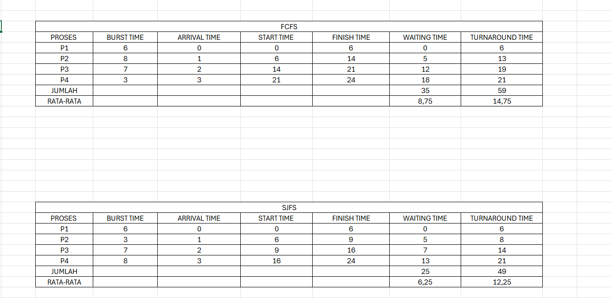
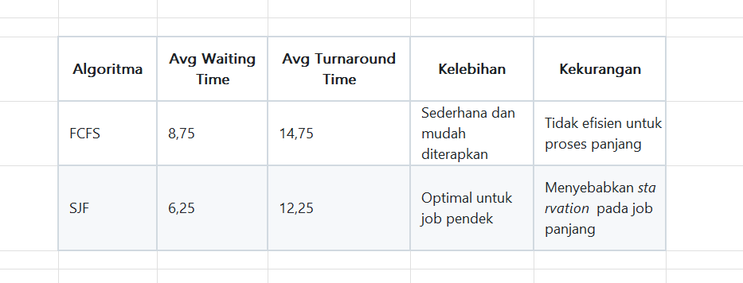

# Laporan Praktikum Minggu [5]
Topik: Penjadwalan CPU – FCFS dan SJF

---

## Identitas
- **Nama**  : [Mohammad Fatikh Mahsun]  
- **NIM**   : [250202952]  
- **Kelas** : [1IKRB]

---

## Tujuan
Tujuan dari praktikum minggu ke-6 ini adalah untuk memahami dan menganalisis mekanisme kerja algoritma penjadwalan CPU, khususnya Round Robin (RR) dan Priority Scheduling. Melalui praktikum ini, saya bertujuan untuk:
1.	Mempelajari prinsip dasar kedua algoritma, yaitu bagaimana CPU memberikan giliran eksekusi kepada setiap proses berdasarkan time quantum (pada RR) dan tingkat prioritas (pada Priority Scheduling).

2.	Menghitung nilai Waiting Time dan Turnaround Time setiap proses secara manual menggunakan data proses yang telah diberikan, serta memahami hubungan antara kedua parameter tersebut terhadap efisiensi sistem.

3.	Menyusun simulasi eksekusi dalam bentuk Gantt Chart, untuk memvisualisasikan urutan dan waktu eksekusi setiap proses secara kronologis.

4.	Menganalisis pengaruh perubahan nilai time quantum terhadap performa algoritma Round Robin, terutama terhadap keadilan (fairness) dan efisiensi penggunaan CPU.

5.	Membandingkan hasil antara algoritma Round Robin dan Priority Scheduling, baik dari segi waktu tunggu rata-rata, waktu penyelesaian rata-rata, maupun kelebihan dan kekurangannya dalam konteks keadilan dan efisiensi eksekusi.

6.	Menarik kesimpulan mengenai karakteristik masing-masing algoritma, serta memahami kondisi atau jenis sistem yang paling cocok untuk menerapkan setiap algoritma tersebut.

---

## Dasar Teori
1.Penjadwalan CPU (CPU Scheduling) merupakan mekanisme yang digunakan sistem operasi untuk menentukan urutan eksekusi proses yang ada di antrian siap (ready queue). Tujuannya adalah untuk memanfaatkan CPU seefisien mungkin, mengurangi waktu tunggu rata-rata, serta meningkatkan kinerja dan respons sistem.

2.Algoritma Round Robin (RR) adalah salah satu metode penjadwalan preemptive yang memberikan giliran waktu eksekusi secara bergantian kepada setiap proses berdasarkan satuan waktu tertentu yang disebut time quantum. Setiap proses mendapat jatah waktu yang sama, sehingga algoritma ini dianggap adil untuk sistem multitasking, terutama pada sistem interaktif.

3.Algoritma Priority Scheduling bekerja dengan cara memilih proses berdasarkan tingkat prioritas yang telah ditentukan. Proses dengan nilai prioritas tertinggi (biasanya angka paling kecil) akan dijalankan terlebih dahulu. Algoritma ini lebih efisien untuk menangani proses penting, tetapi berisiko menyebabkan starvation pada proses dengan prioritas rendah.

4.Waiting Time (WT) dan Turnaround Time (TAT) merupakan dua parameter penting untuk mengevaluasi performa algoritma penjadwalan. Waiting Time menunjukkan lamanya proses menunggu di antrian sebelum dieksekusi, sedangkan Turnaround Time menunjukkan total waktu sejak proses tiba hingga selesai dijalankan.

5.Pemilihan algoritma penjadwalan yang tepat sangat bergantung pada karakteristik sistem dan jenis beban kerja. Algoritma Round Robin lebih cocok untuk sistem interaktif yang membutuhkan keadilan waktu, sedangkan Priority Scheduling lebih sesuai untuk sistem yang menuntut efisiensi dan kontrol terhadap proses penting.

---

## Langkah Praktikum
1. Langkah-langkah yang dilakukan.  
2. Perintah yang dijalankan.  
3. File dan kode yang dibuat.  
4. Commit message yang digunakan.

---

## Kode / Perintah

Waiting Time (WT) = waktu mulai eksekusi - Arrival Time
Turnaround Time (TAT) = WT + Burst Time

| P1 | P2 | P3 | P4 |
0    6    14   21   24

praktikum/week5-scheduling-fcfs-sjf/screenshots/

git add .
git commit -m "Minggu 5 - CPU Scheduling FCFS & SJF"
git push origin main

---

## Hasil Eksekusi
Sertakan screenshot hasil percobaan atau diagram:

---

## Analisis

Pada algoritma Round Robin, setiap proses mendapatkan jatah waktu eksekusi yang sama sesuai dengan nilai time quantum yang ditentukan. Hal ini membuat algoritma ini dianggap adil (fair) karena tidak ada proses yang dimonopoli oleh satu proses tertentu. Dari hasil percobaan, terlihat bahwa semakin kecil nilai time quantum, maka proses akan sering mengalami context switching, sehingga waktu eksekusi total menjadi lebih lama. Sebaliknya, jika time quantum terlalu besar, maka keadilan eksekusi menurun dan algoritma ini akan cenderung menyerupai FCFS (First Come First Served). Oleh karena itu, pemilihan nilai time quantum yang tepat sangat berpengaruh terhadap efisiensi dan kinerja sistem.

Sedangkan pada algoritma Priority Scheduling, penjadwalan dilakukan berdasarkan tingkat prioritas yang telah ditentukan. Proses dengan prioritas tertinggi akan dieksekusi lebih dahulu, tanpa memperhatikan waktu kedatangan atau lama burst time. Dari hasil percobaan, terlihat bahwa algoritma ini mampu menyelesaikan proses-proses penting dengan lebih cepat, namun dapat menyebabkan proses dengan prioritas rendah menunggu terlalu lama (starvation). Hal ini menunjukkan bahwa algoritma ini lebih menekankan pada efisiensi untuk proses kritis, bukan pada keadilan waktu antar proses.

---

## Kesimpulan

algoritma Round Robin lebih cocok digunakan pada sistem interaktif yang membutuhkan respons cepat dan adil bagi semua pengguna, seperti sistem operasi multitasking. Sedangkan Priority Scheduling lebih sesuai digunakan pada sistem yang membutuhkan pengaturan prioritas ketat, seperti sistem real-time atau sistem dengan proses yang memiliki tingkat kepentingan berbeda.

---

## Quiz

1. Perbedaan utama antara FCFS dan SJF

Perbedaan utama antara First Come First Served (FCFS) dan Shortest Job First (SJF) terletak pada cara keduanya menentukan urutan eksekusi proses. FCFS menjalankan proses berdasarkan urutan kedatangan — siapa yang datang lebih dulu akan dieksekusi lebih dulu. Sementara itu, SJF memilih proses yang memiliki waktu eksekusi (burst time) paling singkat untuk dijalankan terlebih dahulu, tanpa memperhatikan urutan kedatangannya. Dengan kata lain, FCFS bersifat sederhana dan adil terhadap waktu kedatangan, sedangkan SJF lebih berfokus pada efisiensi waktu pemrosesan.

2. Alasan SJF menghasilkan rata-rata waktu tunggu minimum

SJF dapat menghasilkan rata-rata waktu tunggu paling rendah karena algoritma ini memprioritaskan proses yang membutuhkan waktu eksekusi paling singkat. Dengan cara ini, proses-proses kecil dapat segera selesai tanpa harus menunggu proses yang lebih lama. Akibatnya, total waktu tunggu seluruh proses menjadi lebih efisien. Pendekatan ini mirip dengan prinsip efisiensi dalam antrean — jika tugas-tugas ringan diselesaikan terlebih dahulu, maka beban sistem secara keseluruhan akan berkurang lebih cepat.

3. Kelemahan SJF pada sistem interaktif

Kelemahan utama SJF ketika diterapkan pada sistem interaktif adalah sulitnya memprediksi waktu eksekusi setiap proses secara akurat. Sistem interaktif biasanya melibatkan banyak permintaan pengguna dengan durasi yang tidak pasti dan berubah-ubah. Selain itu, proses yang memiliki waktu eksekusi lebih panjang cenderung tertunda terus-menerus karena selalu kalah prioritas dengan proses yang lebih singkat. Hal ini dapat menyebabkan masalah starvation atau kelaparan proses, di mana beberapa proses tidak pernah mendapat giliran untuk dijalankan.

---

## Refleksi Diri
Tuliskan secara singkat:
- Apa bagian yang paling menantang minggu ini?  
- Bagaimana cara Anda mengatasinya?  

---

**Credit:**  
_Template laporan praktikum Sistem Operasi (SO-202501) – Universitas Putra Bangsa_
