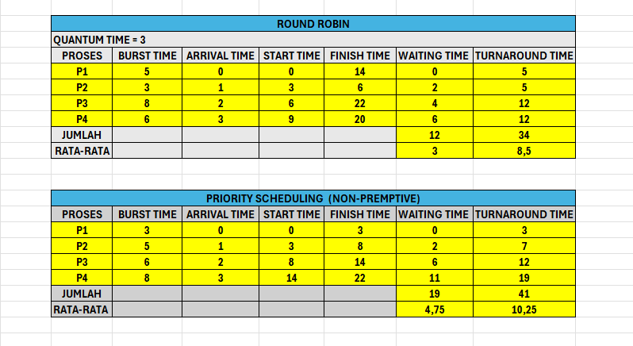
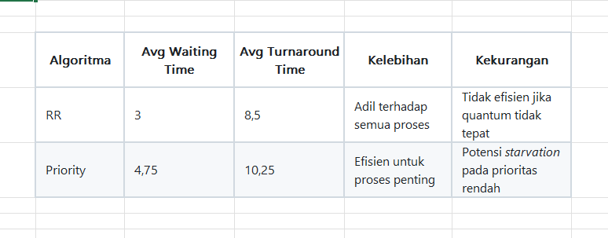

# Laporan Praktikum Minggu [6]
Topik: SCHEDULLING RR PRIORITY

---

## Identitas
- **Nama**  : Mohammad Fatikh Mahsun  
- **NIM**   : 250202952
- **Kelas** :1IKRB

---

## Tujuan
1.  Memahami prinsip kerja algoritma Round Robin dan Priority Scheduling, termasuk mekanisme pemilihan proses serta aturan pembagian waktu eksekusi pada CPU.

2.  Melakukan perhitungan waiting time dan turnaround time untuk setiap proses berdasarkan kedua algoritma tersebut, dengan menggunakan data proses yang telah disediakan.

3.  Menyusun Gantt Chart sebagai representasi visual urutan eksekusi proses, sehingga alur berjalannya setiap proses dapat terlihat secara jelas dan sistematis.

4.  Menganalisis pengaruh variasi time quantum terhadap performa algoritma Round Robin, khususnya terhadap keadilan eksekusi, waktu tunggu, dan waktu penyelesaian proses.

5.  Mengevaluasi dampak penggunaan prioritas pada Priority Scheduling, termasuk keunggulan proses prioritas tinggi serta potensi terjadinya starvation pada proses berprioritas rendah.

6.  Membandingkan performa kedua algoritma melalui hasil perhitungan rata-rata waiting time dan turnaround time, guna menilai efisiensi dan keadilan masing-masing metode penjadwalan.

7.  Menarik kesimpulan berdasarkan hasil simulasi, sehingga dapat memahami kondisi dan skenario yang paling tepat untuk menerapkan algoritma Round Robin maupun Priority Scheduling.

---

## Dasar Teori
1.  Penjadwalan CPU (CPU Scheduling)
Penjadwalan CPU merupakan mekanisme yang digunakan oleh sistem operasi untuk menentukan proses mana yang berhak mendapatkan waktu eksekusi pada CPU. Tujuan utamanya adalah memaksimalkan kinerja sistem melalui pengurangan waiting time, peningkatan throughput, serta pemanfaatan CPU yang optimal.

2.  Round Robin Scheduling (RR)
Round Robin adalah algoritma penjadwalan preemptive yang membagi waktu eksekusi secara merata kepada setiap proses menggunakan satuan waktu tetap yang disebut time quantum. Setiap proses dieksekusi secara bergiliran dalam antrian siap (ready queue). Pendekatan ini dianggap adil karena semua proses mendapatkan jatah waktu yang sama, namun performanya sangat dipengaruhi oleh ukuran quantum.

3.  Priority Scheduling
Priority Scheduling adalah algoritma penjadwalan yang menentukan urutan eksekusi proses berdasarkan tingkat prioritas. Proses dengan nilai prioritas lebih tinggi akan diproses terlebih dahulu. Pada versi non-preemptive, proses yang sedang berjalan tidak akan dihentikan hingga selesai. Algoritma ini efisien untuk menangani proses penting, tetapi dapat menimbulkan masalah starvation pada proses berprioritas rendah.

4.  Waiting Time (WT)
Waiting time merupakan total waktu yang dihabiskan proses dalam antrian sebelum mendapatkan eksekusi CPU. Nilai WT sangat dipengaruhi oleh pola penjadwalan yang digunakan, dan menjadi salah satu indikator utama dalam mengevaluasi performa algoritma.

5.  Turnaround Time (TAT)
Turnaround time adalah total waktu dari sejak proses tiba hingga proses tersebut selesai dieksekusi. Perhitungan TAT mencakup waktu tunggu, waktu eksekusi, serta waktu yang terlibat dalam perpindahan konteks. Nilai TAT digunakan untuk mengukur efisiensi penyelesaian proses oleh sistem operasi.

---

## Langkah Praktikum
1. Langkah-langkah yang dilakukan.  
2. Perintah yang dijalankan.  
3. File dan kode yang dibuat.  
4. Commit message yang digunakan.

---

## Kode / Perintah

```bash
Waiting Time (WT) = waktu mulai eksekusi - Arrival Time
Turnaround Time (TAT) = WT + Burst Time

```

---

## Hasil Eksekusi
Sertakan screenshot hasil percobaan atau diagram:



---

## Analisis
Berdasarkan hasil perhitungan yang telah dilakukan, terlihat bahwa setiap algoritma penjadwalan memiliki karakteristik serta dampak yang berbeda terhadap waktu tunggu (waiting time) dan waktu penyelesaian (turnaround time) setiap proses. Pada algoritma Round Robin, pembagian waktu eksekusi menggunakan time quantum membuat setiap proses memperoleh kesempatan secara merata. Hal ini menciptakan tingkat keadilan yang tinggi, namun pada saat yang sama dapat menyebabkan proses membutuhkan waktu penyelesaian lebih lama apabila quantum yang digunakan terlalu kecil, karena perpindahan konteks terjadi lebih sering.
Sementara itu, algoritma Priority Scheduling menunjukkan pola yang berbeda. Proses dengan prioritas lebih tinggi dapat diselesaikan lebih cepat karena langsung mendapatkan giliran eksekusi tanpa harus menunggu proses lain. Meskipun lebih efisien dalam menangani proses penting, algoritma ini memiliki kelemahan berupa potensi starvation, khususnya pada proses berprioritas rendah yang terus tertunda karena adanya proses baru dengan prioritas lebih tinggi.
Perbandingan nilai rata-rata waiting time dan turnaround time pada kedua algoritma menunjukkan bahwa Round Robin cenderung memberikan hasil yang lebih merata di antara semua proses, sedangkan Priority Scheduling memberikan performa lebih baik pada proses tertentu sesuai tingkat prioritasnya. Secara keseluruhan, efektivitas setiap algoritma sangat bergantung pada konteks penggunaan: Round Robin cocok untuk lingkungan yang menuntut keadilan, sedangkan Priority Scheduling lebih sesuai untuk sistem yang memerlukan penanganan cepat terhadap proses kritis.


---

## Kesimpulan
Dari hasil praktikum yang telah saya lakukan, dapat disimpulkan bahwa algoritma Round Robin dan Priority Scheduling memiliki karakteristik yang berbeda dalam melakukan penjadwalan proses. Round Robin memberikan pemerataan waktu eksekusi melalui penggunaan time quantum, sehingga lebih adil untuk semua proses, meskipun dapat menghasilkan waktu penyelesaian yang lebih lama apabila quantum yang digunakan tidak tepat.
Priority Scheduling menunjukkan kinerja yang lebih cepat pada proses dengan prioritas tinggi karena langsung mendapatkan giliran eksekusi. Namun, algoritma ini memiliki risiko terjadinya starvation pada proses dengan prioritas rendah apabila tidak diatur dengan mekanisme tambahan.
Secara keseluruhan, pemilihan algoritma harus disesuaikan dengan kebutuhan sistem. Round Robin lebih sesuai untuk lingkungan yang mengutamakan keadilan, sedangkan Priority Scheduling lebih tepat digunakan ketika proses penting harus diprioritaskan.


---

## Quiz
1. Apa perbedaan utama antara Round Robin dan Priority Scheduling?
Perbedaan utama antara Round Robin dan Priority Scheduling terletak pada cara keduanya menentukan urutan eksekusi proses. Round Robin memberikan giliran eksekusi secara merata kepada setiap proses berdasarkan time quantum, sehingga semua proses memperoleh kesempatan yang adil tanpa memandang prioritas. Sebaliknya, Priority Scheduling menentukan urutan eksekusi berdasarkan tingkat prioritas, di mana proses dengan prioritas lebih tinggi akan didahulukan, tanpa mempertimbangkan pemerataan waktu antar proses.

2. Apa pengaruh besar/kecilnya time quantum terhadap performa sistem?
Ukuran time quantum sangat mempengaruhi performa algoritma Round Robin. Jika quantum terlalu kecil, sistem akan mengalami banyak perpindahan konteks sehingga waktu eksekusi total dapat meningkat dan kinerja sistem menjadi kurang efisien. Sebaliknya, jika quantum terlalu besar, algoritma akan cenderung menyerupai First-Come First-Served (FCFS), sehingga sifat keadilannya berkurang dan proses dengan burst time pendek harus menunggu lebih lama. Oleh karena itu, pemilihan quantum yang tepat sangat penting untuk menjaga keseimbangan antara efisiensi dan keadilan.

3. Mengapa algoritma Priority dapat menyebabkan starvation?
Priority Scheduling dapat menyebabkan starvation karena proses dengan prioritas rendah berpotensi terus tertunda apabila selalu ada proses baru dengan prioritas lebih tinggi yang masuk ke antrian. Akibatnya, proses berprioritas rendah mungkin tidak pernah mendapatkan kesempatan untuk dieksekusi. Kondisi ini muncul karena mekanisme penjadwalan hanya berfokus pada prioritas tanpa memperhitungkan lamanya waktu proses telah menunggu.

---

## Refleksi Diri
Tuliskan secara singkat:
- Apa bagian yang paling menantang minggu ini?  
- Bagaimana cara Anda mengatasinya?  

---

**Credit:**  
_Template laporan praktikum Sistem Operasi (SO-202501) – Universitas Putra Bangsa_
