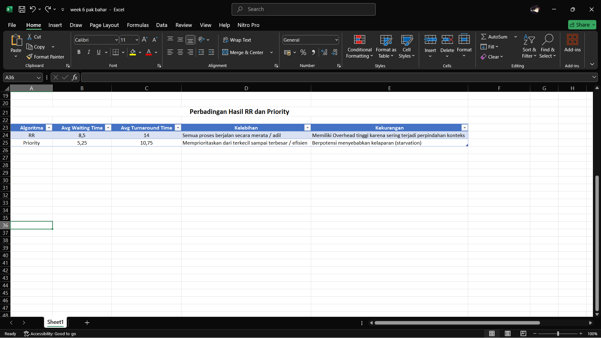

# Laporan Praktikum Minggu 6
Topik: Penjadwalan CPU – Round Robin (RR) dan Priority Scheduling
---

## Identitas
- **Nama**  : Farhan Ramdhani  
- **NIM**   : 250202938  
- **Kelas** : 1IKRB

---

## Tujuan
Tuliskan tujuan praktikum minggu ini.  
1. Menghitung *waiting time* dan *turnaround time* pada algoritma RR dan Priority.  
2. Menyusun tabel hasil perhitungan dengan benar dan sistematis.  
3. Membandingkan performa algoritma RR dan Priority.  
4. Menjelaskan pengaruh *time quantum* dan prioritas terhadap keadilan eksekusi proses.  
5. Menarik kesimpulan mengenai efisiensi dan keadilan kedua algoritma.
---

## Dasar Teori
Tuliskan ringkasan teori (3–5 poin) yang mendasari percobaan.
Penjadwalan CPU (CPU Scheduling)

`Penjadwalan CPU` adalah proses penting dalam sistem operasi yang menentukan proses mana yang akan menggunakan CPU dan berapa lama waktu yang diberikan. Tujuannya supaya CPU tidak menganggur, respon sistem cepat, dan semua proses mendapat giliran dengan adil.

**1. Algoritma Round Robin (RR)**

Algoritma `Round Robin` termasuk jenis penjadwalan preemptive, artinya proses bisa dihentikan sementara untuk memberi kesempatan ke proses lain.
Biasanya digunakan di sistem `time sharing`, di mana banyak pengguna atau program berbagi waktu CPU secara bergantian.

***Cara kerja :*** Setiap proses diberi waktu kecil tertentu yang disebut `kuantum waktu (q)`.
Selama waktu itu, proses akan berjalan. Kalau belum selesai setelah waktu `q` habis, proses tersebut dihentikan sementara dan dimasukkan kembali ke antrian untuk menunggu giliran berikutnya.

***Kelebihan :***
- Semua proses mendapat kesempatan yang sama (adil).
- Tidak ada proses yang terus-menerus menjalankan CPU sendirian.

***Kekurangan :***
- Jika nilai `q` terlalu kecil, pergantian antar proses `(context switch)` terlalu sering dan membuat sistem lambat.
- ika `q` terlalu besar, algoritma ini malah mirip `FCFS` `(First-Come, First-Served)` dan kehilangan keunggulannya.

**2. Algoritma Priority Scheduling (Non-Preemptive)**

Algoritma Priority Scheduling memilih proses berdasarkan tingkat prioritasnya.
Proses dengan prioritas tertinggi akan dijalankan lebih dulu.

***Cara kerja :*** CPU akan menjalankan proses dengan angka prioritas paling kecil (misalnya prioritas 1 lebih tinggi dari prioritas 4).
Karena bersifat non-preemptive, jika suatu proses sudah mulai dijalankan, maka proses itu akan terus berjalan sampai selesai, walaupun ada proses lain dengan prioritas lebih tinggi yang datang belakangan.

***Kelebihan :***
- Cocok untuk sistem yang punya tugas-tugas penting (misalnya tugas sistem lebih penting daripada tugas pengguna biasa).
- Bisa menghasilkan `waktu tunggu (WT)` dan `waktu penyelesaian (TAT)` rata-rata yang cepat kalau proses penting punya waktu eksekusi pendek.

***Kekurangan :***
- Ada risiko `starvation` (kelaparan), yaitu proses berprioritas rendah bisa tidak pernah dijalankan jika terus ada proses berprioritas tinggi yang datang.
---

## Langkah Praktikum
1. **Siapkan Data Proses**
   Gunakan contoh data berikut (boleh dimodifikasi sesuai kebutuhan):
   | Proses | Burst Time | Arrival Time | Priority |
   |:--:|:--:|:--:|:--:|
   | P1 | 5 | 0 | 2 |
   | P2 | 3 | 1 | 1 |
   | P3 | 8 | 2 | 4 |
   | P4 | 6 | 3 | 3 |

2. **Eksperimen 1 – Round Robin (RR)**
   - Gunakan *time quantum (q)* = 3.  
   - Hitung *waiting time* dan *turnaround time* untuk tiap proses.  
   - Simulasikan eksekusi menggunakan Gantt Chart (manual atau spreadsheet).  
     ```
     | P1 | P2 | P3 | P4 | P1 | P3 | ...
     0    3    6    9   12   15   18  ...
     ```
   - Catat sisa *burst time* tiap putaran.

3. **Eksperimen 2 – Priority Scheduling (Non-Preemptive)**
   - Urutkan proses berdasarkan nilai prioritas (angka kecil = prioritas tinggi).  
   - Lakukan perhitungan manual untuk:
     ```
     WT[i] = waktu mulai eksekusi - Arrival[i]
     TAT[i] = WT[i] + Burst[i]
     ```
   - Buat tabel perbandingan hasil RR dan Priority.

4. **Eksperimen 3 – Analisis Variasi Time Quantum (Opsional)**
   - Ubah *quantum* menjadi 2 dan 5.  
   - Amati perubahan nilai rata-rata *waiting time* dan *turnaround time*.  
   - Buat tabel perbandingan efek *quantum*.

5. **Eksperimen 4 – Dokumentasi**
   - Simpan semua hasil tabel dan screenshot ke:
     ```
     praktikum/week6-scheduling-rr-priority/screenshots/
     ```
   - Buat tabel perbandingan seperti berikut:

     | Algoritma | Avg Waiting Time | Avg Turnaround Time | Kelebihan | Kekurangan |
     |------------|------------------|----------------------|------------|-------------|
     | RR | ... | ... | Adil terhadap semua proses | Tidak efisien jika quantum tidak tepat |
     | Priority | ... | ... | Efisien untuk proses penting | Potensi *starvation* pada prioritas rendah |

6. **Commit & Push**
 ```bash
   git add .
   git commit -m "Minggu 6 - CPU Scheduling RR & Priority"
   git push origin main
   ```


---

## Kode / Perintah
Tuliskan potongan kode atau perintah utama:

     | P1 | P2 | P3 | P4 | P1 | P3 | ...
     0    3    6    9   12   15   18  ...
---
     WT[i] = waktu mulai eksekusi - Arrival[i]
     TAT[i] = WT[i] + Burst[i]

---

## Hasil Eksekusi
Sertakan screenshot hasil percobaan atau diagram:




---

## Analisis
- Jelaskan makna hasil percobaan.

Dari hasil percobaan yang saya lakukan, algoritma `Round Robin (RR)` menghasilkan rata-rata `waktu tunggu (WT)` sebesar `8,5` dan rata-rata `waktu penyelesaian (TAT)` sebesar `14`.
Sedangkan algoritma `Priority Scheduling` menghasilkan rata-rata `WT` = `5,25` dan `TAT` = `10,75`.
Dari angka itu bisa dilihat kalau algoritma `Priority` bekerja lebih efisien, karena proses dengan prioritas lebih tinggi dijalankan lebih dulu sehingga total waktu tunggunya lebih kecil.
Sementara `Round Robin` tetap punya keunggulan di sisi keadilan, karena semua proses dapat giliran menjalankan CPU secara bergantian tanpa dibeda-bedakan.

- Hubungkan hasil dengan teori (fungsi kernel, system call, arsitektur OS). 

Dalam sistem operasi, `penjadwalan CPU` diatur langsung oleh `kernel`. `Kernel` bertugas menentukan proses mana yang berhak memakai CPU berdasarkan algoritma penjadwalan yang digunakan (seperti `RR` atau `Priority`).
Proses perpindahan antar tugas (`context switch`) terjadi melalui `system call` yang dilakukan oleh sistem.
Dari hasil percobaan ini, terlihat bagaimana teori tersebut berjalan dalam praktik : sistem mengatur proses secara otomatis agar CPU selalu bekerja optimal dan proses tetap berjalan adil sesuai prioritas yang diberikan.

- Apa perbedaan hasil di lingkungan OS berbeda (Linux vs Windows)? 

Kalau percobaan ini dijalankan di `Linux`, hasilnya bisa sedikit berbeda karena `Linux` memakai `Completely Fair Scheduler (CFS)`, yang mencoba menyeimbangkan keadilan seperti `Round Robin` tapi tetap memperhatikan `prioritas`.
Sedangkan di `Windows`, sistemnya lebih menekankan `preemptive priority`, jadi proses dengan prioritas tinggi bisa langsung mengambil alih CPU kapan saja.
Akibatnya, di `Windows` hasilnya bisa lebih cepat untuk proses penting, tapi ada risiko proses lain tertunda lama `(starvation)`.


---

## Kesimpulan
Tuliskan 2–3 poin kesimpulan dari praktikum ini.
1. Dari hasil percobaan, algoritma `Priority Scheduling` terbukti lebih efisien karena waktu tunggu dan waktu penyelesaiannya lebih kecil dibanding `Round Robin`.


2. `Round Robin` lebih unggul dalam hal keadilan karena semua proses mendapat giliran CPU, tapi bisa jadi lambat kalau kuantum waktunya terlalu kecil.


3. Setiap algoritma punya kelebihan masing-masing, jadi pemilihannya tergantung kebutuhan sistem.

---

## Quiz
1. Apa perbedaan utama antara Round Robin dan Priority Scheduling ?  
   **Jawaban :** `Round Robin` memberikan waktu CPU secara bergantian ke setiap proses dengan durasi waktu tertentu `( time quantum )`, sedangkan `Priority Scheduling` menjalankan proses berdasarkan tingkat prioritasnya ( proses dengan prioritas tertinggi dijalankan terlebih dahulu ).

2. Apa pengaruh besar/kecilnya time quantum terhadap performa sistem ?

   **Jawaban :** Kalau `time quantum` terlalu kecil, sistem akan sering berpindah antar proses `(context switch)`, sehingga performa jadi lambat karena banyak waktu terbuang.
Tapi kalau `time quantum` terlalu besar, proses akan berjalan terlalu lama tanpa disela, dan sistem jadi terasa seperti `FCFS (First-Come, First-Served)`, yang kurang adil untuk proses lain.

  
3. Mengapa algoritma Priority dapat menyebabkan starvation ?  
   **Jawaban :** Karena kalau proses dengan prioritas tinggi terus datang, proses dengan prioritas rendah bisa tidak pernah dieksekusi. Akibatnya, proses tersebut “kelaparan” CPU dan tertunda terus-menerus.
 

---

## Refleksi Diri
Tuliskan secara singkat:
1. Apa bagian yang paling menantang minggu ini? 

Memahami cara mengerjakan tugasya, seperti membuat rumus untuk eksperimen  

2. Bagaimana cara Anda mengatasinya?  

Saya coba memahami langkah-langkahnya dulu dari teori, lalu membuat tabel perhitungan di `Excel`. Setelah itu saya bandingkan hasilnya dengan teori agar lebih yakin bahwa perhitungannya benar.

---

**Credit:**  
_Template laporan praktikum Sistem Operasi (SO-202501) – Universitas Putra Bangsa_
