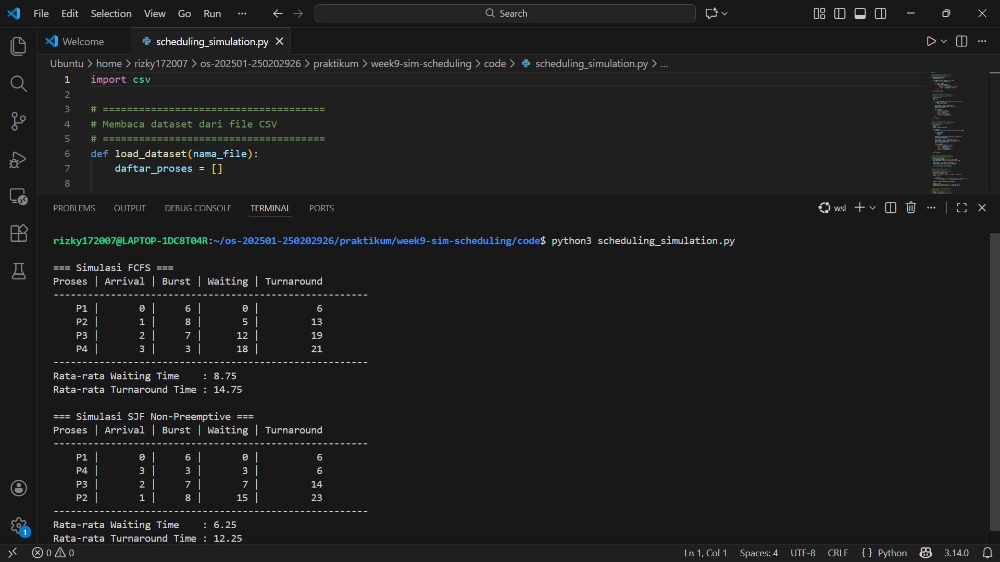

# Laporan Praktikum Minggu 9
Topik: Simulasi Algoritma Penjadwalan CPU

---

## Identitas
- **Nama**  : Rizky Iqbal Hisyam  
- **NIM**   : 250202926  
- **Kelas** : 1IKRA

---

## Tujuan
Setelah menyelesaikan tugas ini, mahasiswa mampu:
1. Membuat program simulasi algoritma penjadwalan FCFS dan/atau SJF.  
2. Menjalankan program dengan dataset uji yang diberikan atau dibuat sendiri.  
3. Menyajikan output simulasi dalam bentuk tabel atau grafik.  
4. Menjelaskan hasil simulasi secara tertulis.  
5. Mengunggah kode dan laporan ke Git repository dengan rapi dan tepat waktu.

---

## Dasar Teori
Penjadwalan CPU adalah cara sistem operasi mengatur urutan proses yang akan dijalankan oleh prosesor. Karena CPU harus melayani banyak proses secara bergantian, diperlukan mekanisme penjadwalan agar penggunaan CPU tetap efisien dan adil. Penjadwalan yang baik dapat mengurangi waktu tunggu proses dan meningkatkan kinerja sistem secara keseluruhan.

Pada praktikum ini, penjadwalan CPU disimulasikan melalui sebuah program dengan data proses yang dibaca dari file CSV. File CSV digunakan untuk menyimpan informasi proses seperti waktu kedatangan dan waktu eksekusi, sehingga data mudah diubah tanpa mengubah kode program. Program kemudian mengolah data tersebut sesuai algoritma penjadwalan yang digunakan dan menampilkan hasil berupa urutan proses serta perhitungan kinerja penjadwalan. Melalui simulasi ini, konsep penjadwalan CPU dapat dipahami dengan lebih jelas dan praktis.

---

## Langkah Praktikum
1. Sesuaikan struktur folder dengan template repo:
```
praktikum/week9-sim-scheduling/
├─ code/
│  ├─ scheduling_simulation.*
│  └─ dataset.csv
├─ screenshots/
│  └─ hasil_simulasi.png
└─ laporan.md
```
2. Siapkan dataset seperti berikut:
   | Proses | Arrival Time | Burst Time |
   |:--:|:--:|:--:|
   | P1 | 0 | 6 |
   | P2 | 1 | 8 |
   | P3 | 2 | 7 |
   | P4 | 3 | 3 |
3. Implementasikan Algoritma

   Program harus:
   - Menghitung *waiting time* dan *turnaround time*.  
   - Mendukung minimal **1 algoritma (FCFS atau SJF non-preemptive)**.  
   - Menampilkan hasil dalam tabel.

4. Eksekusi & Validasi

   - Jalankan program menggunakan dataset uji.  
   - Pastikan hasil sesuai dengan perhitungan manual minggu sebelumnya.  
   - Simpan hasil eksekusi (screenshot).

5. Analisis

   - Jelaskan alur program.  
   - Bandingkan hasil simulasi dengan perhitungan manual.  
   - Jelaskan kelebihan dan keterbatasan simulasi.

6. Commit & Push

   ```bash
   git add .
   git commit -m "Minggu 9 - Simulasi Scheduling CPU"
   git push origin main
   ```


---

## Kode / Perintah
Kode utama ada di folder praktikum/week9-sim-scheduling/code/scheduling_simulation.py

---

## Hasil Eksekusi
Hasil simulasi:


---

## Analisis
- **Alur program:**

   Program ini diawali dengan membaca data proses dari file **dataset.csv** yang berisi nama proses, waktu kedatangan (*arrival time*), dan waktu eksekusi (*burst time*). Setelah data berhasil dimuat, program menjalankan simulasi penjadwalan CPU menggunakan dua algoritma, yaitu **First Come First Served (FCFS)** dan **Shortest Job First (SJF) non-preemptive**. Pada setiap algoritma, program menghitung waktu tunggu (*waiting time*) dan waktu penyelesaian (*turnaround time*) untuk setiap proses berdasarkan urutan eksekusinya. Hasil perhitungan kemudian ditampilkan dalam bentuk tabel di terminal agar mudah dibaca dan dibandingkan. Di bagian akhir, program juga menghitung dan menampilkan **rata-rata waiting time dan turnaround time**, sehingga pengguna dapat melihat perbedaan kinerja kedua algoritma secara langsung.

- **Perbandingan dengan perhitungan manual:**

   Secara mekanisme, perhitungan manual menuntut mahasiswa menghitung setiap langkah penjadwalan secara satu per satu, mulai dari menentukan urutan proses hingga menghitung *waiting time* dan *turnaround time*. Cara ini membantu memahami konsep dasar algoritma, tetapi menjadi kurang efisien dan rawan kesalahan ketika jumlah proses semakin banyak. Sebaliknya, simulasi menggunakan program bekerja secara otomatis mengikuti aturan algoritma yang sama, sehingga lebih cepat, konsisten, dan minim kesalahan, serta mudah diuji dengan berbagai dataset. Namun, simulasi cenderung membuat pengguna kurang teliti terhadap detail perhitungan, sehingga pemahaman konsep tetap perlu dibangun terlebih dahulu melalui perhitungan manual.


---

## Kesimpulan
Melalui praktikum ini, mahasiswa dapat memahami cara kerja algoritma penjadwalan CPU **FCFS** dan **SJF non-preemptive** tidak hanya secara teori, tetapi juga melalui implementasi simulasi menggunakan program. Praktikum ini menunjukkan bahwa simulasi mampu membantu memproses perhitungan secara lebih cepat dan akurat, sekaligus mempermudah analisis perbandingan kinerja algoritma. 

---

## Quiz
1. Mengapa simulasi diperlukan untuk menguji algoritma scheduling?  
   **Jawaban:** Simulasi diperlukan untuk menguji algoritma scheduling karena memungkinkan pengujian algoritma secara aman, cepat, dan terkontrol tanpa harus diterapkan langsung pada sistem nyata. Simulasi juga membantu memvalidasi konsep teori serta mengurangi risiko kesalahan yang mungkin terjadi jika pengujian dilakukan langsung pada sistem operasi sebenarnya.
2. Apa perbedaan hasil simulasi dengan perhitungan manual jika dataset besar?  
   **Jawaban:** Jika dataset berukuran besar, perbedaan utama antara simulasi dan perhitungan manual terletak pada efisiensi dan tingkat akurasi. Perhitungan manual menjadi sangat memakan waktu, sulit dilacak, dan rentan kesalahan, sehingga hasilnya kurang konsisten. Simulasi lebih efektif dan praktis digunakan ketika jumlah proses semakin banyak.
3. Algoritma mana yang lebih mudah diimplementasikan? Jelaskan.   
   **Jawaban:** Algoritma *First Come First Served* (FCFS) paling mudah diimplementasikan karena mekanismenya sederhana, yaitu mengeksekusi proses sesuai urutan kedatangan tanpa perlu melakukan pemilihan proses tambahan. Implementasi FCFS hanya memerlukan pengurutan berdasarkan arrival time dan eksekusi secara berurutan. Sebaliknya, *Shortest Job First* (SJF) memerlukan logika tambahan untuk memilih proses dengan burst time terpendek dari proses yang tersedia, sehingga implementasinya lebih kompleks dibandingkan FCFS.

---

## Refleksi Diri
Tuliskan secara singkat:
- Apa bagian yang paling menantang minggu ini? Menurut saya yang paling sulit di minggu ini adalah  menjalankan dan memahami konsep algoritma dengan menggunakan file CSV karena berbeda dengan kode program langsung.  
- Bagaimana cara Anda mengatasinya?  Mencari referensi cara/langkah-langkah untuk menjalankan algoritma ini.

---

**Credit:**  
_Template laporan praktikum Sistem Operasi (SO-202501) – Universitas Putra Bangsa_
