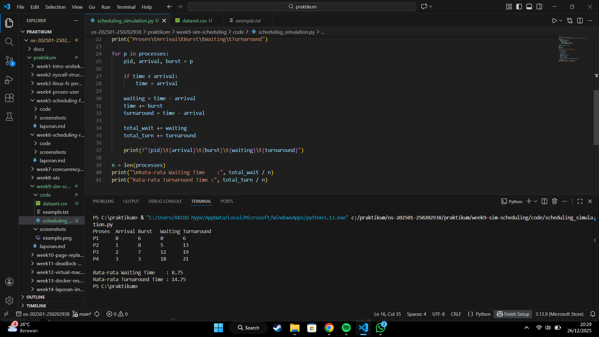

# Laporan Praktikum Minggu 9
Topik: Simulasi Algoritma Penjadwalan CPU

---

## Identitas
- **Nama**  : Farhan Ramdhani  
- **NIM**   : 250202938  
- **Kelas** : 1IKRB

---

## Tujuan
Tuliskan tujuan praktikum minggu ini.  
1. Membuat program simulasi algoritma penjadwalan FCFS dan/atau SJF.  
2. Menjalankan program dengan dataset uji yang diberikan atau dibuat sendiri.  
3. Menyajikan output simulasi dalam bentuk tabel atau grafik.  
4. Menjelaskan hasil simulasi secara tertulis.  
5. Mengunggah kode dan laporan ke Git repository dengan rapi dan tepat waktu.

---

## Dasar Teori
Tuliskan ringkasan teori (3–5 poin) yang mendasari percobaan.

**CPU Scheduling** adalah mekanisme yang digunakan oleh sistem operasi
untuk menentukan urutan eksekusi proses yang berada dalam keadaan siap
(ready queue). Penjadwalan CPU bertujuan untuk meningkatkan efisiensi
penggunaan CPU dan meminimalkan waktu tunggu proses.

**First Come First Serve (FCFS)** merupakan salah satu algoritma penjadwalan
CPU yang paling sederhana. Pada algoritma ini, proses dieksekusi
berdasarkan urutan kedatangannya ke dalam sistem. Proses yang datang
lebih awal akan dieksekusi terlebih dahulu tanpa mempertimbangkan
lama waktu eksekusi (burst time).

**Waiting time** adalah waktu yang dihabiskan suatu proses untuk menunggu
sebelum dieksekusi oleh CPU, sedangkan turnaround time adalah total
waktu yang dibutuhkan proses sejak datang hingga selesai dieksekusi.
Nilai waiting time dan turnaround time digunakan untuk mengevaluasi
kinerja suatu algoritma penjadwalan.

---

## Ketentuan Tesis
- Bahasa pemrograman **bebas** (Python / C / Java / lainnya).  
- Tidak wajib GUI, cukup **program berbasis terminal**.  
- Fokus penilaian pada **logika algoritma dan keakuratan hasil**, bukan kompleksitas bahasa.

Struktur folder (sesuaikan dengan template repo):
```
praktikum/week9-sim-scheduling/
├─ code/
│  ├─ scheduling_simulation.*
│  └─ dataset.csv
├─ screenshots/
│  └─ hasil_simulasi.png
└─ laporan.md
```
---

## Langkah Praktikum
1. **Menyiapkan Dataset**

   Buat dataset proses minimal berisi:

   | Proses | Arrival Time | Burst Time |
   |:--:|:--:|:--:|
   | P1 | 0 | 6 |
   | P2 | 1 | 8 |
   | P3 | 2 | 7 |
   | P4 | 3 | 3 |

2. **Implementasi Algoritma**

   Program harus:
   - Menghitung *waiting time* dan *turnaround time*.  
   - Mendukung minimal **1 algoritma (FCFS atau SJF non-preemptive)**.  
   - Menampilkan hasil dalam tabel.

3. **Eksekusi & Validasi**

   - Jalankan program menggunakan dataset uji.  
   - Pastikan hasil sesuai dengan perhitungan manual minggu sebelumnya.  
   - Simpan hasil eksekusi (screenshot).

4. **Analisis**

   - Jelaskan alur program.  
   - Bandingkan hasil simulasi dengan perhitungan manual.  
   - Jelaskan kelebihan dan keterbatasan simulasi.

5. **Commit & Push**

   ```bash
   git add .
   git commit -m "Minggu 9 - Simulasi Scheduling CPU"
   git push origin main
   ```

---

## Hasil Eksekusi
Sertakan screenshot hasil percobaan atau diagram:



---

## Kesimpulan
Tuliskan 2–3 poin kesimpulan dari praktikum ini.

1. Algoritma First Come First Serve (FCFS) mengeksekusi proses berdasarkan
   urutan kedatangan tanpa mempertimbangkan burst time.
2. Hasil simulasi menunjukkan bahwa proses dengan burst time besar dapat
   menyebabkan waiting time proses berikutnya menjadi lebih lama.
3. Simulasi CPU scheduling membantu memahami cara kerja penjadwalan CPU
   dan perhitungan waiting time serta turnaround time secara praktis.

---

## Quiz
1. Mengapa simulasi diperlukan untuk menguji algoritma scheduling?  
   **Jawaban:**  Simulasi CPU scheduling diperlukan untuk memahami cara kerja algoritma
penjadwalan CPU serta melihat dampaknya terhadap waiting time dan
turnaround time sebelum diterapkan pada sistem nyata.
2. Apa perbedaan hasil simulasi dengan perhitungan manual jika dataset besar?  
   **Jawaban:**  Perhitungan manual memerlukan waktu lebih lama dan berpotensi terjadi
kesalahan, sedangkan simulasi program dapat menghitung hasil dengan
cepat dan akurat terutama untuk jumlah proses yang banyak.
3. Algoritma mana yang lebih mudah diimplementasikan? Jelaskan.  
   **Jawaban:**  Algoritma FCFS merupakan algoritma yang paling mudah diimplementasikan
karena hanya mengurutkan proses berdasarkan arrival time tanpa logika
yang kompleks.

---

## Refleksi Diri
Tuliskan secara singkat:
- Apa bagian yang paling menantang minggu ini?  
   **Jawaban:**  Bagian yang paling menantang pada praktikum minggu ini adalah
mengimplementasikan pembacaan dataset dari file CSV dan memastikan
program dapat berjalan dengan benar di terminal.
- Bagaimana cara Anda mengatasinya?  
   **Jawaban:**  Tantangan tersebut diatasi dengan memahami struktur folder,
menyesuaikan penulisan path file, serta melakukan pengujian program
secara bertahap hingga menghasilkan output yang sesuai.

---

**Credit:**  
_Template laporan praktikum Sistem Operasi (SO-202501) – Universitas Putra Bangsa_
