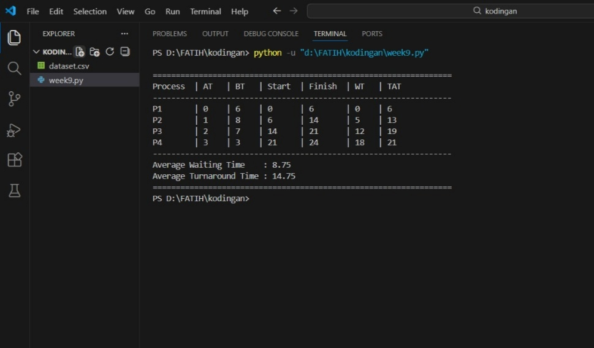
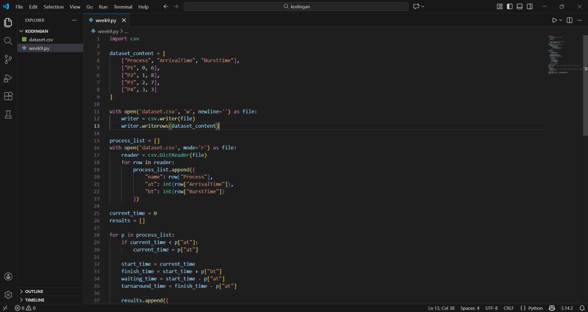
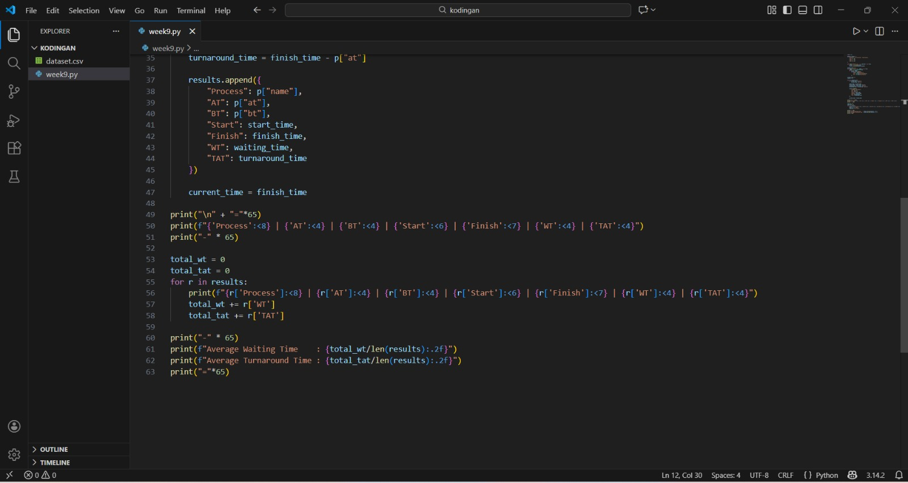

# Laporan Praktikum Minggu [9]
Topik: Simulasi Algoritma Penjadwalan CPU

---

## Identitas
- **Nama**  : Mohammad Fatikh Mahsun
- **NIM**   : 250202952  
- **Kelas** : 1IKRB

---

## Tujuan

1.Mengimplementasikan algoritma penjadwalan CPU, khususnya First Come First Served (FCFS) dan/atau Shortest Job First (SJ

2.Menghitung waiting time dan turnaround time setiap proses secara otomatis menggunakan program.

3.Menjalankan simulasi penjadwalan CPU menggunakan dataset yang telah disiapkan.

4.Menyajikan hasil simulasi dalam bentuk tabel atau grafik.

5.Menganalisis dan menjelaskan hasil simulasi serta membandingkannya dengan perhitungan manual.

6.Mendokumentasikan kode program dan hasil praktikum dalam laporan dan repositori Git secara sistematis.

---

## Dasar Teori
1.Penjadwalan CPU adalah cara sistem operasi mengatur urutan proses yang akan dijalankan oleh CPU agar penggunaan CPU lebih efisien dan tidak terjadi penumpukan proses.

2.Dalam penjadwalan CPU, terdapat beberapa parameter penting seperti arrival time yang menunjukkan waktu kedatangan proses, burst time yang menunjukkan lama proses dieksekusi, waiting time sebagai waktu tunggu proses sebelum dijalankan, dan turnaround time sebagai total waktu proses dari datang hingga selesai.

3.Algoritma First Come First Served (FCFS) menjalankan proses berdasarkan urutan kedatangan. Algoritma ini sederhana dan mudah dipahami, namun bisa menyebabkan waktu tunggu yang lama jika ada proses dengan waktu eksekusi panjang.

4.Algoritma Shortest Job First (SJF) non-preemptive memilih proses dengan waktu eksekusi paling singkat untuk dijalankan lebih dulu. Algoritma ini dapat mengurangi rata-rata waktu tunggu, tetapi berisiko membuat proses dengan burst time besar menunggu terlalu lama.

5.Simulasi penjadwalan CPU digunakan untuk membantu menghitung dan menganalisis kinerja algoritma secara otomatis, sehingga hasilnya lebih cepat diperoleh dan mudah dibandingkan dengan perhitungan manual.

---

## Langkah Praktikum
1.Menyiapkan dataset proses yang berisi informasi proses, arrival time, dan burst time sesuai dengan ketentuan yang diberikan.

2.Membuat program simulasi penjadwalan CPU menggunakan bahasa pemrograman yang dipilih.

3.Mengimplementasikan algoritma penjadwalan CPU, yaitu FCFS dan/atau SJF non-preemptive, ke dalam program.

4.Menambahkan perhitungan waiting time dan turnaround time untuk setiap proses.

5.Menjalankan program menggunakan dataset uji dan mencatat hasil simulasi yang ditampilkan.

6.Memverifikasi hasil simulasi dengan membandingkannya dengan perhitungan manual.

7.Menyimpan hasil eksekusi program dalam bentuk tangkapan layar (screenshot).

8.Menyusun laporan praktikum yang berisi tujuan, dasar teori, langkah praktikum, hasil, analisis, dan kesimpulan.

9.Mengunggah kode program, dataset, dan laporan ke repositori Git sesuai struktur folder yang ditentukan.

---

## Kode / Perintah
```bash
| Proses | Arrival Time | Burst Time |
   |:--:|:--:|:--:|
   | P1 | 0 | 6 |
   | P2 | 1 | 8 |
   | P3 | 2 | 7 |
   | P4 | 3 | 3 |


dan menjalankan kode python scheduling_simulation.py
```


---

## Hasil Eksekusi
Sertakan screenshot hasil percobaan atau diagram:




---

## Analisis
Berdasarkan dataset proses yang digunakan pada percobaan ini, saya dapat melihat bagaimana perbedaan algoritma penjadwalan CPU memengaruhi urutan eksekusi serta waktu tunggu setiap proses. Dataset terdiri dari empat proses dengan waktu kedatangan dan burst time yang berbeda, sehingga cukup jelas untuk melihat dampak dari algoritma yang digunakan.

Pada algoritma FCFS, proses dijalankan sesuai urutan kedatangan, yaitu P1, P2, P3, dan P4. Karena P1 dijalankan pertama dan memiliki burst time yang cukup lama, proses-proses setelahnya harus menunggu hingga P1 selesai. Akibatnya, proses P2, P3, dan P4 memiliki waiting time yang cukup besar. Bahkan P4 yang sebenarnya memiliki burst time paling kecil tetap harus menunggu lama karena datang paling akhir. Dari hasil ini, terlihat bahwa FCFS kurang efisien jika terdapat proses dengan waktu eksekusi yang panjang di awal antrian.

Berbeda dengan FCFS, pada algoritma SJF non-preemptive, setelah P1 selesai dieksekusi, sistem memilih proses dengan burst time paling kecil dari proses yang sudah tersedia, yaitu P4. Selanjutnya proses dieksekusi berdasarkan burst time yang lebih kecil terlebih dahulu. Dengan urutan ini, proses-proses yang memiliki waktu eksekusi singkat dapat selesai lebih cepat, sehingga rata-rata waiting time dan turnaround time menjadi lebih kecil dibandingkan dengan FCFS.

Hasil percobaan ini sesuai dengan teori yang menyatakan bahwa algoritma SJF dapat meminimalkan rata-rata waktu tunggu. Namun, dari simulasi ini juga terlihat bahwa proses dengan burst time besar, seperti P2, harus menunggu lebih lama, sehingga berpotensi mengalami starvation. Dari percobaan ini, saya menyimpulkan bahwa meskipun SJF lebih efisien dari sisi waktu tunggu, algoritma ini memiliki keterbatasan dalam penerapan pada sistem nyata.

---

## Kesimpulan
1.Praktikum ini membantu saya memahami cara kerja algoritma penjadwalan CPU, khususnya FCFS dan SJF, melalui simulasi program sehingga perhitungan waiting time dan turnaround time dapat dilakukan secara otomatis.

2.Dari hasil simulasi, algoritma SJF non-preemptive menghasilkan rata-rata waktu tunggu yang lebih kecil dibandingkan FCFS, sedangkan FCFS lebih sederhana tetapi kurang efisien jika terdapat proses dengan burst time yang panjang.

3.Simulasi penjadwalan CPU mempermudah analisis dan validasi hasil perhitungan, serta membantu menghubungkan konsep teori sistem operasi dengan implementasi komputasional.

---

## Quiz
1. Mengapa simulasi diperlukan untuk menguji algoritma scheduling?

Simulasi diperlukan karena dapat membantu menguji dan memahami cara kerja algoritma penjadwalan CPU tanpa harus menghitung secara manual. Dengan simulasi, proses perhitungan menjadi lebih cepat, akurat, dan mudah diuji menggunakan berbagai dataset. Selain itu, simulasi juga memudahkan analisis kinerja algoritma, seperti perbandingan waiting time dan turnaround time, terutama ketika jumlah proses semakin banyak.

2. Apa perbedaan hasil simulasi dengan perhitungan manual jika dataset besar?

Jika dataset masih kecil, hasil simulasi dan perhitungan manual pada dasarnya akan sama. Namun, pada dataset yang besar, perhitungan manual menjadi tidak efisien, memakan waktu lama, dan rawan kesalahan. Simulasi mampu menangani dataset besar dengan lebih cepat dan konsisten, sehingga hasil yang diperoleh lebih praktis dan mudah dianalisis dibandingkan perhitungan manual.

3. Algoritma mana yang lebih mudah diimplementasikan? Jelaskan.

Algoritma yang lebih mudah diimplementasikan adalah First Come First Served (FCFS), karena hanya membutuhkan pengurutan proses berdasarkan waktu kedatangan tanpa perhitungan tambahan. Sementara itu, Shortest Job First (SJF) memerlukan proses pemilihan burst time terkecil dan informasi waktu eksekusi yang akurat, sehingga implementasinya sedikit lebih kompleks dibandingkan FCFS

---

## Refleksi Diri

- Apa bagian yang paling menantang minggu ini?

   menerapkan logika penjadwalan CPU ke dalam program agar perhitungan waiting time dan turnaround time benar.

- Bagaimana cara Anda mengatasinya?

   dengan memahami kembali perhitungan manual dan menguji program secara bertahap menggunakan dataset sederhana

---

**Credit:**  
_Template laporan praktikum Sistem Operasi (SO-202501) – Universitas Putra Bangsa_
